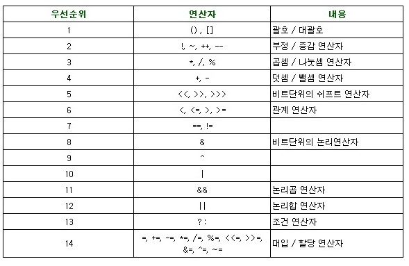

# ■ WebBasic


## 6 배치요소

1. block(그릇) vs inline(콘텐츠(간장))
    1) box model
        - 콘텐츠가 자리하는 영역
    2) block
        - width/height 0, 앞뒤줄바꿈 0, div, h3, p,
    3) inline
        - width / height X , 앞뒤줄바꿈 X , a , span , strong  


2. 배치(1) - float

    - 좌우배치 (왼쪽 또는 오른쪽 배치)
    - clear:both 끊기 : 다음요소의 흐름 정리

    - float를 활용하여 카드를 여러장 작성한뒤 일렬로 배치하는 느낌을 줄 수 있다.
      이때 끌려가지 않으려면 `clear:both`를 사용하여 특정 콘텐츠를 끌려가지 않게할 수 있다.

3. 배치(2) - position

    - 절대/고정위치
    - 부모 relative 위치기준 / 자식 absolite 이동
    - fixed 브라우저 기준

4. 배치(3) - display

    - 요소의 속성 바꾸기


5. 여백 - margin, padding 

    - margin은 다른 콘텐츠와의 거리를 멀어지게 하는 느낌으로 수치를 조정할 수 있으며, 수치를 조정할때 top을 시작으로 시계방향으로 left까지 이어진다. 좌우를 auto로 두면 중앙 배치하는 기법으로 사용할 수 있다.
    - padding은 내부 콘텐츠들이 공간을 확보하는 느낌으로 여백이 생긴다.


6. position의 fixed를 통해 (배너 / 광고 / top) 같은 기능도 만들수 있고.

부모가 되는 relative(부모)와 absolute(자식)를 통해 부모가 되는 요소 안에서 비교적 자유롭게 배치할 수 있다. (top/bottom/left/right 이때, 수치가 늘어남에 따라 부모 중심점에 가까워지는 형태로 배치된다)
이미지의 우측 상단에 배치하고, hover나 transform을 통해 더 다양한 형태의 효과가 구현될 것으로 보인다.

# ■ Java


1. 연산의 우선순위 (먼저),산술연산, 비교연산, 대입연산이다.

    컴퓨터의 연산은 위에서 아래로, 왼쪽에서 오른쪽으로 이루어진다.

    


    ---


    `char`는 조금 특이한 형태의 변수라서

    문자열을 선언할때 '\u0000' 형태로 내용을 선언해두고

    char는 저장될 때 컴퓨터에 문자열을 숫자 형태로 저장시키기 때문에

    연산이 가능하다 따라서 조건문에도 활용이 가능하다.


    ---


2. 제어문


    if (조건문) {출력내용}
    else if (조건문) {출력내용}
    else {출력내용}

    syso(var1 == var2 ? "true" : "false");

    1형식 2형식 다형식 형태로 구성되어 있으며 
    그외 삼항 연산자 출력 구문에 if문을 쓰고 true or false를 실행할 수있다.

    형태로 이루어져있다.

    중첩도 가능한 형태가 있고

    ```
    Java

    String grade =  (score >= 90) ? "A" :
                    (score >= 80) ? "B" :
                    (score >= 70) ? "C" :
                    (score >= 60) ? "D" : "F" ;

    ```
    이렇게 표현해서 범위를 표현하는것도 가능한듯


    
                    
    