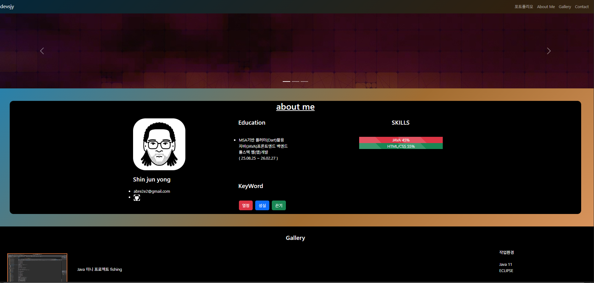
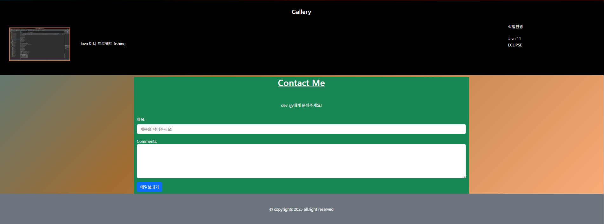

Java part
---

```
package com.company.java007;

import java.util.Arrays;

public class Arr2 {

	public static void main(String[] args) {

		int[][] arr = { { 1, 2, 3 }, // 00 01 02
				{ 4, 5, 6 } // 10 11 12
		};

		System.out.println(arr); // [[I@28a418fc 주소값 출력됨
		System.out.println(Arrays.toString(arr)); // [[I@5305068a, [I@1f32e575] 각 층주소
		System.out.println(Arrays.deepToString(arr)); // 실제 데이터 꺼내기 [[1, 2, 3], [4, 5, 6]]

		// ver-1 눈에 보이는대로
		System.out.print(arr[0][0] + "\t");
		System.out.print(arr[0][1] + "\t");
		System.out.print(arr[0][2] + "\t");
		System.out.println();
		
		System.out.print(arr[1][0] + "\t");
		System.out.print(arr[1][1] + "\t");
		System.out.print(arr[1][2] + "\t");
		System.out.println();
		
		
		
		// ver-2 칸정리
		
		System.out.println("ver-2");
		
		for (int kan=0; kan<=2; kan++){System.out.print(arr[0][kan] + "\t");}
		System.out.println();
		for (int kan=0; kan<=2; kan++){System.out.print(arr[1][kan] + "\t");}
		
		

		// ver-3 층정리
		
		for (int ch=0; ch<=1; ch++) {
			for (int kan=0; kan<=2; kan++) {System.out.print(arr[ch][kan]+"\t");}
		System.out.println();
		}
		
		//4
		System.out.println();
		for(int ch=0; ch<arr.length; ch++) {	//아파트.층수
			for (int kan=0; kan<arr[ch].length; kan++) {System.out.print(arr[ch][kan]+"\t");}
			System.out.println();
		}

	}// end main

}// end class

```

이중 for문 구조로 2층과 3칸의 배열을 모두 출력하는 방법 층수만큼 for문 구조를 만드는듯

```

int[][] arr2 = {{1,2,3},{4,5,6}}

for (int ch = 0; ch < 2; ch++){ // 층이 변한다
    for (int kan = 0; kan < 2; kan++){  // 해당 층에서 칸에 입력값 들 만큼

    System.out.print(arr2[ch][kan]+"\t"); // 1  2   3   4   5   6 형태로 출력된다.

    }    
}
```

teacher(참고해야함)


```

public class Array2Ex008_3 {
    public static void main(String[] args) {
        int[][] datas = {
            {10, 10, 10, 10},
            {20, 20, 20, 20},
            {30, 30, 30, 30}
        };

        int[][] result = new int[datas.length + 1][datas[0].length + 1];

        
        
        // 00 01 02 03  
        // 10 11 12 13
        // 20 21 22 23
        // 30 31 32 33

        
       
        for (int ch = 0; ch < datas.length; ch++) {
            for (int kan = 0; kan < datas[ch].length; kan++) {
                result[ch][kan] = datas[ch][kan]; 
          
                result[ch][result[ch].length - 1] += datas[ch][kan];              
                result[result.length - 1][kan] += datas[ch][kan];
                result[result.length - 1][result[ch].length - 1] += datas[ch][kan];
            }
        }

        // 출력
        for (int ch = 0; ch < result.length; ch++) {
            for (int kan = 0; kan < result[ch].length; kan++) {
                System.out.print(result[ch][kan] + "\t");
            }
            System.out.println();
        }
    }
}


```


# WebBasic
## 6배치요소

1. Web Basic 복습문제

> 2. 부트스트랩 사용법

1. css

사용법 : btn(컴포넌트) btn-primary(색상)

2. 많이 사용하는 css
1) 레이아웃 
    .container (아파트) > .row(층) > .col-sm-* (12칸)

2) margin / padding (1~5) 
    m-3     p-3
    mt-3(top) , mb-3(bottom), ms-3(start), me-3(end), my-3(y축?), mx-3(x축?)
3) 배경/글자
    bg-primary(파랑), bg-danter(빨강)
    bg-info (하늘) , bg-warning(노랑) , bg-success(초록)

    text-white(글자하얀)

4) 가로사이즈
    w-25 w-50 w-75 w-100

> 3. 자기소개 페이지만들기


```

<!DOCTYPE html>
<html lang="ko">

<head>
  <meta charset="UTF-8">
  <meta name="viewport" content="width=device-width, initial-scale=1.0">
  <title>성실한 개발자 신준용 포트폴리오</title>
  <!-- Latest compiled and minified CSS -->
  <link href="https://cdn.jsdelivr.net/npm/bootstrap@5.3.3/dist/css/bootstrap.min.css" rel="stylesheet">

  <!-- Latest compiled JavaScript -->
  <script src="https://cdn.jsdelivr.net/npm/bootstrap@5.3.3/dist/js/bootstrap.bundle.min.js"></script>
  <style>
    /*--------------------------- STYLE -------------------------------------*/
    /* visual */
    div#demo {
      height: 300px;
      overflow: hidden;
    }

    /*높이 300 지정및 남는영역 자르기*/
    body {
      color: #ffffff;
      font-family: 'segoe UI', sans-serif;
      text-decoration: none;
      background: linear-gradient(135deg, #0f85c4, #a26d31, #ffaf7b);
    }

    body ul {
      margin-left: -30px;
    }

    .info {
      background-color: #000000;
      border-radius: 15px;
      margin: 50px;
      ;
    }

    .profile img {
      background-color: #ffffff;
      border-radius: 50px;
    }

    .portfolio {
      background-color: #333;
    }

    .info h4 {margin: 5% 0;}

    h3 {text-decoration:underline; font-size:2.2em;}

    .keyWord li {list-style-type:none; margin-right:10px; }

    /* .col-sm-4 {border:2px solid white; border-radius:5px; margin:-4px} */
  </style>


</head>

<body>
  <!-- 여기에 콘텐츠를 추가하세요 -->

  <!-- header -->
  <header class="header">

    <nav class="navbar navbar-expand-sm navbar-dark" style="background-color:rgba(0,0,0, 0.7)">
      <div class="container-fluid">
        <a class="navbar-brand" href="javascript:void(0)">devsjy</a>
        <button class="navbar-toggler" type="button" data-bs-toggle="collapse" data-bs-target="#mynavbar">
          <span class="navbar-toggler-icon"></span>
        </button>
        <div class="collapse navbar-collapse" id="mynavbar">
          <ul class="navbar-nav ms-auto">
            <li class="nav-item">
              <a class="nav-link" href="javascript:void(0)">포트폴리오</a>
            </li>
            <li class="nav-item">
              <a class="nav-link" href="javascript:void(0)">About Me</a>
            </li>
            <li class="nav-item">
              <a class="nav-link" href="javascript:void(0)">Gallery</a>
            </li>
            <li class="nav-item">
              <a class="nav-link" href="javascript:void(0)">Contact</a>
            </li>
          </ul>
        </div>
      </div>
    </nav>
  </header><!-- header end -->

  <!--visual-->
  <section class="visual">

    <!-- Carousel -->
    <div id="demo" class="carousel slide" data-bs-ride="carousel">

      <!-- Indicators/dots -->
      <div class="carousel-indicators">
        <button type="button" data-bs-target="#demo" data-bs-slide-to="0" class="active"></button>
        <button type="button" data-bs-target="#demo" data-bs-slide-to="1"></button>
        <button type="button" data-bs-target="#demo" data-bs-slide-to="2"></button>
      </div>

      <!-- The slideshow/carousel -->
      <div class="carousel-inner">
        <div class="carousel-item active">
          
        </div>
        <div class="carousel-item">
          
        </div>
        <div class="carousel-item">
          
        </div>
      </div>

      <!-- Left and right controls/icons -->
      <button class="carousel-control-prev" type="button" data-bs-target="#demo" data-bs-slide="prev">
        <span class="carousel-control-prev-icon"></span>
      </button>
      <button class="carousel-control-next" type="button" data-bs-target="#demo" data-bs-slide="next">
        <span class="carousel-control-next-icon"></span>
      </button>
    </div>
  </section><!--visual end-->


  <section class="info">
    <div class="container">
      <h3 class="text-center mb-2">about me</h3>
      <div class="row">
        <div class="col-sm-4" style="margin-top:20px;margin-right:-20px;"><!-- 1 w-25 w-50 w-75 w-100 -->
          <p class="profile image"></p>
          <!--img-fluid(부모사이즈에 맞춤) w-사이즈(50%-부모사이즈절반정도)-->
          <h4>Shin jun yong</h4>
          <ul>
            <li>abre2e2@gmail.com</li>
            <li><a href="https://github.com/suda77881/fullstack_junyong">
                
              </a></li>
          </ul>
        </div>
        <div class="col-sm-4"><!--2-->


          <h4>Education</h4>
          <br />
          <ul>
            <li>MSA기반 플러터(Dart)활용<br />
              자바(JAVA)프론트엔드 백엔드 <br />
              풀스택 웹(앱)개발 <br />( 25.08.25 ~ 26.02.27 )</li>
          </ul>
          <br />
          <br />
          <h4>KeyWord</h4>
          <br />
          <ul class="d-flex keyWord">
            <li><input type="button" value="열정" class="btn btn-danger" /></li>
            <li><input type="button" value="성실" class="btn btn-primary" /></li>
            <li><input type="button" value="끈기" class="btn btn-success" /></li>
          </ul>
        </div>
        <div class="col-sm-4"><!--3-->
          <h4 style="text-align:center;">SKILLS</h4>
          <br />
          <div class="progress-bar bg-danger progress-bar-striped" style="width:80%; margin-left:43px;">JAVA 45%</div>
          <div class="progress-bar bg-success progress-bar-striped" style="width:80%; margin-left:43px;">HTML/CSS 55%
          </div>

        </div>
      </div>

    </div>


  </section>

  <!-- header end -->

  <div class="portfolio" style="background-color:#000000">
    <div class="row">
      <h4 style="text-align:center; margin-top:30px; ">Gallery</h4>
      <div class="col-sm-10"><!--1-->
        <p><a href="https://www.youtube.com/watch?v=lDgME6b8qHY" target="_blank"
            style="text-decoration:none; color:#ffffff;" title="미니프로젝트링크">
            Java 미니 프로젝트 fishing</a></p>
      </div><!--fix해서 더 깔끔한 버전으로-->
      <div class="col-sm-2"><br />작업환경<br><br>Java 11<br>ECLIPSE<!--2-->
      </div>
      </div>
    </div>
      <section class="contact mt-2">
        <div class="container bg-success" style="display:flex; flex-direction:column; ">
          <h3 style="text-align:center;">Contact Me</h3>
          <br /><br />
          <p style="text-align:center;">dev sjy에게 문의주세요!</p>

          <form action="/action_page.php">
      <div class="mb-3 mt-3">
        <label for="title" class="form-label">제목:</label>
        <input type="text" class="form-control" id="title" placeholder="제목을 적어주세요!" name="tilte">
      </div>
      <div class="mb-3">
        <label for="comment">Comments:</label>
        <textarea class="form-control" rows="5" id="comment" name="comment"></textarea>
      </div>
      <div class="mb-3 text-end"> </div>
      <button type="submit" class="btn btn-primary mb-2">메일보내기</button>
    </form>
    </div>
        


      </section><!-- contact end -->

      <footer class="footer text-center bg-secondary p-5">


     &copy; copyrights 2025 all.right reserved

      </footer><!-- footer end -->


</body>

</html>

```





현재 여기까지


```
&copy; copyrights 2025 all.right reserved   //   새로 배운 footer 문장 &copy 문양나오는듯
```

```
text-decoration:underline;  //   밑줄 긋기
```

```
text-center , text-end, text-start // 텍스트 위치 중앙, 오른쪽, 왼쪽 버튼도 가능?
```

구성요소 순서

>container(중앙정렬 박스) → row(행) → colounm(열) (col-sm-(숫자)) // 이때 12칸에 맞춰준다(숫자배분)


## Track001 -  github

> 1. (~18:00) 깃허브정리 day013.md
> 2. BANK 상담정리

1. 팀장뽑기 (아~ 이팀장이면 믿을만하다~~! )
2. 팀장이  2,3,4,5차까지 만들 포트폴리오 주제 안내
3. 팀원들은 가고 싶은팀 익명으로 투표
4. 팀장은 팀원뽑기 (익명)
5. 다시 고르기

# ■ Github   
### 12. 깃허브 협업 
---
1조 : 유희재, 한승현, 김정민, 강서현
2조 : 성태훈, 길상현, 박현주 
3조 : 최상욱, 김영민, 신준용
3i1e         : https://github.com/kyoungsjjj0211/portfolio.git
드래곤치킨     : https://github.com/taehun00/dragonchicken.git
트리플윈      : https://github.com/suda77881/triple1


# ■ Java
■ 복습문제
■1. Java  복습문제
■1. Java  복습문제
■1. Java  복습문제
>>>>>>>> JAVA
■ 실습1 - 배열  
[eclipse] 배열명 : chars
for문과 .length를 이용하여 값 넣기 :  'a' 'b' 'c'
for문과 .length를 이용하여 출력


```
public class ArrayPractice {
    public static void main(String[] args) {
        // 배열 선언 및 생성
        char[] chars = new char[3];
         
        char data = 'a';
        // for문과 .length를 이용하여 값 넣기
        for (int i = 0; i < chars.length; i++) {
            chars[i] = data++;  // 'a', 'b', 'c' 순서대로 넣기
        }

        // for문과 .length를 이용하여 출력
        for (int i = 0; i < chars.length; i++) {
            System.out.println(chars[i]);
        }
    }
}
````


■14. array 배열
1. 배열?
- [같은 타입]의 데이터를 [연속된 공간에 저장]하는 자료구조
- 각 데이터의 저장위치 [인덱스]를 통해서 접근

 
연습문제1)  array
패키지명 : com.company.java007_ex
클래스명 :  Array2Ex001
배열을 이용하여 다음의 프로그램을 작성하시오.   
  
   int[][] arr2={{100,200,300},{400,500,600}};

   이중for 이용해서 출력하기


연습문제2)  array
패키지명 : com.company.java007_ex
클래스명 :  Array2Ex002
배열을 이용하여 다음의 프로그램을 작성하시오.   
  
   int[][] arr2={{101,102,103},{201,202,203}};

   이중for 이용해서 출력하기


연습문제3)  array
패키지명 : com.company.java007_ex
클래스명 :  Array2Ex003
배열을 이용하여 다음의 프로그램을 작성하시오.   
1. new 연산자 이용하여 다차원배열만들기
2. for + length 이용해서 대입   
3. for + length 이용해서 출력 
	101	    102	    103
	104 	105 	106


연습문제4)  array
패키지명 : com.company.java007_ex
클래스명 :  Array2Ex004
배열을 이용하여 다음의 프로그램을 작성하시오.   
1. new 연산자 이용하여 다차원배열만들기
2. for + length 이용해서 대입   
3. for + length 이용해서 출력 
	A	B	C
	B	C	D

연습문제5)  array
패키지명 : com.company.java007_ex
클래스명 :  Array2Ex005
배열을 이용하여 다음의 프로그램을 작성하시오.   
1. 다음의 주어진조건을 이용하여 총점과 평균을 구하시오.

 int[][] arr = {
	{ 1, 1, 1,},
	{ 2, 2, 2,},
	{ 3, 3, 3,},
	{ 4, 4, 4,},
 };
 int total=0;  double avg=0.0;

출력내용:
총점 : 30
평균 : 2.5

연습문제6)  array
패키지명 : com.company.java007_ex
클래스명 :  Array2Ex006
> 2차원배열 
1.  new 로 만들고   5*5
2.  데이터 넣기  for+length
3.  데이터 출력  for+length

1	2	3	4	5
6	7	8	9	10
11	12	13	14	15
16	17	18	19	20
21	22	23	24	25

연습문제7)  array
패키지명 : com.company.java007_ex
클래스명 :  Array2Ex007
> 2차원배열   4*4
1.  new 로 만들고 
2.  데이터 넣기  for+length
3.  데이터 출력  for+length
1	2	3	4
1	2	3	4
1	2	3	4
1	2	3	4


연습문제8)  array
패키지명 : com.company.java007_ex
클래스명 :  Array2Ex008
배열을 이용하여 다음의 프로그램을 작성하시오.   
1. 다음의 주어진조건을 이용하여 총점과 평균을 구하시오.

int[][] datas = {  {  10, 10, 10 ,10}, 
	         {  20, 20, 20 ,20}, 
	         {  30, 30, 30 ,30},  
};  // 3층 4칸 
int[][] result = new int[datas.length+1][datas[0].length+1];

#1. result 에 datas데이터 복사하기
#2. 가로방향누적데이터
#3. 세로방향데이터누적
#4. 총합

출력내용:
10	10	10	10	40	
20	20	20	20	80	
30	30	30	30	120	
60	60	60	60	240	


 


# ■ WebBasic
## 6 배치요소

■1. Web  Basic  복습문제
■1. Web  Basic  복습문제
■1. Web  Basic  복습문제
■1. Web  Basic  복습문제
 
> 2. 부트스트랩사용법
1. css
사용법 : btn(컴포넌트)  btn-primary(색상)

2. 많이 사용하는 css
1) 레이아웃
   .container(아파트)  >  .row(층) > .col-sm-* (12칸)

2) margin/padding (1~5)
    m-3   p-3
    mt-3 , mb-3, ms-3, me-3 , my-3 , mx-3

3) 배경/글자
   bg-primary(파랑) , bg-danger(빨강)
   bg-info (하늘) , bg-warning(노랑) , bg-success(초록)

   text-white(글자하얀) 
   text-center(중앙정렬)  text-start(왼쪽정렬)  text-end(오른쪽정렬)

4) 가로사이즈
   w-25   w-50  w-75  w-100

> 3. 자기소개페이지만들기


내일~!)   h1~h6 outline / portfolio


■ ■ ■  복습문제 DAY016
■ ■ ■  복습문제 DAY016
■ ■ ■  복습문제 DAY016
 
>>>>> java
연습문제1)  array 
클래스명 :  Repeat017_1
배열을 이용하여 다음의 프로그램을 작성하시오.   
1. new 연산자 이용하여 다차원배열만들기
2. for + length 이용해서 대입   
3. for + length 이용해서 출력 
	101	    102	    103
	104 	    105 	    106


연습문제2)  array 
클래스명 :  Repeat017_2
배열을 이용하여 다음의 프로그램을 작성하시오.   
1. new 연산자 이용하여 다차원배열만들기
2. for + length 이용해서 대입   
3. for + length 이용해서 출력 
	A	B	C
	B	C	D


>>>>> web-basic
# 부트스트랩 사용법 - 빈칸 채우기 문제

#### 1. 버튼 스타일링
- 기본 버튼 클래스는 `btn` 이고, 파란색 버튼을 만들려면 `btn-primary` 클래스를 추가한다.

#### 2. 레이아웃 구성
- 부트스트랩의 기본 레이아웃 구조는 `.container` → `row` → `colunm` 순서로 구성된다.

#### 3. 여백 설정
- 요소에 전체 마진을 3단계로 주려면 `m-3` 클래스를 사용한다.
- 요소의 왼쪽에 여백을 주려면 `ml` 클래스를 사용한다.
- 요소의 위쪽과 아래쪽에 여백을 동시에 주려면 `my` 클래스를 사용한다.

#### 4. 배경색과 글자색
- 배경을 초록색으로 설정하려면 `bg-success` 클래스를 사용한다.
- 배경을 노란색으로 설정하려면 `bg-warning` 클래스를 사용한다.
- 글자를 흰색으로 설정하려면 `text-white` 클래스를 사용한다.

#### 5. 텍스트 정렬
- 텍스트를 가운데 정렬하려면 `text-center` 클래스를 사용한다.
- 텍스트를 오른쪽 정렬하려면 `text-end` 클래스를 사용한다.

#### 6. 너비 설정
- 요소의 너비를 75%로 설정하려면 `w-75` 클래스를 사용한다.
  

■ ■ ■  복습문제 DAY016 - ANSWER
■ ■ ■  복습문제 DAY016 - ANSWER
■ ■ ■  복습문제 DAY016 - ANSWER

,,,,,,,,,,,,,,,,,,,,,,,,  answer
,,,,,,,,,,,,,,,,,,,,,,,,  answer
연습문제1)
```
public class Repeat017_1 {
    public static void main(String[] args) {
        int[][] arr = new int[2][3]; // 2행 3열 배열 생성

        int num = 101;
        for (int i = 0; i < arr.length; i++) {           // 행 반복
            for (int j = 0; j < arr[i].length; j++) {    // 열 반복
                arr[i][j] = num++;
            }
        }

        for (int i = 0; i < arr.length; i++) {
            for (int j = 0; j < arr[i].length; j++) {
                System.out.print(arr[i][j] + "\t");
            }
            System.out.println();
        }
    }
}

```

연습문제2)
```
public class Repeat017_2 {
    public static void main(String[] args) {
        char[][] arr = new char[2][3]; // 2행 3열 문자 배열 생성

        char ch = 'A';
        for (int i = 0; i < arr.length; i++) {
            for (int j = 0; j < arr[i].length; j++) {
                arr[i][j] = ch++;
            }
            ch = 'B';
        }

        for (int i = 0; i < arr.length; i++) {
            for (int j = 0; j < arr[i].length; j++) {
                System.out.print(arr[i][j] + "\t");
            }
            System.out.println();
        }
    }
}

```

 


,,,,,,,,,,,,,,,,,,,,,,,,  answer
,,,,,,,,,,,,,,,,,,,,,,,,  answer
부트스트랩 사용법 - 빈칸 채우기 문제 (정답 포함)
1. 버튼 스타일링
기본 버튼 클래스는 (btn) 이고, 파란색 버튼을 만들려면 (btn-primary) 클래스를 추가한다.

2. 레이아웃 구성
부트스트랩의 기본 레이아웃 구조는 .container → (row) → (col-sm-*) 순서로 구성된다.

3. 여백 설정
요소에 전체 마진을 3단계로 주려면 (m-3) 클래스를 사용한다.

요소의 왼쪽에 여백을 주려면 (ms-3) 클래스를 사용한다.

요소의 위쪽과 아래쪽에 여백을 동시에 주려면 (my-3) 클래스를 사용한다.

4. 배경색과 글자색
배경을 초록색으로 설정하려면 (bg-success) 클래스를 사용한다.

배경을 노란색으로 설정하려면 (bg-warning) 클래스를 사용한다.

글자를 흰색으로 설정하려면 (text-white) 클래스를 사용한다.

5. 텍스트 정렬
텍스트를 가운데 정렬하려면 (text-center) 클래스를 사용한다.

텍스트를 오른쪽 정렬하려면 (text-end) 클래스를 사용한다.

6. 너비 설정
요소의 너비를 75%로 설정하려면 (w-75) 클래스를 사용한다.

```


