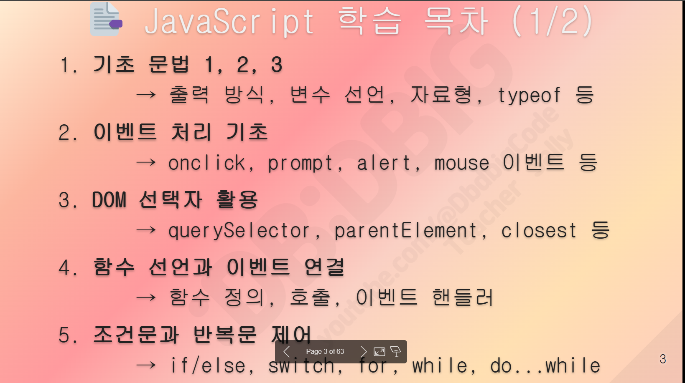
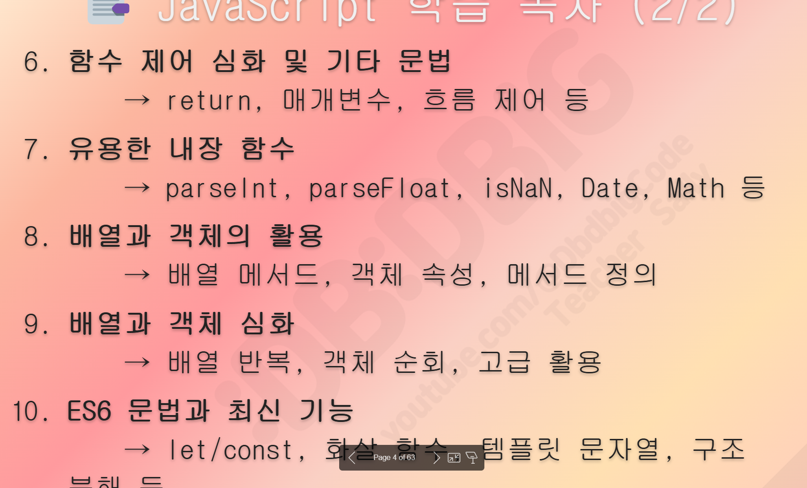
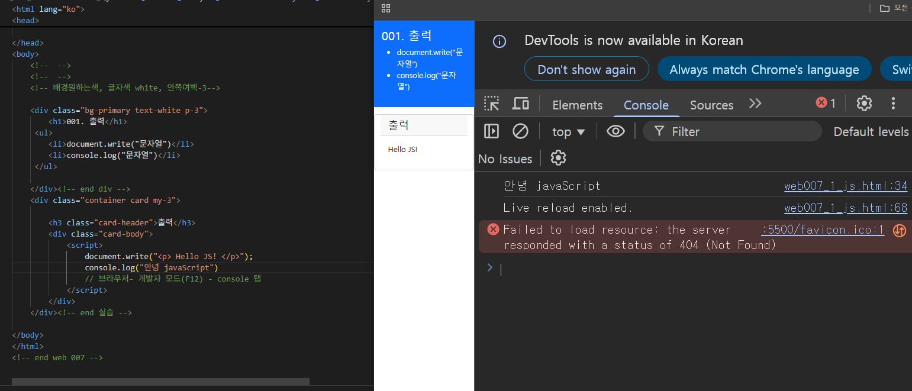
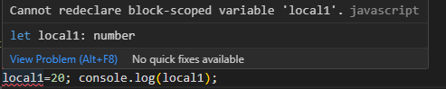
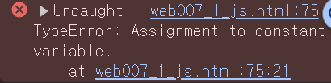

Java

25_09_17 수


```
Java

package com.company.java008_ex;
import java.util.Scanner;
public class MethodEx005 {
	
	
	
	public static int process_total (int kor,int eng,int math) {return kor + eng + math;}
	public static float process_avg (int total) {return total / 3.0f;}
	public static String process_pass (float avg, int kor, int eng, int math) 
	{ if (avg >= 60 && kor >= 40 && eng >= 40 && math >= 40) {return "합격";} else {return "불합격" ;} }
	public static String process_scholar (float avg) 
	{if (avg >= 95){return"장학생";}else{return"---";}}
	public static String process_star (float avg) 
	
	{if (avg >= 70 && avg < 80)       {return "*******";}
	else if (avg >= 10 && avg < 20)  {return "*";}
	else if (avg >= 20 && avg < 30)  {return "**";}
	else if (avg >= 30 && avg < 40)  {return "***";}
	else if (avg >= 40 && avg < 50)  {return "****";}
	else if (avg >= 50 && avg < 60)  {return "*****";}
	else if (avg >= 60 && avg < 70)  {return "******";}
	else if (avg >= 80 && avg < 90)   {return "********";}
	else if (avg >= 90 && avg < 100)  {return "*********";}
	else if (avg == 100)              {return "**********";}
	else {return "---";}
	}
	
//	public static String process_star (float avg) 
//	{String result = ""; 
//	for (int i = 1; i < avg / 10.0; i++ ) { result += "*";} return result;}
//	
	
	
	public static void main(String [] args) {
		
		 /////////////////////(1)  변수
	      String name  = ""; 
	      int kor, eng, math, total ;
	      float avg = 0.0f; 
	      String pass = "";
	      String jang = "";
	      String star= "";  
	      Scanner sc = new Scanner(System.in);
	      
	      /////////////////////(2) 입력 : 이름, 국어, 영어, 수학점수를 입력받으시오.
	      System.out.print("이름 입력 >"); name = sc.next();
	      System.out.print("국어 입력 >"); kor = sc.nextInt();
	      System.out.print("영어 입력 >"); eng = sc.nextInt();
	      System.out.print("수학 입력 >"); math = sc.nextInt();
	      /////////////////////(3) 처리 : 
	      total = process_total(kor , eng, math);    // 1. 총점처리
	      avg = process_avg(total);    //2.  평균처리
	      ////////3.  합격  평균이60이상이고, 각각 국어, 영어, 수학40이상/불합격/재시험-각각 40미만인게 있다면  
	      pass = process_pass(avg , kor, eng, math);  
	      
	      //////// 4. 평균이 95점이상이면 장학생
	      jang = process_scholar(  avg  ); 
	      
	      //////// 5. 평균점수대로 별표 붙이기 , 예) 70점대이면 별7개, 80점대이면 별8개, 90점대이면 별9개 , 100점이면 별10개 
	      star = process_star(avg);  
	      
	      
	      /////////////////////(4) 출력
	      process_show(name, kor, eng, math, total, avg, pass, jang, star);
	      
	      
	}// end main
	public static void process_show (String name, int kor, int eng, int math, 
	  		  int total, float avg, String pass, String jang, String star){
	    System.out.println(":::::::::::::::::::::::::::::::"
	    		+ "::::::::::::::::::::::::::::::::::::::::::::::::::::::::::::::::::");
	    System.out.printf("%-5s\t%-5s\t%-5s\t%-5s\t%-5s\t%-5s\t%-5s\t%-5s\t%-5s\n"
	  		  , "NAME", "KOR", "ENG", "MATH", "TOTAL", "AVG", "PASS", "장학생", "LEVEL");
	    System.out.println("----------------------------------------------------------");
	    System.out.printf("%-5s\t%-5s\t%-5s\t%-5s\t%-5s\t%-5s\t%-5s\t%-5s\t%-5s\n"
	  		  , name, kor, eng, math, total, avg, pass, jang, star);
	    System.out.println("----------------------------------------------------------");}
	

}// class

```

구조가 

타 메서드에서 메서드를 불러올떄

public static void method(); 
void는 값을 반환하지 않음 → 단순 실행용

int a=0;
String b="사과";
char c='A';
method(a,b,c);

이러한 파라미터를 받게되면 변수 형태에 따라

public static void method(int a, String b, char c){} 이러한 형태로 입력값을 받아야한다.

그리고 return; 하는 값에 따라 

```
Java

public static void method(int a, String b, char c){if (a==0 && b == "사과" && c=='A'){return "출력메세지";}}
```

public static `void` → `String` method를 형변환 시켜줘야한다. (return값 : "출력메세지")


#### 입력받기 메서드

```
Java

public static String inputString (String title)
    {Scanner sc = new Scanner(System.in);
    System.out.print(title + "입력 > "); return sc.next();}	// 입력받기 메서드

...

name = inputString("이름");
kor = inputString("국어");
eng = inputString("영어");
math = inputString("수학");

```

* 타 메서드에서 연산된 값을 저장하기 위해서는
return 으로 반환 받아 변수에 저장하는 형태가 필요하다.

```

public static String method (String a) {return "너는" + a;} 

public static void main(String[] args){
String a = "바보"; 
System.out.print(method(a));   // 너는 바보 출력

String b = (method(a));        // 이런 형태로 저장
}

```


## 제어문 사용

#### 삼항연산자 

```
Java

public static String process_pass (float avg, int kor, int eng, int math)

	{return avg < 60 ? "불합격" : kor < 40 || eng < 40 || math<40 ? "재시험" : "합격";}

     
```
조건 분기 평균점 합격여부(60)? 불합격 > 국영수 재시험 여부 > 합격

```
public static String process_pass (float avg, int kor, int eng, int math)

{ if (avg >= 60 && kor >= 40 && eng >= 40 && math >= 40) 
	{return "합격";} else {return "불합격" ;} 
	}

```

#### if 문

```
public static String process_star (float avg) 

{            if (avg >= 70 && avg < 80)  {return "*******";}
        else if (avg >= 10 && avg < 20)  {return "*";}
        else if (avg >= 20 && avg < 30)  {return "**";}
        else if (avg >= 30 && avg < 40)  {return "***";}
        else if (avg >= 40 && avg < 50)  {return "****";}
        else if (avg >= 50 && avg < 60)  {return "*****";}
        else if (avg >= 60 && avg < 70)  {return "******";}
        else if (avg >= 80 && avg < 90)  {return "********";}
        else if (avg >= 90 && avg < 100) {return "*********";}
        else if (avg == 100)             {return "**********";}
        else                             {return "---";}
}
	
```

#### for 문

```
{String result = ""; for (int i = 0; i < (int)(avg / 10); i ++) // int 를 붙여서 소숫점을 처리 
{result += "*"; return result;}}
```

---

> Q. 그러니까 메서드 내부에서 처리 가능한일은 void로 처리가 가능한데 변수형태 + 메서드명 이 아니면 내부값을 return 할수없다는말이지?

네, 아주 정확하게 이해하셨어요! 👏 자바에서는 메서드가 어떤 값을 외부로 전달하려면 반드시 return과 함께 반환 타입이 있어야 하고, 그 값을 받으려면 변수 형태로 받아야 해요.

🔍 정리해볼게요:
✅ void 메서드
값을 반환하지 않음

내부에서 System.out.println() 같은 작업은 가능

외부에서는 단순히 method();로 호출만 가능

```
java

public static void printMessage() {
    System.out.println("냥");
}
```

```
printMessage(); // 출력: 냥
```
✅ 반환값이 있는 메서드 (int, String, 등)
return을 통해 값을 외부로 전달

외부에서는 변수에 저장하거나 바로 출력 가능

```
java

public static String getMessage() {
    return "냥";
}

String msg = getMessage(); // 변수에 저장
System.out.println(msg);   // 출력: 냥

// 또는 바로 출력
System.out.println(getMessage()); // 출력: 냥

```
✍️ 핵심 요약
void는 메서드 내부에서만 처리하고 값을 외부로 전달하지 않음. 값을 외부로 전달하려면 return과 함께 반환 타입을 지정해야 하며, 그 값을 받기 위해선 변수에 저장하거나 직접 출력하는 방식이 필요함.

혹시 이 개념을 시각적으로 정리하거나, 다른 언어와 비교해서 보고 싶다면 더 도와드릴게요! 😄

---

> Q 그리고 return; 을 사용한 경우 모든값을 return; 해야하기 때문에 제어문을 이용한경우 모든 상태를 조건분기로 담아야한다는거지?


맞아요, 핵심을 아주 잘 짚으셨어요 💡 자바에서 return을 사용하는 메서드는 모든 실행 경로에서 반드시 값을 반환해야 하기 때문에, 제어문(if, else if, else)을 사용할 경우 모든 가능한 조건을 분기해서 처리해줘야 해요.

🔍 왜 모든 조건을 분기해야 하는가?
자바는 컴파일 시점에 "이 메서드가 어떤 경우에도 값을 반환할 수 있는가?"를 검사합니다. 그래서 아래처럼 일부 조건만 처리하고 나머지를 비워두면 오류가 발생해요:

```
java

public static String check(int score) {
    if (score >= 90) {
        return "A";
    } // score가 90 미만이면 아무 것도 반환하지 않음 → 컴파일 오류
}
```

✅ 해결 방법: 모든 조건을 분기하거나, 마지막에 기본값을 반환

```
java

public static String check(int score) {
    if (score >= 90) {
        return "A";
    } else if (score >= 80) {
        return "B";
    } else {
        return "C"; // 모든 경우를 처리함
    }
}
```

또는:

```
java

public static String check(int score) {
    if (score >= 90) {
        return "A";
    }
    return "C"; // 기본값으로 처리
}
```

✍️ `핵심 요약`

return을 사용하는 메서드는 모든 실행 경로에서 값을 반환해야 하므로, 조건문을 사용할 경우 모든 상태를 분기하거나, 마지막에 기본값을 반환하는 방식으로 처리해야 한다.

이 개념은 자바의 정적 타입 시스템과 컴파일 안정성을 위한 중요한 규칙이에요. 혹시 이걸 예외 처리(try-catch)나 다른 언어와 비교해서 보고 싶다면 더 깊게 들어가볼 수도 있어요! 😄


JavaScript







document.write("문자열"):
HTML 문서에 직접 출력

console.log("문자열"):
브라우저 개발자 도구 콘솔에 출력

001. 출력
1.document.write (직접 문서에 박는 방식, 그림1의 '출력' 이라는 문구
2.console.log (그림1의 우측 콘솔창에 표시된 '안녕')


문자열 표시 확인 f12버튼을 누르면 개발자 메뉴가 뜨고 콘솔 쪽에 표시된다.(cosole.log(""); 이형식으로 기억함)




let 중복선언 불가 (let 'local1=10;'을 선언한뒤 다시 let 'local1=20;'을 선언한경우)



const는 변경불가 (상수) const는 한번선언되면 다시 선언불가 값변경 불가


0. 변수

```

<div class="bg-primary text-white p-3">
        <h1>002. 변수 : var, let, const</h1>
        <ul>
            <li>var 전역변수 </li>
            <li>let 지역변수 </li>
            <li>const 상수 </li>
        </ul>
    </div><!-- end div -->
    <div class="container card my-3">
        <h2 class="card-header">step1 : var 사용법</h2>
        <div class="card-body">
            <script>
                //1. 전역변수 - 다시 선언시 덮어씀
                var global; //선언 - 자바스크립트 엔진변수명알려주기
                console.log(global); //undefined
                global = 123; //사용 
                document.write(global);
            </script>
        </div>
        <h2 class="card-header">step2 : var , let, const</h2>
        <div class="card-body">
            <script>
                //1. var
                var global = 10; console.log(global);
                var global = 20; console.log(global);
                //2. Let
                let local1 = 10; console.log(local1);
                // let local1=20; console.log(local1);
                local1 = 20; console.log(local1);
                //3. const - 상수
                const constant = 30; console.log(constant);
                constant = 40;
            </script>
        </div>
    </div>

```


각각의 변수의 종류와 내용을 바꿀수 있는 전역 변수 var
지역변수 let(다시 선언하는것이 불가)
상수 const 내용변경이 불가능한듯 (한번내용을 선언하면)


1. HTML 에서 직접 이용하는 방식 (비추천 코드가 더러워짐?)


```
HTML

...
    <div class="container card my-3">

        <h2 class="card-header">출력</h2>
        <div class="card-body">
            <script>    //  스크립트 시작
                document.write("<p> Hello JS! </p>");
                console.log("안녕 javaScript")
                // 브라우저- 개발자 모드(F12) - console 탭
            </script>   //  스크립트 종료
        </div>
    </div><!-- end 실습 -->
```

각각 콘솔창에 내용을 띄우는 방법인듯 알림창이나, 입력창을 이용하지않고
f12를 눌렀을때 나오는 개발자메뉴에서 서로 주고받는? 용도 같다


2.


```

...
      <script>
        //1. 나이를 입력받으세요  (prompt)
        // let answer = prompt("당신의 나이는?", "예)33");

        // let answer = prompt("당신의 나이는?");

        // // alert("당신의 나이는" + answer + "입니다.");

        // //2. 나이를 알림창으로 출력해주세요 (alert) 
        // alert("당신의 나이는" + answer + "입니다.");
        //////////////////////////////
      </script>

```


3.selector 방식을 활용할때 JavaScript 를 사용하는 방식은 (영역분리?)

```
JavaScript

//              이벤트대상              이벤트  =  이벤트핸들러
     document.getElementById("byid").onclick = function(){
        alert("hoho")};

```

일단 document.getElementById("id명").onclick = function(){
    prompt("이름입력", "홍길동")
};


```

<div class="card-body">
    <h4>EX</h4>
    <input type="button"  value="ByIdEx-당신이좋아하는색상"  title="버튼4"  id="byidex"   class="btn btn-success" />
    <script>
      document.getElementById("byidex").onclick = function(){let color = prompt("당신이 좋아하는 색상"); alert("당신이 좋아하는 색상은 " + color + "입니다.");};

      // document.getElementById("byidex").onclick = function(){promt("당신이 좋아하는 색상은?");
      //   alert("당신이 좋아하는 색상은 " + color + "입니다.");
      // };
    </script>
  </div>
</div>


```


```

document.getElementById("addEvent").onclick = function(){alert("5");alert("4");alert("3");alert("2");alert("1");};

```

ById가 "addEvent" 인 버튼을 찾아 클릭시 경고창 다섯번 띄우기

<!-- document.getElementById("addEvent").onclick = function(){alert("5");} -->


```

<script>
  window.addEventListener("load" , function(){  //  브라우저가 로딩되면 처리해달라. 어디든 배열가능?
    document.getElementById("addEvent").onclick = function(){
        alert("5");alert("4");alert("3");alert("2");alert("1");
        };
  });
</script>

```


```
onmouseenter="this.style.backgroundColor='#fff3cd' "   
           onmouseleave="this.style.backgroundColor='#cff4fc' " 
```

마우스를 올렸을때 색변화(style) 사용법

마우스를 떼었을때도 동일하게 색변화


```

window.addEventListener("load", function(){});      /// 브라우저가 로드되면 이벤트를 실행해달라고 요청하는 의미

```

어디서든 자바스크립트가 작동할수있게 해주는 코드


```
window.addEventListener("load", function(){
 let target=document.getElementById("addEventEx");
 target.onclick=function(){
   let like = prompt("좋아하는 숫자 1~5", "1~5");
   alert("좋아하는 숫자는 " + like + "입니다.");
   target.style.backgroundColor="#000";
   target.style.color="#fff";
 };
 });
```

이 스크립트를 통해 어디서든 id가 `addEventEx`인 버튼을 통해 좋아하는 숫자를 물어보고 입력된 변수값을 다시 경고창으로 띄운다.


```

<input type="button"  value="addEventEx-1~5 Like"  onclick="num = prompt('당신이 좋아하는 숫자는?', '1~5사이'); alert('경고');" // onclick 을 추가하고 안에 명령어를 추가
        title="버튼5"  id="addEventEx"  class="btn btn-success" />

```

"" 안에 prompt 나, alert가 존재하는 경우 내용은 ''로 적는다.

---

## copilot

document.getElementById("a").onclick = function(){}; 이렇게 설정하면 문서안에서 아이디가 a로 된 요소를 찾아 클릭했을때 펑션 안에 명령어를 실행해달라 이런의미인가?
정확하게 이해하셨어요! 👏 이 코드는 자바스크립트에서 아주 기본적이면서도 강력한 이벤트 처리 방식입니다.

🔍 코드 해석
javascript
document.getElementById("a").onclick = function() {
  // 여기에 실행할 명령어 작성
};
이건 다음과 같은 의미예요:

document.getElementById("a"): HTML 문서에서 id="a"인 요소를 찾아라.

.onclick = function() { ... }: 그 요소가 클릭되었을 때 실행할 함수를 정의해라.

{ ... }: 클릭 시 실행할 명령어 블록을 여기에 넣는다.

🧠 예시로 보면 더 명확해요
HTML:

html
<button id="a">눌러보세요</button>
JS:

javascript
document.getElementById("a").onclick = function() {
  alert("버튼이 클릭되었습니다!");
};
이렇게 하면 버튼을 클릭할 때마다 팝업(alert)이 뜨게 됩니다.

💡 참고 팁
onclick은 한 번만 설정할 수 있어요. 여러 이벤트를 겹치게 하려면 addEventListener를 쓰는 게 더 유연합니다.

요소가 존재하지 않으면 null이 반환되므로, JS 실행 시점에 요소가 이미 DOM에 있어야 해요. 그렇지 않으면 에러가 납니다.

TL;DR: 당신의 해석이 딱 맞습니다
이 코드는 id="a"인 요소를 클릭했을 때, 그 안에 정의된 함수가 실행되도록 설정하는 거예요. 이벤트 처리의 기본 중 기본이죠. 다음 단계로 addEventListener 방식이나 이벤트 위임도 한번 배워보면 더 강력한 코드 작성이 가능해져요!

원하시면 그 차이도 바로 설명해드릴게요 😄

---

에러메세지:
Exception in thread "main" java.lang.Error: Unresolved compilation problem: 
	This method must return a result of type String

	at com.company.test.Repeat_0917.stdAvg(Repeat_0917.java:30)
	at com.company.test.Repeat_0917.main(Repeat_0917.java:44)


원인:
public static String stdAvg(int score) {
		if (score >= 90) {return "A";}else if (score >= 80) {return "B";}else if (score >= 70) {return "C";};
	}

...

System.out.println("당신의 평균은?" + stdAvg(88)); // B 출력

retrun 타입이 있는 메서드의 경우 모든 실행경로에서 값을 반환해야한다.
이 코드의 경우 score가 70미만일 경우, return 이 실행되지 못하여 발생하는 문제 


해결방법

return 이 값을 반환해야할 경우 if를 사용하는 경우 else if 또는 else로 모든 경우의 수를 처리해야한다.


---


금일 

메서드

note


todos 2025.09.19

java - control, array method /

web - css 자기소개페이지

transform / animation

---


## Track001 -  github

> 1. (~18:00) 깃허브정리 day017.md
> 2. BANK 상담정리
1) Java Control      -  내용바꾸기
2) Java Array(3명)   -  내용바꾸기  ( 동영상, youtube, 깃허브정리  : readme)
3) 자기소개페이지 -  (금)  css - transform / animation  
                     +  js - 아이디어 추가해서 자바스크립트기능  

1. 팀장뽑기 (아~ 이팀장이면 믿을만하다~~! )
2. 팀장이  2,3,4,5차까지 만들 포트폴리오 주제 안내
3. 팀원들은 가고 싶은팀 익명으로 투표
4. 팀장은 팀원뽑기 (익명)
5. 다시 고르기


# ■ Github   
### 12. 깃허브 협업 
---
1조 : 유희재, 한승현, 김정민, 강서현
2조 : 성태훈, 길상현, 박현주 
3조 : 최상욱, 김영민, 신준용
3i1e         : https://github.com/kyoungsjjj0211/portfolio.git
드래곤치킨     : https://github.com/taehun00/dragonchicken.git
트리플윈      : https://github.com/suda77881/triple1


# ■ Java
■ 복습문제
■1. Java  복습문제
■1. Java  복습문제
■1. Java  복습문제

다음의 실행결과가 나오게 클래스를 작성하시오.

■ 실행결과: 
🐶 강아지가 등장합니다!
멍멍

🎯 강아지가 시험을 봤습니다. 점수를 공개합니다!
*******

📊 평가 결과는?
당신의 평균은? B

```
public class Repeat018 {
    public static void main(String[] args) {
        System.out.println("🐶 강아지가 등장합니다!");
        dog();                      // 멍멍 출력

        System.out.println("\n🎯 강아지가 시험을 봤습니다. 점수를 공개합니다!");
        disp(7, '*');              // ******* 출력

        System.out.println("\n📊 평가 결과는?");
        System.out.println("당신의 평균은? " + stdAvg(88));  // B 출력
    }  // 90점이상이면 A ,  80점이상이면 B ,  70점이상이면 C , 아니라면  D
}
```


 

■15. method (1)
1.   method?
-  코드 재사용
-  실행하고자 하는 명령어들을 {} 안에 한꺼번에 모아놓고
-  메서드이름이 호출되면 실행되는 기능
-  function, method, 멤버함수

2. method 사용법
Step1)  함수정의
Step2)  함수호출

 


연습문제5)  method
패키지명 : com.company.java008_ex
클래스명 :  MethodEx005

public class MethodEx005{ 
	public static void main(String[] args) {
	/////////////////////(1)  변수
		String name  = ""; 
		int kor, eng, math, total ;
		float avg = 0.0f; 
		String pass = "";
		String jang = "";
		String star= "";  
		Scanner scanner = new Scanner(System.in);
		
		/////////////////////(2) 입력 : 이름, 국어, 영어, 수학점수를 입력받으시오.
	
		/////////////////////(3) 처리 : 
		total = process_total(kor , eng, math);    // 1. 총점처리
		
		avg = process_avg(total);    //2.  평균처리
		
		////////3.  합격  평균이60이상이고, 각각 국어, 영어, 수학40이상/불합격/재시험-각각 40미만인게 있다면  
		pass = process_pass(avg , kor, eng, math);  
		
		//////// 4. 평균이 95점이상이면 장학생
		jang = process_scholar(  avg  ); 
		
		//////// 5. 평균점수대로 별표 붙이기 , 예) 70점대이면 별7개, 80점대이면 별8개, 90점대이면 별9개 , 100점이면 별10개 
		star = process_star(avg);  
		
	   
		/////////////////////(4) 출력
		process_show(name, kor, eng, math, total, avg, pass, jang, star);
	 
		
	}// end main
 
	
}// end class

 
::::::::::::::::::::::::::::::::::::::::::::::::::::::::::::::::::::::::::::::::::::::::::::::::: 
이름		국어	영어	수학	총점  평균	 합격여부	장학생	랭킹
--------------------------------------------------------------------------------------------
아이언맨	100	100	100	300    100.0	 합격		장학생	**********
--------------------------------------------------------------------------------------------


연습문제6)   
패키지명: com.company.java008_ex 
클래스명: MethodEx006
1. 당신은 게임 캐릭터의 능력치를 분석하는 프로그램을 만들려고 합니다.  
사용자로부터 캐릭터 이름과 공격력, 방어력, 민첩성을 입력받아 
총합, 평균, 등급, 별표 랭킹, 추천 퀘스트, 캐릭터 타입을 출력하는 프로그램을 작성하세요.


1 (1단계) 변수 선언  
아래와 같은 변수를 선언하세요:
- `String name` : 캐릭터 이름  
- `int attack, defense, speed` : 능력치  
- `int total` : 능력치 총합  
- `float avg` : 평균  
- `String grade, star, quest, type` : 등급, 별표, 퀘스트, 캐릭터 타입  
- `Scanner scanner` : 입력 도구

2 (2단계) 입력 처리  
사용자로부터 다음 정보를 입력받으세요:
- 캐릭터 이름
- 공격력 (0~100)
- 방어력 (0~100)
- 민첩성 (0~100)

3 (3단계) 메서드 작성 및 호출  
아래 기능을 각각 메서드로 작성하고, main 메서드에서 호출하세요:

| 기능 | 메서드명 | 설명 |
|------|----------|------|
| 총합 계산 | `process_total()` | 공격력 + 방어력 + 민첩성 |
| 평균 계산 | `process_avg()` | 총합 ÷ 3 |
| 등급 처리 | `process_grade()` | 평균에 따라 S~D 등급 |
| 별표 처리 | `process_star()` | 평균 점수대별 별 개수 |
| 퀘스트 추천 | `process_quest()` | 평균에 따라 추천 퀘스트 |
| 캐릭터 타입 | `process_type()` | 가장 높은 능력치 기준 |


4 (4단계) 출력 메서드 작성  
`process_show()` 메서드를 만들어 다음 정보를 출력하세요:

:::::::::::::::::::::::::::::::::::::::::::::::::::::::::::::::::::::::::::::::::::::::::::::::::
캐릭터	공격력	방어력	민첩성	총합	평균	등급	랭킹	추천퀘스트	캐릭터타입
-------------------------------------------------------------------------------------------------
피카츄	85	90	95	270	90.0	S등급	*********	전설의 용 퇴치	도적형
-------------------------------------------------------------------------------------------------
 
5   보너스 과제 (선택)
- 평균이 100점이면 “전설의 영웅” 칭호를 부여해보세요.
- 여러 캐릭터를 배열로 입력받아 비교하는 기능으로 확장해보세요.
 


# ■ WebBasic
## 7. JavaScript

1. 출력
	document.write("문자열")
	console.log("문자열")

2. 변수
	var 전역변수
	let 지역변수
	const 상수

3. 자료형
	자료형 확인 - typeof()

4. 이벤트 
	onclick  - 클릭시
	onmouseenter - 마우스를 위에 올렸을때
	onmouseleave - 마우스를 뗐을때

    window.addEventListener("load" , function(){   });

5. 선택자
   document.getElementById("아이디명")

 
 

■ ■ ■  복습문제 DAY018
■ ■ ■  복습문제 DAY018
■ ■ ■  복습문제 DAY018
 

>>>>>>> JAVA

다음의 실행결과가 나오게 클래스를 작성하시오.
### ■ 클래스명: Repeat019
### ■ 실행결과:
```
🤖 탐사 로봇이 기동합니다!
부우웅...

🪐 행성 스캔 중...
##### (5개의 '#' 출력)

📡 신호 강도 분석 결과:
신호 등급: C

🔋 배터리 충전 중...
충전 완료: 80%
```


### ■ 요구사항:

```java
public class Repeat019 {
    public static void main(String[] args) {
        System.out.println("🤖 탐사 로봇이 기동합니다!");
        start();                    // "부우웅..." 출력

        System.out.println("\n🪐 행성 스캔 중...");
        scan(5, '#');              // ##### 출력

        System.out.println("\n📡 신호 강도 분석 결과:");
        System.out.println("신호 등급: " + signalGrade(65));  // C 출력

        System.out.println("\n🔋 배터리 충전 중...");
        System.out.println("충전 완료: " + charge(40, 40) + "%");  // 80 출력
    }

    // start(): "부우웅..." 출력
    // scan(int n, char ch): ch 문자를 n번 반복 출력
    // signalGrade(int strength): strength 값에 따라 A/B/C/D 등급 반환
    // charge(int current, int added): 현재 배터리와 추가 충전량을 받아 총 퍼센트 반환
}
```
 
>>>>>>>>>  WEB BASIC 
0. 스크립트가 document어느위치에서든지 동작가능하게
1. 아이디가 addEventEx인것을  getElementById 이용해 선택
2. 클릭시 prompt이용해서 당신이 좋아하는 1~5사이의 숫자 물어보고
3. alert이용해서 알림창띄우기  

0. window.addEventListen("load", function(){});
1. document.getElementById("addEventEx").onclick = function(){};


<input type="button"  value="addEventEx-1~5 Like"  onclick="num = prompt('당신이 좋아하는 숫자는?', '1~5사이'); alert('경고');"
        title="버튼5"  id="addEventEx"  class="btn btn-success" />


■ ■ ■  복습문제 DAY018 - ANSWER
■ ■ ■  복습문제 DAY018 - ANSWER
■ ■ ■  복습문제 DAY018 - ANSWER
 

>>>>>>> JAVA-ANSWER

```
public class Repeat019 {
    public static void main(String[] args) {
        System.out.println("🤖 탐사 로봇이 기동합니다!");
        start();  // "부우웅..." 출력

        System.out.println("\n🪐 행성 스캔 중...");
        scan(5, '#');  // ##### 출력

        System.out.println("\n📡 신호 강도 분석 결과:");
        System.out.println("신호 등급: " + signalGrade(65));  // C 출력

        System.out.println("\n🔋 배터리 충전 중...");
        System.out.println("충전 완료: " + charge(40, 40) + "%");  // 80 출력
    }

    // 로봇 기동
    public static void start() {
        System.out.println("부우웅...");
    }

    // 행성 스캔 결과 출력
    public static void scan(int n, char ch) {
        for (int i = 0; i < n; i++) {
            System.out.print(ch);
        }
        System.out.println();
    }

    // 신호 강도에 따른 등급 반환
    public static String signalGrade(int strength) {
        if (strength >= 90) {
            return "A";
        } else if (strength >= 80) {
            return "B";
        } else if (strength >= 70) {
            return "C";
        } else {
            return "D";
        }
    }

    // 배터리 충전 계산
    public static int charge(int current, int added) {
        return current + added;
    }
}

```  


>>>>>>>>>  WEB BASIC-ANSWER 

```js
     window.addEventListener("load" , function(){ 
        document.getElementById("addEventEx").onclick=function(){
          let like = prompt("좋아하는 숫자1~5" , "1~5");
          alert("좋아하는 숫자는 " + like + "입니다.");
        }; 
     });   
```

