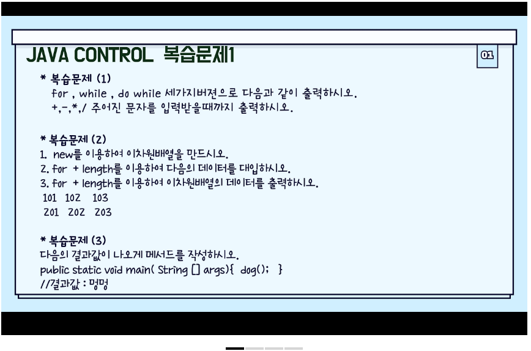
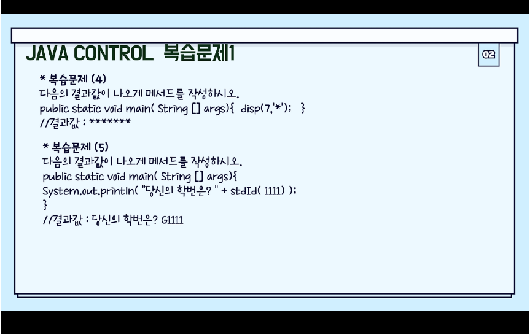
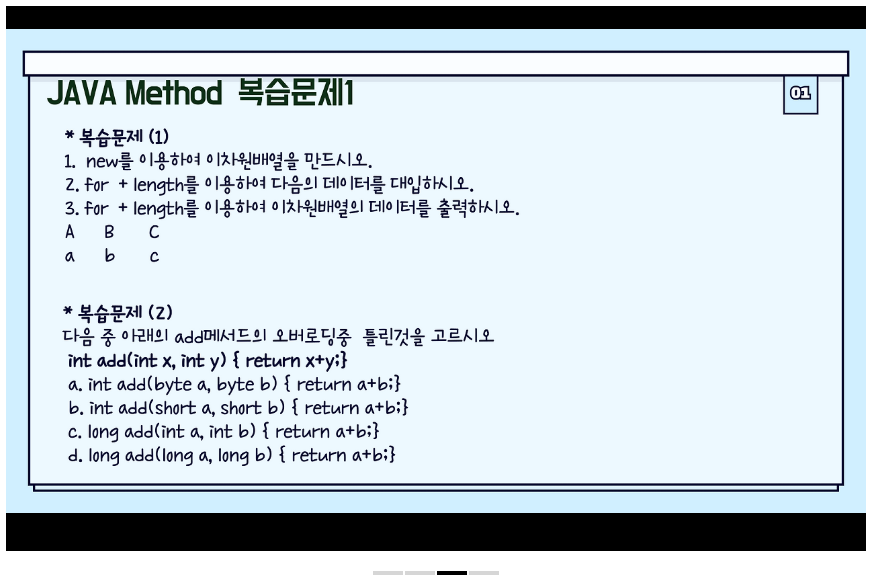
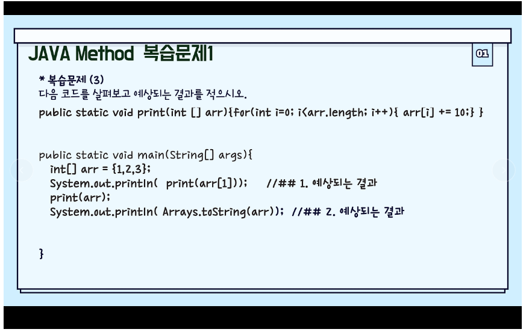

금일메모


복습내용




```

```


```
(2)

package com.company.test;

import java.util.Arrays;

public class test_0919_array {
	public static void dog () {System.out.println("멍멍");}
	public static void main(String[] args) {
		
		int [][]num = new int[2][3];
		int data = 100;
		for (int i = 0; i<num.length; i++) {
			for (int j = 0; j<num[i].length; j++) {
				
				num[i][j] += ++data; 
				
				System.out.print(j==2 ? num[i][j] + "\n" : num[i][j] + "\t");
			}
			data += 97;
		}
		
//		System.out.println(Arrays.deepToString(num));
		dog();
		
	}

}

```

주의해야할 점은 진입할 때 while 은 조건에 만족에 버리면 애초에 진입을 하지않기 때문에 초기값이 중요하다.

```
teacher

	System.out.println("\n\n1. for(2)");
		ch= ' ';
		for(; !(ch== '+' || ch== '-' || ch== '*' || ch== '/');) {
			System.out.print("+,-,*,/를 입력해주세요.");
			ch = sc.next().charAt(0);
			
		}
```

for 문에 조건식을 활용한 버전




```
package com.company.test;


public class test_0919_control {
	
	public static String stdId(int num2) { return "G"+num2;}
	public static void disp(int num, char ch) {for (int i = 1; i <= num; i++ ) {System.out.print(ch);}
		}
	public static void main(String[] args) {
		
		disp(7,'*');
		System.out.println();
		System.out.println("당신의 학번은?" + stdId (1111));
	}
	
	

}

```







5. 선택자

document.getElementById("아이디명")

1. 깃허브에 docs 폴더만들기.
2. 레파짓토리 Settings 에가서 page 설정
3. docs 에 index.html 파일올리기
4. 자기소개 페이지

>https://suda77881.github.io/fullstack_junyong

https://사용자이름.github.io/레파지토리이름


5. Contact Me
https://www.emailjs.com/


```

// emailjs 에서 가입하고 정보가져와야함

<section class="contact my-3">
    <div class="container bg-black" style="display:flex; flex-direction:column; ">
      <h3 class="text-center my-5">Contact Me</h3>
      <br /><br />
      <p style="text-align:center;">dev sjy에게 문의주세요!</p>
        <script type="text/javascript"
        src="https://cdn.jsdelivr.net/npm/@emailjs/browser@4/dist/email.min.js">
    </script>
    <script type="text/javascript">             /// 시작 퍼블릭키 부분
    (function(){
        emailjs.init({
            publicKey: "lOF9IcL65wkmHCwvG",
        });
    })();
    ////////////////////////////////
    function sendEmail( e ){                            // 브라우저 스크립트
        e.preventDefault(); // 무조건 전송기능 막기
        var templateParams = {
            name: document.getElementById("name").value,
            email: document.getElementById("email").value,
            title: document.getElementById("title").value,
            message: document.getElementById("message").value ,
        };

        emailjs.send('abre2e2', 'template_rf2q3db', templateParams ).then(  //  이부분 변경 
        (response) => {
            alert("메일 성공적으로 전송되었습니다.")
            console.log('SUCCESS!', response.status, response.text);
        },
        (error) => {
            alert("메일 전송에 실패했습니다.")
            console.log('FAILED...', error);
        },
        );
        }

    </script>

    <form onsubmit="sendEmail(event)">
      
      //// id, name, type 값에 주의해야함

        <div class="mb-3 mt-3">
          <label for="title" class="form-label">name:</label>
          <input type="text" class="form-control" id="name" 
                 placeholder="이름을 적어주세요!" name="name">
        </div>
        <div class="mb-3 mt-3">
          <label for="title" class="form-label">email:</label>
          <input type="email" class="form-control" id="email" 
                 placeholder="이메일을 적어주세요!" name="email">
        </div>
        <div class="mb-3 mt-3">
          <label for="title" class="form-label">제목:</label>
          <input type="text" class="form-control" id="title" 
                 placeholder="제목을 적어주세요!" name="title">
        </div>
        <div class="mb-3">
          <label for="message">Comments:</label> // email 로 
          <textarea class="form-control" rows="5" id="message" name="message"></textarea>
        </div>
        <div class="mb-3 text-end"> </div>
        <button type="submit" class="btn btn-primary mb-2">메일보내기</button>
      </form>
    </div>

  </section><!-- contact end -->


  ```


  자바스크립트 이메일 전송 파트