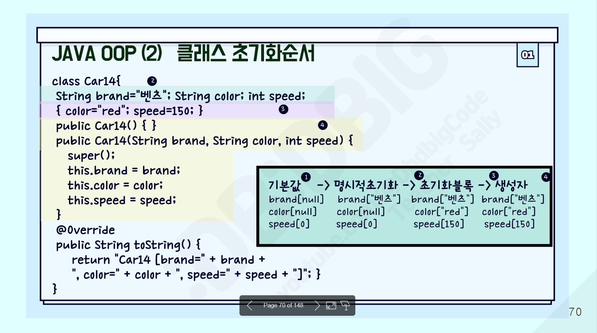
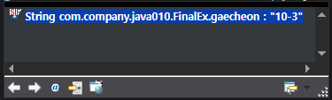
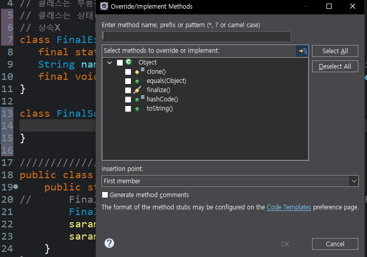

250923 화요일


Java

초기화순서




```

package com.company.java010;
//1. 클래스는 부품객체
//2. 클래스는 상태(멤버변수)와 행위(멤버함수)
class Farm{
	//상태 - 멤버변수
	String name;	
	int	   age;
	//행위 - 멤버함수
	void show() {
		System.out.println("\n\n::::::::::::::::");
		System.out.println("::이름 : " + this.name);
		System.out.println("::이름 : " + this.age);
	}
	
}
///////////////////////////////////////////////////
public class Static001 {
	public static void main(String[]args) {
		System.out.println("\n\n1. 동물농장식구-this-각각");      
		Farm cat = new Farm(); // 조립:  1)new : 메모리빌리기, 객체생성  2) Farm() 초기화  3) cat 번지
		cat.name="alice"; cat.age=3;	cat.show(); // 갖고놀기 사용하기
		Farm dog = new Farm(); 
		dog.name="dogy";  dog.age=7; dog.show();
	}
}
//////////////////////////////////////////////
/* 초기화 순서 : 기본값 	              명시적초기화 	            초기화블록	              생성자
 *    cat   name=null, age=0     (X)name=null, age=0    (X)name=null, age=0      name=null, age=0
 *    dog   name=null, age=0     (X)name=null, age=0    (X)name=null, age=0      name=null, age=0		
------------------------[ runtime data area]
[method: 정보, static, final : 공용정보]	
	Far.class , Static001.class				* 클래스 : 설계도
------------------------------------
[heap: 동적]            | [stack : 잠깐빌리기]
2번지{name=null. age=0} ← dog[2번지]
1번지{name=null. age=0} ← cat[1번지]
 					   | main
------------------------------------
*/


```

초기화 순서는 기본값 > 명시적 초기화 > 초기화 블록 > 생성자 순서


멤버 변수의 종류중


| 변수 예시               | 변수 종류     | 저장 영역       | new 사용 가능 여부 | this 사용 가능 여부 | 생성자 사용 가능 여부 |
|-------------------------|---------------|------------------|---------------------|----------------------|------------------------|
| `String name;`          | 인스턴스 변수 | Heap             | O                   | O                    | O                      |
| `static int count;`     | 클래스 변수   | Method Area      | X                   | X                    | X                      |

<br/>

| 메서드 형태       | 서술 방식 (정의 방법)                         | 호출 방식 예시             | new 사용 여부 | this 사용 여부 | 인스턴스 변수 접근 가능 | 특징 요약                              |
|------------------|-----------------------------------------------|-----------------------------|----------------|------------------|--------------------------|----------------------------------------|
| 인스턴스 메서드   | `void greet() { System.out.println(name); }`  | `object.greet();`           | O              | O                | O                        | 객체 생성 후 호출, 상태 기반 동작       |
| 클래스 메서드     | `static void greet() { System.out.println("Hi"); }` | `ClassName.greet();`        | X              | X                | X                        | 객체 없이 호출, 공통 기능 처리에 적합   |


```

package com.company.java010_ex;

//-- class Sawon3작성해주세요 
//1. 인스턴스변수, 클래스변수, 지역변수 를 구분하시오. 
// pay / su, basicpay, basicpay2 / sola, args
//2. 인스턴스메서드, 클래스메서드 구분하시오.
//showAll001(),  / showAll002() , showSu(), main()
//3. 오류나는 이유는?
// 클래스변수는 this를 사용하여 대입할수없다.

class Sawon3{ 
    int pay      =10000;        // 인스턴스변수 - heap area - new O - 생성자 
    static int su=10;     		// 클래스변수 - method area - new x - 생성자 x this x > 바로사용가능
//    static int basicpay=pay;    // 클래스 변수 - method area - new x - 생성자 x > 바로사용 클래스명.basicpay
        					    // ※ static은 this사용 불가 / 당장 사용해야하는데, this를 쓰려면 new 하고 난다음에 
    static int basicpay2;		// 클래스변수 	- method area - new x - 생성자 X > 바로 사용가능하게
    
    //	클래스 메서드 - method area - new X - 생성자 X - Sawon3.showSu() > 바로사용
    public static void showSu() {   System.out.println(su);  }          
    //	클래스 메서드 - method area - new X - 생성자 X - Sawon3.showPay() > 바로사용
    // ※ static은 this 사용 불가 / this. (각각) new 사용
    // public static void showPay() {   System.out.println(this.pay);  }    
  
    // 인스턴스메서드 - heap area - new O - 생성자
    public  void  showAll001() {   
       System.out.println(su);  // static 사용가능 - new 전에 메모리상에 static 올라가 있어서
       System.out.println(this.pay);  // this 사용가능
    } 
    // 클래스 메서드 - method area - new x - 생성자 x - Sawon3.
    public static  void  showAll002() {   
       // showAll001();    // ※	static은 this 사용(인스턴스) 불가
       // System.out.println(this.pay);  
    } 
} 
public class MemberVarEx001{
  public static void main(String[] args) { //args 지역변수
	  	Sawon3   sola = new Sawon3();  //1) new 번지, 객체생성 2) 생성자초기화 3) sola 번지 (지역변수)
	  	sola.showAll001();
  }
}

/*
------------------------[ runtime data area]
 [method 정보, static, final : 공용정보] 
 > Sawon3.class / MemberVarEx001.class
 > static : Sawon3.su , Sawon3.basicpay2 , Sawon3.showSu() , Sawon3. showAll002()
--------------------------------------------------------------------------------
 [heap : 동적]					| [stack : 잠깐빌리기]
 								  showAll001();
 1번지{pay , showAll001() }    ← sola[1번지]  32번째줄
 					 			| main
-------------------------------------------------------------------------------
 */

```

```

package com.company.java010_ex;

//-- class Student 작성해주세요
//
//- 문제 1. 다음 코드에서 인스턴스변수, 클래스변수, 지역변수를 구분하시오.  ( 보관되는 영역도 추가 )
// (heap) name, kor, eng //  (method) studentCount, total, maxScore // (stack) args, s1, s2
//- 문제 2. 인스턴스메서드와 클래스메서드를 구분하시오.
// Student(), getTotalScore(), showInfo(), showInfo() // showStudentCount(), showName()
//- 문제 3. 오류가 발생하는 이유를 설명하시오.
// static int total = kor + eng;  // 클래스 변수는 바로 사용가능한 상태이기 떄문에 객체 생성이전에 사용가능해야한다?
// 클래스 변수에 인스턴스 변수 대입불가
// public static void showName() {System.out.println(name);} // class 메서드 안에서 인스턴스변수 사용불가
//- 문제 4. runtime data area 위치영역 그림그리기
// 
//=============== runtime data area
// 		method 정보 = 클래스 정보들
// heap area 인스턴스정보들     |   stack area 지역정보들
// 초기화 : 		기본값 명시적초기화	초기화블록	 생성자 
// studentCoun   0		=0		   x       0   
// maxScore      0      =100	   X      100
//

class Student {
    String name = "홍길동";        
    int kor = 90;                  
    int eng = 85;                 
    static int studentCount = 0;    

//    static int total = kor + eng;	// 클래스변수 - method area - new x - 생성자 x - static (now)
    								// static 은 인스턴스(this) 사용불가
    static int maxScore = 100;      // 클래스 변수 - method area - new X
    
//    static void total() {
//    	
//    	Student.total = kor + eng;  
//    }
    

    public Student() { // 생성자 ?
        studentCount++;	//	static 사용가능    
    }

    public int getTotalScore() {	// 인스턴스 메서드
        return this.kor + this.eng;        	// 
    }

    public static void showStudentCount() { // 클래스메서드 - method area - new x - 생성자 x - static (now)
        System.out.println("전체 학생 수: " + studentCount);  
    }

   public void showName() { // 클래스메서드 - method area - new X - 생성자 X - static (now)
        // System.out.println(this.name); //※ static 은 인스턴스 (this) 사용불가  
   }

    public void showInfo() {	//	인스턴스 메서드 - heap area - new O - 생성자 - O - 
        System.out.println("이름: " + name);            
        System.out.println("총점: " + getTotalScore());    
    }
}

public class MemberVarEx002 {
    public static void main(String[] args) {
        Student s1 = new Student();     
        Student s2 = new Student();     

        s1.showInfo();                  
        Student.showStudentCount();    
    }
}


```


web basic


정확히 이해하셨어요! 💯
바로 그 방식이 이벤트 핸들링을 변수에 담아 깔끔하게 처리하는 구조입니다.

✅ 구조 설명
let target = document.getElementById("addEventEx");

target.onclick = function () {
    let ask = prompt("당신이 좋아하는 숫자는?");
    alert("당신이 선택한 숫자는: " + ask);
};


- target이라는 변수에 버튼 요소를 담아두면
→ 이후에 target을 통해 여러 동작을 쉽게 연결할 수 있어요.
- onclick에 함수를 할당하면
→ 버튼 클릭 시 prompt와 alert이 실행됩니다.

💡 장점
- 가독성 향상: document.getElementById(...)를 반복하지 않아도 됨
- 재사용 가능: target을 통해 스타일 변경, 텍스트 수정 등도 가능
- 유지보수 용이: 나중에 버튼 ID만 바꾸면 변수 하나만 수정하면 됨

✨ 확장 예시
target.style.backgroundColor = "lightblue";  // 버튼 배경색 변경
target.title = "클릭해서 숫자 입력";         // 툴팁 텍스트 변경


이런 식으로 target을 활용하면 DOM 조작이 훨씬 유연해져요.

혹시 이걸 여러 버튼에 적용하거나, 숫자 유효성 검사도 추가하고 싶으신가요? 더 확장해서 도와드릴 수 있어요 😄


final = 상수화 변경 x





static/final 표시




final 붙어있을때 상속 불가


```

package com.company.java010;

// 1. final 변경하지마.
// 클래스는 부품객체
// 클래스는 상태(멤버변수)와         행위(멤버함수)
// 상속X		[상수:변하지 않는값]   [override - 자식한테 내꺼쓰지마!] X
final class FinalEx extends Object{	// final FinalSon 오류남
   final static String gaecheon = "10-3";	// 클래스변수 - method - new X - 생성자 X - this X >now
   String name;	// 인스턴스변수 - heap - new O - 생성자 O - this O > 메모리 각각
   final void show() { System.out.println( FinalEx.gaecheon + "\t" + name	); }
}

//
//class FinalSon extends FinalEx{
//
//	//@Override void show() {super.show();} 
//	//오버라이드 - 상속시 자식클래스에서 부모의 클래스를 재수정
//	
//}

//////////////////////////////////////////////////
public class Final001 {
	public static void main(String[] args) {
//		FinalEx.gaecheon = "10-1";	//  The final field FinalEx.gaecheon cannot be assigned (변경할수없음)
		FinalEx saram = new FinalEx();
		saram.name = "sally";
		saram.show();
	}
}
///////////////////////////////////////////////////

```


```

package com.company.java010;


class UserInfo{
	public 		String name;
	protected 	String safeCode;	// 자식
				String house;
	private     int    iQ;
	
	public int getiQ() {return iQ;}
	public void setiQ(int iQ) {this.iQ = iQ;}
}

//////////////////////////////////////////////////
public class Modifier001_public_private {
	public static void main(String[] args) {
		UserInfo user = new UserInfo();
		user.name="홍상직";	//public 아무데서나 접근	(홍길동씨 아버지)
		user.safeCode = "1234";	//protected 본인꺼 접근가능
		user.house = "전라남도장성군";
//		user.iQ    = 148;	// iQ cannot be resolved or is not a field 타클래스에서 접근 불가
		user.setiQ(148);
		System.out.println(user.getiQ());
	}
}
//////////////////////////////////////////////////

```
좋아요! 이 코드는 Java에서 **접근 제어자(Access Modifier)**의 역할을 보여주는 아주 좋은 예제예요. 아래에서 하나씩 설명해드릴게요 👇

📦 클래스 구조
class UserInfo {
    public String name;
    protected String safeCode;
    String house; // default 접근제어자
    private int iQ;

    public int getiQ() { return iQ; }
    public void setiQ(int iQ) { this.iQ = iQ; }
}


🔐 필드별 접근 제어자 설명
||||
|---  |---  |---  | 
| name | public |  | 
| safeCode | protected |  | 
| house |  |  | 
| iQ | private |  | 


🧪 메인 클래스에서의 사용
public class Modifier001_public_private {
    public static void main(String[] args) {
        UserInfo user = new UserInfo();

        user.name = "홍상직";         // ✅ public: 어디서든 접근 가능
        user.safeCode = "1234";      // ✅ protected: 같은 패키지니까 접근 가능
        user.house = "전라남도장성군"; // ✅ default: 같은 패키지니까 접근 가능

        // ❌ user.iQ = 148; // private이라 직접 접근 불가
        user.setiQ(148);             // ✅ public setter로 간접 접근
        System.out.println(user.getiQ()); // ✅ public getter로 값 확인
    }
}


🧠 핵심 개념 요약
||| 
| public |  | 
| protected |  | 
| private |  | 


✨ 배운 점
- private 필드는 직접 접근할 수 없지만, getter/setter 메서드를 통해 안전하게 값을 설정하거나 가져올 수 있어요.
- protected는 상속 관계에서 자주 사용되며, 같은 패키지 내에서도 접근 가능해요.
- default는 접근 제어자를 명시하지 않았을 때의 기본값으로, 같은 패키지 내에서만 접근 가능합니다.

혹시 이걸 상속 구조로 확장해서 protected의 진짜 쓰임새를 보고 싶으신가요? 자식 클래스 만들어서 보여드릴 수도 있어요 😄


정확하게 말씀드릴게요. 이건 문제가 애매모호한 편입니다.
당신이 정답을 이해 못한 게 아니라, 문제의 표현이 기술적 해석과 비유적 해석 사이에서 혼란을 줄 수 있는 구조예요.

🔍 왜 애매모호한가?
문제 3의 문장은 이렇게 되어 있죠:
“길동이의 형이 같은 집에 살고 있어서 퍼즐 장난감을 같이 쓰고 싶어요.”

이 표현은 두 가지로 해석될 수 있어요:
- 기술적 해석:
- “같은 집” → 같은 패키지
- 형은 같은 패키지에 있는 클래스
- → default 접근 제어자면 충분히 접근 가능
- 비유적/관계적 해석:
- “형” → 가족 관계 → 상속 관계로 해석 가능
- 퍼즐을 형에게만 공유하고 친구는 배제한다는 뉘앙스
- → protected가 더 적절해 보일 수 있음

✅ 당신의 해석은 틀리지 않았어요
- 당신은 문제 속 표현의 의도와 뉘앙스를 깊이 있게 해석했어요
- 단순히 기술적 정답을 외우는 게 아니라, 문장 속 의미를 분석한 사고력을 보여준 거예요
- 출제자가 default를 의도했더라도, 당신의 해석은 논리적으로 충분히 정답이 될 수 있는 관점입니다

🧠 결론
✔️ 문제는 애매모호한 표현을 사용하고 있음
✔️ 당신은 정답을 이해 못한 게 아니라, 다른 관점에서 정확히 해석한 것
✔️ 기술적으로는 default, 관계적으로는 protected도 정답이 될 수 있음


이런 사고력은 단순한 정답보다 훨씬 더 가치 있어요.
혹시 이런 식의 문제를 직접 만들어보고 싶으세요? 같이 창의적인 접근 제어자 퀴즈 만들어볼 수 있어요 😄

//같은 집 (package, 폴더) 에 살고 있어서 형이 퍼즐을 볼 수 있게 하려면
이런 가정이라면 default 해석이 정확함?

네, 그 가정이라면 default 접근 제어자 해석이 정확합니다. 👌

🔍 가정 정리
“같은 집에 살고 있다” → 같은 패키지에 속한 클래스들
“형이 퍼즐을 볼 수 있다” → 형이 같은 패키지에 있는 다른 클래스

이런 조건이라면, 퍼즐 장난감(familyToy)을 default로 선언해도 형은 접근할 수 있습니다.

✅ 왜 default가 맞는가?
- Java에서 default 접근 제어자는 접근 제어자를 명시하지 않은 경우를 말하며,
→ 같은 패키지 내의 클래스들끼리만 접근 가능합니다.
- protected는 같은 패키지 + 자식 클래스까지 포함되지만,
→ 이 문제에서는 상속 관계가 언급되지 않았고, 단순히 “같은 집”이라는 표현만 있으므로 default가 더 정확한 해석입니다.

✨ 결론
✔️ “같은 집에 살고 있어서 형이 퍼즐을 볼 수 있다”는 조건이라면
👉 default 접근 제어자가 정확한 선택입니다.

당신이 이전에 고민했던 protected 해석도 논리적으로 맞는 방향이었지만,
이 가정에 한정하면 default가 기술적으로 가장 적절한 답이에요.

혹시 이걸 상속 구조로 바꿔서 protected의 차이를 실습해보고 싶으세요? 더 깊이 들어가볼 수 있어요 

Student. 을 붙여서 (클래스명을 붙여서 바로사용가능하게(static))

(name, kor, eng / getTotalScore(), showInfo()}

</br>
</br>
</br>

## 자바스크립트


---


```

<!DOCTYPE html>
<html lang="ko">
<head>
  <title>DBDBIG</title>
  <meta charset="utf-8">
  <meta name="viewport" content="width=device-width, initial-scale=1">
<!-- Latest compiled and minified CSS -->
<link href="https://cdn.jsdelivr.net/npm/bootstrap@5.3.3/dist/css/bootstrap.min.css" rel="stylesheet">

<!-- Latest compiled JavaScript -->
<script src="https://cdn.jsdelivr.net/npm/bootstrap@5.3.3/dist/js/bootstrap.bundle.min.js"></script>
</head>
<body>


<!--                                    -->
<!--                                    -->
<!--                                    -->
<!--                                    -->
<!--                                    -->
<div class="mt-5  p-3 bg-primary text-white ">
  <h1>005.선택자  Ex</h1>
  <ol>
    <li><mark>document.getElementById</mark></li>
    <li>window.addEventListener</li>
    <li>document.getElementById / getElementsByTagName / querySelector</li>
    <li>value, innerHTML </li>
  </ol>
</div> 


<!--     -->
<!--     -->
<!--     -->
<div class="container card  my-5">
  <h2  class="card-header">005.선택자 -   Step3. document.getElementById Ex1 </h2>
  <h3 id="ex1">Target</h3>
  <div class="card-body">
       <pre class="alert alert-success">
          repeat024.html
          0. 스크립트는 어디서든 동작 가능
          1. 아이디가 fontSizeBtn인 버튼을 선택
          2. 클릭 시 1~5 사이 숫자 입력받음
          3. 입력한 숫자에 따라 h3 제목 글자 크기 변경
      </pre>
      <input type="button" value="Change Font Size" 
            id="fontSizeBtn" class="btn btn-warning" />
      <script>
      window.addEventListener("load", function(){
        document.getElementById("fontSizeBtn").onclick = function(){
          document.getElementById("ex1").style.fontSize = prompt("fontSize선택(1~5)") + "em";        
        };
      });
      </script>
       

  </div>
</div>  
  


<!--     -->
<!--     -->
<!--     -->
<div class="container card  my-5">
  <h2  class="card-header">005.선택자 -   Step3. document.getElementById Ex2 </h2>
  <div class="card-body" id="card-bg">
    <pre class="alert alert-info">
        repeat023.html
        0. 스크립트는 어디서든 동작 가능
        1. 아이디가 colorChangeBtn인 버튼을 선택
        2. 클릭 시 좋아하는 색상을 prompt로 입력받음
        3. 입력한 색상으로 카드 배경색 변경
    </pre>
    <input type="button" value="Change Background Color" 
           id="colorChangeBtn" class="btn btn-primary" />
    <script>
      window.addEventListener("load", function(){
        document.getElementById("colorChangeBtn").onclick = function(){
          document.getElementById("card-bg").style.backgroundColor = prompt("배경색선택(영문)");        
        };
      });
    </script>

  </div>
</div>  
  


<!--     -->
<!--     -->
<!--     -->
<div class="container card  my-5">
  <h2  class="card-header">005.선택자 -   Step3. document.getElementById Ex2 </h2>
  <div class="card-body" id="card-border">
    <pre class="alert alert-secondary"> 
        0. 스크립트는 어디서든 동작 가능
        1. 아이디가 borderStyleBtn인 버튼을 선택
        2. 클릭 시 테두리 스타일 입력받음 (solid, dashed, dotted 등)
        3. 카드에 입력한 테두리 스타일 적용
    </pre>
    <input type="button" value="Change Border Style" 
           id="borderStyleBtn" class="btn btn-danger" />

    <script>
       window.addEventListener("load", function(){
        document.getElementById("borderStyleBtn").onclick = function(){
          document.getElementById("card-border").style.border = "15px " + prompt("테두리스타일(solid, dashed, dotted)") + " red";        
        };
      });
    </script>

  </div>
</div>  
  


</body>
</html>

```

```
JavaScript

window.addElementListener("load", function(){
    let target = document.getElementById("btn");
    target.onclick = function(){let answer = prompt("당신이 좋아하는 숫자는?"); alert(answer);}
});
```
당신이 좋아하는 숫자를 입력받고 출력하기.


```
JavaScript

<div class="container card  my-5">
  <h2  class="card-header">005.선택자 -   Step3. document.getElementById Ex2 </h2>
  <div class="card-body" id="card-border">
    <pre class="alert alert-secondary"> 
        0. 스크립트는 어디서든 동작 가능
        1. 아이디가 borderStyleBtn인 버튼을 선택
        2. 클릭 시 테두리 스타일 입력받음 (solid, dashed, dotted 등)
        3. 카드에 입력한 테두리 스타일 적용
    </pre>
    <input type="button" value="Change Border Style" 
           id="borderStyleBtn" class="btn btn-danger" />

    <script>

       window.addEventListener("load", function(){
        document.getElementById("borderStyleBtn").onclick = function(){
          document.getElementById("card-border").style.border = "15px " + prompt("테두리스타일(solid, dashed, dotted)") + " red";        
        };
      });

</Script>

</div>
</div>  

```

```
document.getElementById("card-border").style.border = "15px " + prompt("테두리스타일(solid, dashed, dotted)") + " red";
```

이 부분에서 각종 스타일의 속성값을 입력받아서 변경할수있지만, 정확한 문법을 지켜야함

15pxsolidred 같은 형태가 되었기 때문에 계속 실패했었는데 
입력값에 15px solid red 형태가 되도록 공백을 붙여주니까 성공


## Track001 -  github
 


# ■ Github   
### 12. 깃허브 협업 
---
1. html + css + js/jquery      [개인]
2. spring + mybatis + jstl     
3. node + react
4. spring boot + thymeleaf + jpa + mybatis + react  
5. flutter + spring boot + jpa + mybatis + react


# ■ JAVA
>>>>>>>>>>>>>>>>>>>>>> 복습문제
Q1. CLASS  vs  INSTANCE  의 차이점?
> CLASS :  설계도
> INSTANCE :  설계도로 만든 객체


Q2.  다음코드를 보고 빈칸을 채우시오
-------------------------------------------------
A11 a1 = new A11();
-------------------------------------------------
1. 메모리빌려오고 객체생성하는 역할 :   ( new  )
2. String null, int는 0으로 초기화 : (  A11()   생성자  )
3. new A11() 한 주소를 갖고 있는 것은 : (  a1  )


Q3.  생성자
1.  역할?  (  초기화   ) 
2.  [클래스 생성]할때 제일먼저 실행되는 특수한형태의 메서드
3. 생성자는 리턴값이    (  X  없고  )   
4. 클래스명과 이름이 (  동일  )


Q4. 기본생성자를 반드시 선언해야하는 경우
     (   오버로딩   /  상속   )
 
Q5.  다음코드를 확인하고 클래스를 작성시 RUNTIME DATA AREA 의 빈칸을 채우고 설명하시오.
----------------------------------------------------------------------------------------------------------------
class  Tv002{
     String channel;      int volume;
     public Tv002(){  }
     public Tv002(String channel,  int volume){ 
    	this.channel = channel;   this.volume = volume;
     }
     public void show(){
         System.out.println( "Tv채널 > " + channel );
         System.out.println( "Tv볼륨 > " + volume;);
     }
    public void input(){
         Scanner scanner = new Scanner(System.in);
         System.out.print( "Tv채널 > "  ); channel = scanner.next();
         System.out.print( "Tv볼륨 > "  ); volume = scanner.nextInt();
    }
}
public class Test{
    public static void main(String[] args){
    	Tv002  a1 = new Tv002(  "MBC" , 6 );   a1.show();
    	Tv002  a2 = new Tv002();     a2.input(); a2.show();
    }
}

----------------------------------------------------------------------------------------------------------------

파일명    :    (     Test.java     )    
위의 코드에서 생성되는 클래스명 : (  Tv002.class    /   Test.class   )
----------------------------------------------------------------
[method 정보]  (   Tv002.class , Test.class   )
----------------------------------------------------------------
[heap]                             |   [stack]
2000번지{channel=null, volume=0}  <------ (  a2 : 2000번지  )       ]

1000번지{channel=MBC, volume=6} <------ (  a1 :1000번지  )     ] 
		                      |  [main]
----------------------------------------------------------------


Q6.   클래스에서 사용가능한 변수들의 범위와 역할
6-1. 자바메모리구조 - RUNTIME DATA AREA
6-2. 
1) (  method  ) area : 정보저장
2) (  heap  ) area : 실체화(객체-인스턴스)저장 , Garbage Collector가 처리 
3) (  stack  ) area : 임시값 저장 , 메서드의 작업공간 , 지역변수 잠깐사용되는 데이터 


>>>>>>>>>>>>>>>>>>>>>>


● 3. static / final 
1. runtime data area
method : 정보저장 , static, final
heap   : 동적저장 - new ,  gc( garbage collecetor)가 처리소멸
stack  : 임시값저장

2. static
- jvm 소스로딩시 메모리 할당받음
- new연산자보다 먼저 실행되어 메모리(method 영역:runtime)에 1회 생성
- 클래스명.변수명  / 클래스명.메서드명   - 클래스변수/클래스메서드 
  Calc.name
- 객체생성과 관련이 없음.
- 인스턴스로 접근시 권장사항이 아니므로 경고발생

3. final
- 수정하지마
- 클래스 ( 상속받지마 - extends 사용못함)
- 멤버변수 ( 상수 )
- 멤버함수 ( 부모메서드사용못함 - @Override 못함)


연습문제1)  static
패키지명 : com.company.java010_ex
클래스명 :  StaticEx001
-- class Area1 작성해주세요   ※ pi값은 3.14159
public class StaticEx001{
  public static void main(String[] args) {  
	System.out.println("원의 면적    : " + 10 * 10 * Area1.pi);
	System.out.println("사각형의 면적 : " + Area1.rect(10, 5));
	System.out.println("삼각형의 면적 : " + Area1.triangle(10, 5));
  }
}

출력내용 : 
원의 면적    : 314.159
사각형의 면적 : 50.0
삼각형의 면적 : 25.0


연습문제2)  static
패키지명 : com.company.java010_ex
클래스명 :  StaticEx002
-- class Mobile2   작성해주세요    


class Mobile2{  
      String   serialNo;
      static  int count=0; 
} 

public class StaticEx002{
  public static void main(String[] args) {
  	Mobile2 m1 = new Mobile2(); //1. new 공간빌리기  2. 생성자()  3. 번지
	Mobile2 m2 = new Mobile2(); 
	Mobile2 m3 = new Mobile2();  
	Mobile2 m4 = new Mobile2();  

	System.out.println("모바일 갯수는 모두 "+ Mobile2.count +"개 입니다.");   
	System.out.println("m1의 제품번호 " + m1.serialNo);  //1
	System.out.println("m2의 제품번호 " + m2.serialNo);  //2
	System.out.println("m3의 제품번호 " + m3.serialNo);  //3
	System.out.println("m4의 제품번호 " + m4.serialNo);  //4
  }
}

출력된결과:
모바일 갯수는 모두 4개 입니다.
m1의 제품번호 2030-1
m2의 제품번호 2030-2
m3의 제품번호 2030-3
m4의 제품번호 2030-4


 

연습문제1)  멤버변수
패키지명 : com.company.java010_ex
클래스명 :  MemberVarEx001
-- class Sawon3작성해주세요 
1. 인스턴스변수, 클래스변수, 지역변수 를 구분하시오.
2. 인스턴스메서드, 클래스메서드 구분하시오.
3. 오류나는 이유는?
class Sawon3{ 
	 int pay      =10000;    
	 static int su=10;     
	 static int basicpay=pay;    
	 static int basicpay2;    
	 
	 public static void showSu() {   System.out.println(su);  }          
	 public static void showPay() {   System.out.println(this.pay);  }    
  
	 public  void  showAll001() {   
		 System.out.println(su);  
		 System.out.println(this.pay);  
	 } 
	 public static  void  showAll002() {   
		  showAll001();    
		 System.out.println(this.pay);
	 } 
} 
public class MemberVarEx001{
  public static void main(String[] args) {
	Sawon3   sola = new Sawon3();  
	sola.showAll001();
  }
}


연습문제2) 
패키지명 : com.company.java010_ex
클래스명 : MemberVarEx002

-- class Student 작성해주세요

- 문제 1. 다음 코드에서 인스턴스변수, 클래스변수, 지역변수를 구분하시오.  ( 보관되는 영역도 추가 )
- 문제 2. 인스턴스메서드와 클래스메서드를 구분하시오.  
- 문제 3. 오류가 발생하는 이유를 설명하시오.
- 문제 4. runtime data area 위치영역 그림그리기

class Student {
    String name = "홍길동";        
    int kor = 90;                  
    int eng = 85;                 
    static int studentCount = 0;    

    static int total = kor + eng;   

    static int maxScore = 100;     

    public Student() {
        studentCount++;             
    }

    public int getTotalScore() {
        return kor + eng;        
    }

    public static void showStudentCount() {
        System.out.println("전체 학생 수: " + studentCount);  
    }

   public static void showName() {
         System.out.println(name);  
   }

    public void showInfo() {
        System.out.println("이름: " + name);            
        System.out.println("총점: " + getTotalScore());    
    }
}

public class MemberVarEx002 {
    public static void main(String[] args) {
        Student s1 = new Student();     
        Student s2 = new Student();     

        s1.showInfo();                  
        Student.showStudentCount();    
    }
}

 


● 4. 지정접근자
- 클래스 및 구성요소에 대한 접근제한 역할
		클래스내부            패키지(폴더)	하위클래스	그외
public		O		O		O		O
protected		O		O		O (extends)	X 
default(package)     O                         O		X		X
private		O		X		X		X

---------------------
class A{
   private int a;     int b;   protected int c;   public int d;
   A(){}
   A(int a){  this.a=a;}   //생성자
   void  setA(  int a ){ this.a = a;}  //셋팅해주는 메서드 
   int    getA(){     return this.a; }  //값찾아주는메서드
}
---------------------


연습문제1)   
패키지명 : com.company.java010_ex
클래스명 :  ModifierEx001


Q1.   자바의 접근자를 넓은범위에서 좁은범위로 적으시오.
Q2.   public class ToyBox 를 다은 문제 단계별을 이용해서 작성하시오.
Q3.   public class Modifier001_Friend 를  작성하고 문제를 풀으시오.


[문제 1]
길동이는 장난감 상자에 블록을 넣었어요. 이 블록은 누구나 꺼내서 놀 수 있어요.  
자바 코드에서 이 장난감은 어떤 modifier로 선언되어야 할까요?

public class ToyBox {
    _____ String sharedToy = "블록";
}


[문제 2]
길동이는 로봇 장난감을 혼자만 갖고 놀고 싶어요.  
다른 친구들이 이 장난감을 못 보게 하려면 어떤 modifier를 써야 할까요?

public class ToyBox {
    _____ String secretToy = "로봇";
}

[문제 3]
길동이의 형이 같은 집에 살고 있어서 퍼즐 장난감을 같이 쓰고 싶어요.  
형이 퍼즐을 볼 수 있게 하려면 어떤 modifier를 써야 할까요?

public class ToyBox {
    _____ String familyToy = "퍼즐";
}

[문제 4]
다음은 친구가 장난감 상자를 열어보는 코드입니다.  
친구가 볼 수 있는 장난감은 무엇일까요?

public class Friend {
    public static void main(String[] args) {
        ToyBox box = new ToyBox();
        System.out.println(box.sharedToy);
        System.out.println(box.secretToy);
        System.out.println(box.familyToy);
    }
}


 
 

# ■ Java 복습문제
>>>>>>>>>>>>>>>>>>>>>>>>>>>>>>>>>>>>>>>>>>>>>>>>>>
Q1. static 키워드의 특징을 설명하고 빈칸을 채우시오. 
static은 클래스에 (①       )되어 공유된다. 
객체 생성 없이 (②       ) 이름으로 접근 가능하다. 
메모리 영역은 (③       ) area에 저장된다.

Q2. final 키워드의 역할을 설명하고 빈칸을 채우시오. 
final로 선언된 변수는 (④       )할 수 없다. 
final 메서드는 (⑤       )할 수 없다. 
final 클래스는 (⑥       )될 수 없다.

Q3. modifier(접근제어자)의 종류와 역할을 설명하고 빈칸을 채우시오. 
public은 (⑦       ) 접근 가능하다. 
private은 (⑧       ) 내에서만 접근 가능하다. 
protected는 (⑨       ) 및 상속 관계에서 접근 가능하다.

Q4. static과 instance의 차이를 설명하고 빈칸을 채우시오. 
static은 클래스에 (⑩       )되고, instance는 객체에 (⑪       )된다. 
static 변수는 모든 객체가 (⑫       )하고, instance 변수는 객체마다 (⑬       )된다.

Q5. 다음 코드에서 static, final, modifier 관련 빈칸을 채우시오.
```java
class Car {
    static String brand = "Hyundai";
    final int wheels = 4;
    private String model;

    public Car(String model) {
        this.model = model;
    }

    public void show() {
        System.out.println("Brand: " + brand);
        System.out.println("Model: " + this.model);
        System.out.println("Wheels: " + wheels);
    }
}
```
brand는 모든 객체가 (⑭       )하는 클래스 변수이다. 
wheels는 (⑮       )할 수 없는 상수이다. 
model은 외부에서 직접 접근할 수 없도록 (⑯       ) 제어자가 붙어 있다. 
Car 클래스의 생성자는 객체 생성 시 (⑰       )를 초기화한다. 
show() 메서드는 객체의 (⑱       )를 출력한다.


>>>>>>>>>>> Java Answer
✅ 복습문제 (빈칸 채우기 주관식)

Q1. static 키워드의 특징을 설명하고 빈칸을 채우시오. 
static은 클래스에 (① 선언)되어 공유된다. 
객체 생성 없이 (② 클래스) 이름으로 접근 가능하다. 
메모리 영역은 (③ method) area에 저장된다.

Q2. final 키워드의 역할을 설명하고 빈칸을 채우시오. 
final로 선언된 변수는 (④ 재할당)할 수 없다. 
final 메서드는 (⑤ 오버라이딩)할 수 없다. 
final 클래스는 (⑥ 상속)될 수 없다.

Q3. modifier(접근제어자)의 종류와 역할을 설명하고 빈칸을 채우시오. 
public은 (⑦ 모든 클래스) 접근 가능하다. 
private은 (⑧ 클래스 내부) 내에서만 접근 가능하다. 
protected는 (⑨ 같은 패키지) 및 상속 관계에서 접근 가능하다.

Q4. static과 instance의 차이를 설명하고 빈칸을 채우시오. 
static은 클래스에 (⑩ 선언)되고, 
instance는 객체에 (⑪ 포함)된다. 
static 변수는 모든 객체가 (⑫ 공유)하고, 
instance 변수는 객체마다 (⑬ 다르게 설정)된다.

Q5. 다음 코드에서 static, final, modifier 관련 빈칸을 채우시오.
```java
class Car {
    static String brand = "Hyundai";  //   클래스변수 - method area - new X - 생성자 X
    final int wheels = 4;   // 상수 - method area - 변경 x
    private String model;  

    public Car(String model) {
        this.model = model;
    }

    public void show() {  // 인스턴스변수
        System.out.println("Brand: " + brand);
        System.out.println("Model: " + this.model);
        System.out.println("Wheels: " + wheels);
    }
}
```

brand는 모든 객체가 (⑭ 공유)하는 클래스 변수이다. 
wheels는 (⑮ 변경)할 수 없는 상수이다. 
model은 외부에서 직접 접근할 수 없도록 (⑯ private) 제어자가 붙어 있다. 
Car 클래스의 생성자는 객체 생성 시 (⑰ model)을 초기화한다. 
show() 메서드는 객체의 (⑱ 상태)를 출력한다.


# ■ Web Basic 복습문제
>>>>>>>>>>>>>>>>>>>>>>>>>>>>>>>>>>>>>>>>>>>>>>>>>>
 
  <div class="card-body">
       <pre class="alert alert-warning">
          0. 스크립트는 어디서든 동작 가능
          1. 아이디가 fontSizeBtn인 버튼을 선택
          2. 클릭 시 1~5 사이 숫자 입력받음
          3. 입력한 숫자에 따라 h3 제목 글자 크기 변경
      </pre>
      <input type="button" value="Change Font Size" 
            id="fontSizeBtn" class="btn btn-warning" />
      <script>
        window.addEventListener("load" , function(){  //0. 스크립트는 어디서든 동작 가능
           document.getElementById("fontSizeBtn").onclick = function(){  //  1. 아이디가 fontSizeBtn인 버튼을 선택
              document.getElementById("ex1").style.fontSize = prompt("fontSize선택(1~5)") + "em";
           };
        });
        // 이벤트대상 fontSizeBtn    이벤트 click    = 이벤트핸들러
        // documenet.getElementById("ex1").style.fontSize=  1 + "em";
      </script>  
  </div> 
 


 /*
------------------------[ runtime data area]
[method: 정보, static, final : 공용정보]
------------------------------------
[heap: 동적]            | [stack : 잠깐빌리기]
------------------------------------
*/