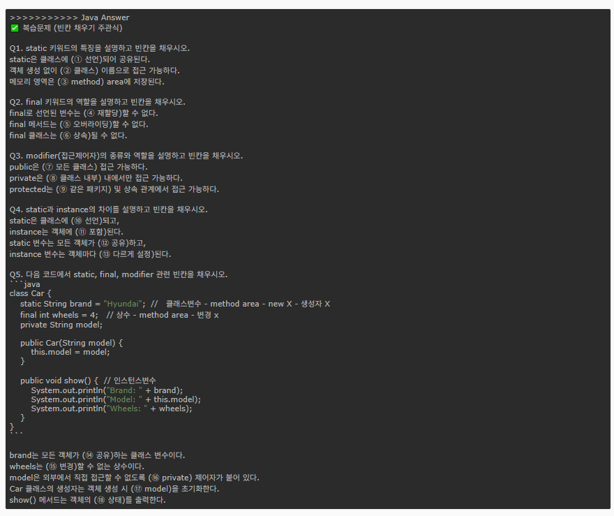
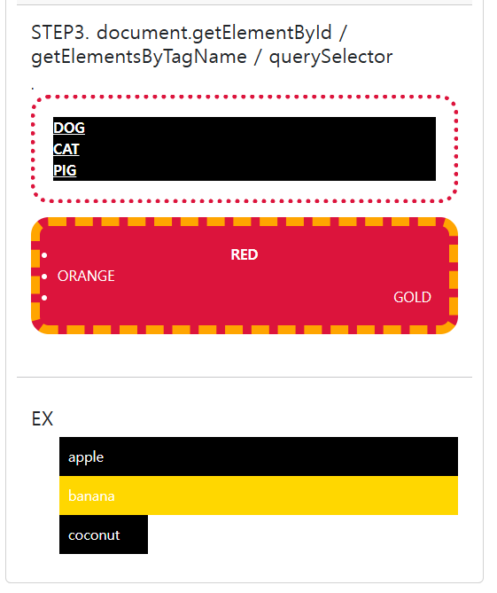

Java script

window.addEventListener("load", function(){document.getElementById("btn").onclick = let answer = prompt("좋아하는 색상"); document.getElementById("card-body").style.backgroundColor = answer;});

target = document.getElementById("아이디") ; 형태로
target.onclick; target.style.스타일속성명식의 활용도 가능

이렇게 해서 사용자에게 입력을 받아서 색상을 해당 카드에 적용도 가능


Java

modifier 종류

public(어디서든) > protected > default(패키지한정) > private(gettersetter이용해서접근)

메서드, 변수 종류


static(즉시사용) , final (상수) 이 달려있으면 클래스 메서드 변수 method 영역에 저장하여 new this 생성자는 못하지만 다사용가능

void 변수형(return) 형태면 메서드


둘다없으면 걍 생성자


public은 최상위 클래스당  한개만 가능 자식 클래스는 가능


✅ JavaScript 정리

🔹 이벤트 처리 및 스타일 변경

window.addEventListener("load", function() { document.getElementById("btn").onclick = function() { let answer = prompt("좋아하는 색상"); document.getElementById("card-body").style.backgroundColor = answer; }; });

✔️ backgroundColor는 backgroundcolor가 아니라 카멜케이스로 써야 작동합니다.

🔹 DOM 접근 방식

let target = document.getElementById("아이디"); target.onclick = function() { ... }; target.style.속성명 = 값;

✔️ 이 방식으로 사용자 입력을 받아서 스타일을 동적으로 변경하는 것도 가능합니다.

✅ Java 정리

🔹 접근 제어자 (Modifier)


🔹 메서드와 변수 종류


✔️ "둘 다 없으면 생성자"라는 표현은 정확합니다.
✔️ static, final이 붙은 변수나 메서드는 Method Area에 저장됩니다.

🔹 클래스 선언 관련

public 클래스는 한 파일당 하나만 가능 (파일명과 클래스명이 같아야 함)
자식 클래스는 public이어도 상관없음
✔️ 이 부분도 정확하게 이해하셨어요.

🧠 전체 요약

정리하신 내용은 핵심 개념을 잘 짚고 있고,
약간의 문법 수정만 하면 실무에서도 바로 통하는 수준입니다.

필요하시면 JavaScript에서 addEventListener와 onclick의 차이,
Java에서 static 초기화 블록이나 생성자 오버로딩도 이어서 설명드릴게요!


generate constructors from superclass (디폴트 생성자)
toString (주소값대신 변수명과 값을 보기좋게 출력)
generate getter and setters (private 가 사용된 변수 클래스에 접근하여 받을수있게)
generate constructor using fields


✅ 1. Generate Constructors from Superclass

의미: 상속받은 부모 클래스의 생성자를 자식 클래스에서 호출할 수 있도록 자동 생성
자주 쓰이는 경우: 부모 클래스에 매개변수가 있는 생성자가 있을 때
디폴트 생성자도 포함될 수 있지만, 이 기능은 상속 관계에서의 생성자 연결이 핵심이에요
public class Parent { public Parent(String name) { ... } } public class Child extends Parent { public Child(String name) { super(name); // 부모 생성자 호출 } }

✅ 2. toString()

목적: 객체를 출력할 때 주소값 대신 필드 값들을 보기 좋게 문자열로 반환
자동 생성 시 모든 필드를 포함한 문자열을 만들어줌
@Override public String toString() { return "Milk [mno=" + mno + ", mname=" + mname + ", mprice=" + mprice + "]"; }

✅ 3. Generate Getters and Setters

목적: private으로 선언된 필드에 대해 외부에서 안전하게 읽고/수정할 수 있도록 메서드 생성
getX() → 읽기 / setX(value) → 수정
public int getMprice() { return mprice; } public void setMprice(int mprice) { this.mprice = mprice; }

✅ 4. Generate Constructor Using Fields

목적: 클래스의 모든 필드를 매개변수로 받아서 초기화하는 생성자 자동 생성
객체 생성 시 한 번에 모든 값을 설정할 수 있음
public Milk(int mno, String mname, int mprice) { this.mno = mno; this.mname = mname; this.mprice = mprice; }


window.addEventListener("load", function(){ let color = document.getElementById("color"); let lis = color.getElementsByTagName("li"); lis[0].style.fontWeight="bold"; });
이런형태라면 실제론 선택할땐 복수를 지정하기 위해서
document.getElementById("color").getElementsByTagName("li");
이런형태로 지정하고있는거임?


맞습니다! 정확하게 이해하고 계세요 👏
document.getElementById("color").getElementsByTagName("li");


이 표현은 **복수의 요소(li 태그들)**를 선택하기 위한 방식이에요.
즉, id="color"인 요소 내부에 있는 모든 <li> 태그를 배열처럼 접근 가능한 HTMLCollection으로 가져오는 거예요.

✅ 코드 흐름 설명
let color = document.getElementById("color");
let lis = color.getElementsByTagName("li");


- color: id="color"인 요소를 가져옴
- lis: 그 요소 내부의 모든 <li> 태그를 가져옴 → lis[0], lis[1] 등으로 개별 접근 가능

✅ 복수 선택이 필요한 이유
- getElementsByTagName("li")는 복수의 <li> 요소를 가져오기 위한 메서드입니다
- 반환값은 HTMLCollection이므로 반복문이나 인덱스로 접근 가능
for (let i = 0; i < lis.length; i++) {
    lis[i].style.color = "blue";
}


🔍 참고: 다른 복수 선택 방법
|  |  | 
| getElementsByClassName("className") |  | 
| querySelectorAll("li") |  | 


필요하시면 querySelectorAll과 getElementsByTagName의 차이나, 이벤트 위임 방식도 이어서 설명드릴게요!


네, 아주 좋은 관찰이에요!
자바스크립트에서 getElementById와 getElementsByTagName 같은 DOM 메서드를 사용할 때, **단일 요소(Element)**를 먼저 선택한 다음에 그 안에서 **복수 요소(Elements)**를 선택하는 방식이 일반적입니다.

✅ 구조 이해
let color = document.getElementById("color"); // 단일 Element 선택
let lis = color.getElementsByTagName("li");   // 그 Element 내부의 복수 Elements 선택


- getElementById("color") → 하나의 요소(Element)를 반환
- 그 다음 .getElementsByTagName("li") → 그 요소 내부의 여러 <li>들을 가져옴
✔️ 즉, Element → Elements 순서로 접근하는 게 맞습니다.

🔍 다른 예시
let section = document.querySelector("#section1");
let paragraphs = section.getElementsByTagName("p");


- 먼저 section1이라는 단일 요소를 선택하고
- 그 안의 모든 <p> 태그를 복수로 가져오는 구조

💡 요약
|  |  | 
|  | getElementByIdquerySelector | 
|  | getElementsByTagNamequerySelectorAll | 


필요하시면 querySelectorAll과 getElementsByClassName의 차이나, 이벤트 위임 방식도 이어서 설명드릴게요!


Q.for 문이 작동하잖아? 자바스크립트에서?
그럼 while이나 if같은것들도 다작동함?
삼항연산자도?


맞아요! 자바스크립트에서는 for문뿐만 아니라 while, if, switch, do...while, 그리고 삼항 연산자까지 모두 작동합니다. 자바스크립트는 완전한 프로그래밍 언어이기 때문에 조건문, 반복문, 연산자 등 기본적인 제어 구조를 모두 지원해요.

✅ 자바스크립트에서 사용 가능한 제어문 예시
🔹 if 조건문
let score = 85;
if (score >= 80) {
  console.log("우수");
} else {
  console.log("보통");
}


🔹 while 반복문
let i = 0;
while (i < 5) {
  console.log("반복:", i);
  i++;
}


🔹 do...while 반복문
let j = 0;
do {
  console.log("최소 한 번 실행:", j);
  j++;
} while (j < 3);


🔹 삼항 연산자 (조건 ? 참 : 거짓)
let age = 20;
let result = age >= 18 ? "성인" : "미성년자";
console.log(result); // "성인"


🧠 요약
|  |  | 
| ifelse ifelse |  | 
| forwhiledo...while |  | 
| switch |  | 
| 삼항 연산자 | 조건 ? 참 : 거짓 | 


자바스크립트는 웹뿐 아니라 서버(Node.js), 앱, 게임 등 다양한 분야에서 쓰이는 강력한 언어예요.
필요하시면 각 문법을 활용한 실전 예제도 만들어드릴게요!





선택자

어떤 엘레멘트 요소를 선택할건지

단수 => 복수순서로 지정하고

복수는 배열로 받을수있기떄문에 for문을 이용해서 전체 지정해줘야함(ElementsByTagName)


```
<!DOCTYPE html>
<html lang="ko">
<head>
  <title>DBDBIG</title>
  <meta charset="utf-8">
  <meta name="viewport" content="width=device-width, initial-scale=1">
<!-- Latest compiled and minified CSS -->
<link href="https://cdn.jsdelivr.net/npm/bootstrap@5.3.3/dist/css/bootstrap.min.css" rel="stylesheet">

<!-- Latest compiled JavaScript -->
<script src="https://cdn.jsdelivr.net/npm/bootstrap@5.3.3/dist/js/bootstrap.bundle.min.js"></script>
<script>
  window.addEventListener("load" , function(){       
    document.getElementById("addEvent").onclick=function(){
      alert(5);  alert(4); alert(3); alert(2); alert(1);
    };
  });
</script>  
</head>
<body>

<!--                                    -->
<!--                                    -->
<!--                                    -->
<!--                                    -->
<!--                                    -->
<div class="mt-5  p-3 bg-primary text-white ">
  <h1>005.선택자 </h1>
  <ol>
    <li>document.getElementById</li>
    <li>window.addEventListener</li>
    <li>document.getElementById / getElementsByTagName / querySelector</li>
    <li>value, innerHTML </li>
  </ol>
</div>
<div class="container card  my-5">
  <h2  class="card-header">005.선택자 - STEP1. document.getElementById</h2>
  <div class="card-body">
    <h4  id="step1">STEP1. document.getElementById</h4>
    <input type="button" value="ById" 
       id="byid" title="버튼을 클릭하세요.(js)" 
       class="btn btn-outline-primary"      />
    <script>
      //      이벤트대상                  이벤트      = 이벤트핸들러
      document.getElementById("byid").onclick = function(){ 
        alert("hoho");
      };
      // step1을 클릭하면 본인이름 알림창띄우기  
      document.getElementById("step1").style.cursor = "pointer";
      document.getElementById("step1").onclick = function(){
        alert("홍길동");
      };
    </script>
  </div>
  <!--     -->
  <!--     -->
  <hr/>
  <div class="card-body">
    <h4>EX</h4>
    <pre class="alert alert-warning">
    1. 아이디가 byidex 인것을  getElementById 이용해 선택
    2. 클릭시 prompt이용해서 당신이 좋아하는 색상 물어보고
    3. alert이용해서 알림창띄우기 
    </pre>    
    <input type="button"  value="ByIdEx-당신이좋아하는색상"  
       title="버튼4"  id="byidex"   class="btn btn-success" />
    <script>
    document.getElementById("byidex").onclick = function(){
      let color = prompt("당신이 좋아하는 색상은? ");
      alert("당신이 좋아하는 색상은 " + color + "입니다.");
    }; 
    </script>
  </div>
</div>

<!--     -->
<!--     -->
<!--     -->
<div class="container card  my-5">
  <h2  class="card-header">005.선택자 - STEP2. window.addEventListener</h2>
  <div class="card-body">
    <h4>STEP2. window.addEventListener</h4>
    <pre class="alert alert-warning">
    1. 아이디가 addEvent 인것을  getElementById 이용해 선택
    2. 클릭시 5,4,3,2,1 alert창 다섯번띄우기
    </pre>     
    <input type="button"  value="addEventListener" 
     title="버튼4"  id="addEvent"    class="btn btn-outline-primary"    />

  </div>
  <!--     -->
  <!--     -->
  <hr/>
  <div class="card-body">
    <h4>EX</h4>
    <pre class="alert alert-warning">
    0. 스크립트가 document어느위치에서든지 동작가능하게
    1. 아이디가 addEventEx인것을  getElementById 이용해 선택
    2. 클릭시 prompt이용해서 당신이 좋아하는 1~5사이의 숫자 물어보고
    3. alert이용해서 알림창띄우기 
    </pre>        
    <input type="button"  value="addEventEx-1~5 Like"  
           title="버튼5"  id="addEventEx"  class="btn btn-success" />
    <script>
     window.addEventListener("load" , function(){
        let target=document.getElementById("addEventEx");
        target.onclick=function(){
          let like = prompt("좋아하는 숫자1~5" , "1~5");
          alert("좋아하는 숫자는 " + like + "입니다.");
          target.style.backgroundColor="#000";
          target.style.color="#fff";
        };
     });   

    </script>
  </div>
</div>


<!--     -->
<!--     -->
<!--     -->
<div class="container card  my-5">
  <h2  class="card-header">005.선택자 - Step3. document.getElementById / getElementsByTagName / querySelector  </h2>
  <div class="card-body">
    <h4>STEP3. document.getElementById / getElementsByTagName / querySelector</h4> .
    <ul id="animal">
      <li>DOG</li>
      <li id="cat">CAT</li>
      <li id="pig">PIG</li>
    </ul>
    <script>
    window.addEventListener("load" , function(){            
      //1. step1 #animal 선택하기 
      let animal = document.getElementById("animal");
      console.log(animal);
      //2. 그 안에 동물들(li) 찾기
      let anis = animal.getElementsByTagName("li"); // li태그들 다.... 찾아서
      console.log(anis);
      //3. 꾸미기
      // anis.style.color="#f00"; //blue, #f00(빨간색) ? style은 개별요소에 적용, 전체적용 X
      // HTMLCOLlection(3) [li, li#cat, li#pig, cat: li#cat, pig: li#pig]
      anis[0].style.color="blue";
      anis[1].style.color="#f00";

    });

    


    </script>
    <script>
     //4. 만능 querySelector 

      //5. 만능 모든요소가져오기 querySelectorAll
 
    </script>


    <ul id="color">
      <li>RED</li>
      <li id="orange">ORANGE</li>
      <li id="gold">GOLD</li>
    </ul>
    <script>
      // Q1. #color 선택하기 color라는 변수에 담기
      // Q2. 안에 있는 li태그들 선택
      // Q3. 첫번째 RED의 굵게 font-weight="bold"
      window.addEventListener("load", function(){
        let color = document.getElementById("color");
        let lis   = color.getElementsByTagName("li");
        lis[0].style.fontWeight="bold";
      });
    </script>
      
      
    <script>

      window.addEventListener("load",function(){          
        //4. 만능 querySelector (#animal)
        let animal2 = document.querySelector("#animal");
        console.log(animal2);
        animal2.style.border="5px dotted crimson";
        animal2.style.padding="20px";
        animal2.style.borderRadius="20px";  // border 다음 R자는 대문자
        //5. 만능 모든요소가져오기 querySelectorAll
        let alis = document.querySelectorAll("#animal li");
        for(let i=0; i<alis.length; i++)  {
          alis[i].style.fontWeight="bold";
          alis[i].style.textDecoration="underline";
          alis[i].style.backgroundColor="black";
          alis[i].style.color="white";
        }
      }); //  end 
    </script>

    <script>

     
     // Q4. # color 선택 - 배경 crimson, 글자색 white
      // 6~9
     window.addEventListener("load", function(){
      let color2 = document.querySelector("#color");
      color2.style.backgroundColor = "crimson";
      color2.style.color = "white";
      // 6. querySelector
      let cs = document.querySelector("#color");
      let children = cs.children;
      console.log(children);
      //7. parentElement
      let orange = document.querySelector("#orange");
      orange.parentElement.style.border="10px dashed orange"
      orange.parentElement.style.borderRadius="20px"
      //8. 제일가까운 상위부모 
      orange.closest("ul").style.padding="20px";
      //9. 형제요소  
      // orange.style.textAlign="center"
      orange.previousElementSibling.style.textAlign="center";
      orange.nextElementSibling.style.textAlign="right";
    });
    </script>

  </div>
  <!--     -->
  <!--     -->
  <hr/>
  <div class="card-body">
    <h4>EX </h4>
    <ul id="fruits">
      <li>apple</li>
      <li id="banana">banana</li>
      <li id="coconut">coconut</li>
    </ul>
      <script>
        window.addEventListener("load", function(){
      //Q1) document.getElementsById 이용해서  #fruits 선택  

      let fruits = document.getElementById("fruits");

      //Q2) document.getElementsByTagName 이용해서  
      //   #fruits 안의 모든 li에 배경색 black, 글자색 white , 여백 10px주기
      let lis = fruits.getElementsByTagName("li");
          for (let i = 0; i < lis.length; i++){
          lis[i].style.backgroundColor = "black";
          lis[i].style.color = "white";
          lis[i].style.padding = "10px";
        };
     
      //Q2) document.getElementsById 이용해서 banana 선택 배경색 gold
      document.getElementById("banana").style.backgroundColor = "gold";
      //Q3) document.querySelector 이용해서 coconut 선택 
      // let fruits = document.getElementById("fruits");
      // let fruitArr = fruits.getElementsByTagName("li");
      // fruitArr.style.backgroundColor ="black"; 안됨
      // for(let i=0; i<fruitArr.length; i++){
      // fruitArr[i].style.backgroundColor="black";
      // fruitArr[i].style.Color="white";
      // fruitArr[i].style.padding="10px";}
        
      // document.getElementById("banana").style.backgroundColor="gold";
      // document.querySelector("#coconut").onclick = function(){
      // document.querySelector.style.width="200px"};
      // this.style.width="200px"; // 내가 선택한 이벤트 대상

      let coco = document.querySelector("#coconut");
      coco.onclick = function(){coco.style.width="100px";


      }
      //  coconut를 클릭하면 width:200px; 로 수정
    });
    </script>
  </div>
</div>

<!--     -->
<!--     -->
<!--     -->
<div class="container card  my-3">
  <h2  class="card-header">005.선택자 - STEP4. value(input 안에 있는 값), innerHTML(일반태그안의 콘텐츠)</h2>
  <div class="card-body">
    <h4>STEP4. value, innerHTML </h4>
    <div class="row">
      <div class="col"><input type="text"    id="value_target"  class="form-control"
                         placeholder="input에서는 value"  /></div> <!-- readonly 읽기전용-->
      <div class="col"><input type="button"  value="value"  title="value_target"  id="value"  class="btn btn-outline-primary" /></div>
    </div>
    <hr/>
    <div class="row">
      <div class="col"> <div class="inner_target  alert alert-success"></div>  </div>
      <div class="col"><input type="button"  value="value"  title="value_target"  id="inner"   class="btn btn-outline-primary" /></div>
    </div>

    <script>
      window.addEventListener("load", function(){
        //value
        let value = document.querySelector("#value");
        value.addEventListener("click", function(){
          let value_target = document.querySelector("#value_target");
          alert(value_target.value);  // input 대상의 .value

          value_target.value=""; // iput 대상의 값 변경
        });
        //innerHTML
        let inner = document.querySelector("#inner")
        inner.addEventListener("click" , function(){
          let inner_target = document.querySelector(".inner_target");
          inner_target.innerHTML="WELCOME JS!";
          alert(inner_target.innerHTML);
        });
      });
    </script>
  </div>
  <!--     -->
  <!--     -->
  <hr/>
  <div class="card-body">
    <h4>EX</h4>
    <input type="button"  value="click"         id="test1"    class="btn btn-success"   />
    <input type="button"  value="value"         id="test2"    class="btn btn-success"   />
    <input type="button"  value="innerHtml"     id="test3"    class="btn btn-success"   />
    <input type="button"  value="MOUSEOVER-OUT" id="test4"    class="btn btn-success"   />
    <div class="result_target  my-5">JAVASCRIPT</div>

    <pre>

    브라우저가 로딩이 되면
    Q1) #test1를 클릭하면 본인이름 입력받고 입력받은 값 알림창 띄우기
    Q2) #test2를 클릭하면 #test2의 value값을 INPUT으로 수정
    Q3) #test3를 클릭하면
    1.  .result_target영역안의 문자열을 알림창으로 띄우고
    2.  .result_target영역안을 본인이름으로 수정
    Q4) #test4를 마우스를 올리면(mouseover)  #test7의 배경색을 crimson으로
                    마우스를 떼면(mouseout)     #test7의 배경색을 black으로

     https://www.w3schools.com/js/js_events.asp
    </pre>
    <script>

      // window.addEventListener("load", function(){

      //   let test1 = document.querySelector("#test1");
      //   test1.addEventListener("click", function(){

      //       name = prompt ("당신의 이름을 입력하세요.");
      //       alert(name);
      //   })

      //   document.querySelector("#test2").addEventListener("click", function(){
      //       this.value="INPUT"
      //   })


      // });

      window.addEventListener("load", function(){

        let test1 = document.getElementById("test1");
        test1.onclick = function(){
          let name = prompt("이름 입력 >"); alert(name);
        }
        let test2 = document.querySelector("#test2");
        test2.addEventListener("click", function(){
          let value2 = document.querySelector("#value"); // # 아이디
          value2.value="INPUT";
          alert(value2.value);
        });

        let text = document.querySelector(".result_target");  //  . 문자열
        let test3 = document.querySelector("#test3")
        test3.addEventListener("click" , function(){
          
          alert(text.innerHTML);
          text.innerHTML="name";
        });

        let test4 = document.querySelector("#test4")
        test4.addEventListener("mouseenter", function(){
          test4.style.backgroundColor="crimson";
        });

        test4.addEventListener("mouseleave", function(){
          test4.style.backgroundColor="black";
        });
          

        });
      
    </script>
  </div>
</div>


</body>
</html>

```

금일 진행한 자바스크립트


VSCode (JavaScript)

        탐색범위                           요소     기준  기준의이름      메서드   =     실행        실행할 내용
 (document 또는 변수로 범위지정가능 )   
       document.                       getElement  ById    ("").     onclick   =  function()   {        }


    요소를 선택할때, 단수 -> 복수형으로 선택함 (예) ById 기준으로 검색하고, 이후 ByTagName 같은 기준으로 검색하여 지정에는 li[1] 같은 형태를 써야한다?

    따라서 for문을 사용해 Id의 하위에 있는 동일한 태그네임의 요소들을 동시에 스타일을 적용하거나 기타 동작들이 가능하게 만든다.

    형태는

    ```
    document.getElemnetById("a").getElementsByTagName("H1"); 
    ```

    이러한 형태가되는데 보통 앞에 단수형을 let a = document.getElementById("a"); 로 담아서 a.getElementsByTagName("H1");
    이런 느낌으로 사용한다.

    전체 적용을 시킬때 기존 Java에서 배웠던, for문을 사용 할 수 있다.
    
    ```
    for(let i = 1; i< H1.length; i++){

        a[i].style.fontWeight="bold";
        a[i].style.textDecoration="underline";
        a[i].style.backgroundColor="black";
        a[i].style.color="white";
    }
    ```

    vlaue값을 변경할때, 메서드부분에 'a.value="INPUT";' 형식으로
    innertext(텍스트필드)는 'text.innerHTML="name";' 형식으로 변경한다.


## Track001 -  github
 


# ■ Github   
### 12. 깃허브 협업 
---
1. html + css + js/jquery      [개인]
2. spring + mybatis + jstl     
3. node + react
4. spring boot + thymeleaf + jpa + mybatis + react  
5. flutter + spring boot + jpa + mybatis + react


# ■ JAVA
# ■ Java 복습문제
>>>>>>>>>>>>>>>>>>>>>>>>>>>>>>>>>>>>>>>>>>>>>>>>>>

Q1. static 키워드의 특징을 설명하고 빈칸을 채우시오. 
static은 클래스에 (① 선언)되어 공유된다. 
객체 생성 없이 (② 클래스) 이름으로 접근 가능하다. 
메모리 영역은 (③ method) area에 저장된다.

Q2. final 키워드의 역할을 설명하고 빈칸을 채우시오. 
final로 선언된 변수는 (④ 재할당)할 수 없다. 
final 메서드는 (⑤ 오버라이딩)할 수 없다. 
final 클래스는 (⑥ 상속)될 수 없다.

Q3. modifier(접근제어자)의 종류와 역할을 설명하고 빈칸을 채우시오. 
public은 (⑦ 모든 클래스) 접근 가능하다. 
private은 (⑧ 클래스 내부) 내에서만 접근 가능하다. 
protected는 (⑨ 같은 패키지) 및 상속 관계에서 접근 가능하다.

Q4. static과 instance의 차이를 설명하고 빈칸을 채우시오. 
static은 클래스에 (⑩ 선언)되고, 
instance는 객체에 (⑪ 포함)된다. 
static 변수는 모든 객체가 (⑫ 공유)하고, 
instance 변수는 객체마다 (⑬ 다르게 설정)된다.

Q5. 다음 코드에서 static, final, modifier 관련 빈칸을 채우시오.
```java
class Car {
    static String brand = "Hyundai";  //   클래스변수 - method area - new X - 생성자 X
    final int wheels = 4;   // 상수 - method area - 변경 x
    private String model;  

    public Car(String model) {
        this.model = model;
    }

    public void show() {  // 인스턴스변수
        System.out.println("Brand: " + brand);
        System.out.println("Model: " + this.model);
        System.out.println("Wheels: " + wheels);
    }
}
```

brand는 모든 객체가 (⑭ 공유)하는 클래스 변수이다. 
wheels는 (⑮ 변경)할 수 없는 상수이다. 
model은 외부에서 직접 접근할 수 없도록 (⑯ private) 제어자가 붙어 있다. 
Car 클래스의 생성자는 객체 생성 시 (⑰ model)을 초기화한다. 
show() 메서드는 객체의 (⑱ 상태)를 출력한다.


# ■ Java 진행 (1)
>>>>>>>>>>>>>>>>>>>>>>  
static, final, modifier 연습문제
  

연습문제3)  멤버변수
패키지명 : com.company.java010_ex
클래스명 :  MemberVarEx003
//- 문제 1. 다음 코드에서 인스턴스변수, 클래스변수, 지역변수를 구분하시오.  ( 보관되는 영역도 추가 )
//- 문제 2. 인스턴스메서드와 클래스메서드를 구분하시오.  
//- 문제 3. 오류가 발생하는 이유를 설명하시오.
//- 문제 4. runtime data area 위치영역 그림그리기
//- 문제 5. 다음과 같이 출력되도록 코드를 작성하시오.
:: 주인 이름: std-1
총 음식량: 175
전체 급식판 수: 1


:: 주인 이름: std-2
총 음식량: 175
전체 급식판 수: 2

 
class LunchTray {
    String owner;        
    int rice = 90;               
    int soup = 85;               

    static int trayCount = 0;      

    static int totalFood = rice + soup;

    static int maxRice = 100;       

    public int getFoodAmount() {
        return rice + soup;         
    }

    public static void showTrayCount() {
        System.out.println("전체 급식판 수: " + trayCount);   
    }

    public static void showOwner() { 
       System.out.println(owner);
    }

    public void showTray() {
        System.out.println("\n\n:: 주인 이름: " + owner);                
        System.out.println("총 음식량: " + getFoodAmount());     
    }
}


public class MemberVarEx003 {
	public static void main(String[] args) {
        LunchTray tray1 = new LunchTray();   
        tray1.showTray();                    
        LunchTray.showTrayCount();         

        LunchTray tray2 = new LunchTray();   
        tray2.showTray();                   
        LunchTray.showTrayCount();         
	}
} 


>>>>>>>>>>>>>>>>>>>>>>>>>>>>>>>>>>>>>>
연습문제1)  final
패키지명 : com.company.java011_ex
클래스명 : FinalEx
다음코드에서 오류나는 부분을 찾아 주석달고 이유를 적으시오.
class User002 {
	final String nation = "Korea";   
	final String jumin;   
	String name;

	public User002() { jumin="00000"; }
	public User002(String jumin, String name) {
		this.jumin = jumin;
		this.name = name;
	}
}
 public class FinalEx {
	public static void main(String[] args) {
		User002 user1 = new User002("123456-1234567", "아이유");
		System.out.println(user1);   
		
		user1.nation = "USA";      
		user1.jumin  = "123123-1234321"; 
		user1.name = "IU"; 
		System.out.println(user1);   
	}
}


 


연습문제2)  지정접근자
패키지명 : com.company.java010_ex
클래스명 : ModifierEx2
다음과 같이 코드를 작성하시오.
ㅁ출력된화면
	Milk [mno=0, mname=null, mprice=0]
	Milk [mno=0, mname=null, mprice=2000]
	
ㅁ주어진조건
public class Milk{  // java011_ex에 설정해주세요!
	private int  mno;   
	private String mname;  
	private  int mprice;  
}
public class ModifierEx2{ // java011 패키지에 설정해주세요.
	public static void main(String[] args) {
		Milk m1 = new Milk();  
		System.out.println( m1 );  
		m1.setMprice(2000);       
		System.out.println( m1 );
	} // end main
} // end class


연습문제3)  지정접근자
패키지명 : com.company.java011_ex
클래스명 : ModifierEx3
다음과 같이 코드를 작성하시오.

ㅁ출력된화면
:::::::::::::::::::::::::::::::::::::::::::::::::::::::::::::::::::::::::::::::::::::::::::::::::::::::::::::::::::::::::::::::::::::::::::::::::::::::::::::
이름	국어	영어	수학	총점	평균	합격여부	장학생	랭킹
:::::::::::::::::::::::::::::::::::::::::::::::::::::::::::::::::::::::::::::::::::::::::::::::::::::::::::::::::::::::::::::::::::::::::::::::::::::::::::::
iron	100	100	100	300	100.00	합격	장학생	**********
hulk	20	50	30	100	33.33	불합격		***


ㅁ주어진조건
public class Score{
	private String name;
	private int kor, eng, math , total;
	private double aver;
	private String p  , s  , rank;
} // java011_ex에 설정해주세요!

public class ModifierEx3{    // java011 패키지에 설정해주세요.
	public static void main(String[] args) {
		Score iron = new Score();     
		Score hulk = new Score("hulk" , 20,50,30);    
		
		// Score.info()위에 메서드작성해주세요!  ##
		// setter를 이용해주세요!
		iron.setName("iron"); iron.setKor(100); iron.setEng(100); iron.setMath(100);
		
		Score.info();	  // 클래스메서드
		iron.show();			 
		hulk.show();	
	}

}

Score.info() 사용시화면
:::::::::::::::::::::::::::::::::::::::::::::::::::::::::::::::::::::::::::::::::::::::::::::::::::::::::::::::::::::::::::::::::::::::::::::::::::::::::::::
이름	국어	영어	수학	총점	평균	합격여부	장학생	랭킹
:::::::::::::::::::::::::::::::::::::::::::::::::::::::::::::::::::::::::::::::::::::::::::::::::::::::::::::::::::::::::::::::::::::::::::::::::::::::::::::


연습문제5) 지정접근자  
패키지명 : com.company.java010_ex  
클래스명 : ModifierEx004  
다음과 같이 코드를 작성하시오.

ㅁ출력된화면  
=========================================================================================================
이름     산책시간   간식개수   쓰다듬횟수   행복도      간식보상      꼬리흔들기         오늘의멘트
=========================================================================================================
콩이       60     3        10         140      ★★★★★      흔들흔들흔들       "오늘은 정말 행복했어요!"
나비       10     1        2          30       ★★          꼬리 내림         "외로웠어요..."


ㅁ주어진조건  

1) 항목별 조건 및 계산 방식
 간식개수 (snackCount)
사용자가 직접 입력하는 값 (예: kong.setSnackCount(3);)
행복도 계산 시 10점씩 반영됨 → snackCount * 10

2) 쓰다듬횟수 (cuddleCount)
사용자가 직접 입력하는 값 (예: kong.setCuddleCount(10);)
행복도 계산 시 5점씩 반영됨 → cuddleCount * 5

3) 행복도 (moodScore)
계산 공식:
코드
moodScore = walkTime + (snackCount * 10) + (cuddleCount * 5)
예: 산책 60분, 간식 3개, 쓰다듬 10회 → 60 + 30 + 50 = 140

4) 간식보상 (snackStars)
행복도 점수 범위	간식보상 출력
90 이상	★★★★★
70 이상	★★★★
50 이상	★★★
30 이상	★★
그 외	★

5)  꼬리흔들기 (tailWag)
행복도 점수 범위	꼬리흔들기 출력
90 이상	흔들흔들흔들
60 이상	흔들흔들
40 이상	살짝 흔들
그 외	꼬리 내림

6)  오늘의 멘트 (todayMessage)
행복도 점수 범위	출력 멘트
90 이상	"오늘은 정말 행복했어요!"
60 이상	"좋은 하루였어요!"
40 이상	"조금 더 놀아줘요!"
그 외	"외로웠어요..."


public class Pet{  
   private String name;  
   private int walkTime, snackCount, cuddleCount, moodScore;  
   private String snackStars, tailWag, todayMessage;  
} // java011_ex에 설정해주세요!

public class PetMoodEx{    // java011 패키지에 설정해주세요.  
   public static void main(String[] args) {  
      Pet kong = new Pet();       
      Pet nabi = new Pet("나비", 10, 1, 2);    

      // Pet.info()위에 메서드작성해주세요!  ##  
      // setter를 이용해주세요!  
      kong.setName("콩이"); kong.setWalkTime(60); kong.setSnackCount(3); kong.setCuddleCount(10);  

      Pet.info();     // 클래스메서드  
      kong.show();          
      nabi.show();   
   }  
}


# ■ WEB BASIC
# ■ WEB BASIC 복습문제
>>>>>>>>>>>>>>>>>>>>>>>>>>>>>>>>>>>>>>>>>>>>>>>>>>
 <div class="card-body">
       <pre class="alert alert-warning">
          0. 스크립트는 어디서든 동작 가능
          1. 아이디가 fontSizeBtn인 버튼을 선택
          2. 클릭 시 1~5 사이 숫자 입력받음
          3. 입력한 숫자에 따라 h3 제목 글자 크기 변경
      </pre>
      <input type="button" value="Change Font Size" 
            id="fontSizeBtn" class="btn btn-warning" />
</div>
 


 

# ■ Java 복습문제
>>>>>>>>>>>>>>>>>>>>>>>>>>>>>>>>>>>>>>>>>>>>>>>>>>

Q1. 클래스와 인스턴스의 관계를 설명하시오
클래스는 객체를 만들기 위한 (①     ) 역할을 한다.
인스턴스는 클래스의 구조를 기반으로 (②     ) 되어 메모리에 생성된 실체이다.
같은 클래스라도 인스턴스는 서로 다른 (③     ) 값을 가질 수 있다.

Q2. 다음 코드의 실행 결과와 메모리 구조를 설명하시오
```java
Car myCar = new Car("Hyundai", 2023);
```
new Car(...)는 객체를 생성하고 (④     ) 영역에 저장된다.
myCar는 해당 객체의 (⑤     ) 를 참조한다.
생성자 내부에서는 전달받은 값을 (⑥     ) 한다.

Q3. 생성자에 대한 설명으로 옳은 것을 고르시오
생성자는 클래스명과 (⑦     ) 이 같아야 한다.
생성자는 객체 생성 시 자동으로 (⑧     ) 된다.
생성자는 반환값이 (⑨     )

Q4. 기본 생성자가 자동으로 생성되지 않는 경우는?
클래스에 (⑩     ) 생성자가 이미 정의되어 있을 경우
상속받은 클래스에서 부모 생성자 호출이 필요한 경우

Q5. 다음 코드에서 객체가 저장되는 메모리 영역과 메서드 실행 흐름을 설명하시오
```java
Book b1 = new Book("Java", 500);
Book b2 = new Book();
b2.setTitle("Spring");
```
Book 클래스의 인스턴스는 (⑪     ) 영역에 저장된다.
b1, b2는 각각 객체의 (⑫     ) 를 참조한다.
setTitle() 메서드는 (⑬     ) 영역에서 실행된다.

Q6. 자바 메모리 구조에서 각 영역의 역할을 설명하시오
Method Area : 클래스 정보 및 static 변수 저장
Heap Area : (⑭     ) 저장, GC가 관리
Stack Area : (⑮     ) 저장, 메서드 호출 시 사용됨

Q7. 변수의 종류와 메모리 위치를 연결하시오
클래스 변수 → (⑯     ) 영역
인스턴스 변수 → (⑰     ) 영역
지역 변수 → (⑱     ) 영역

Q8. 접근자를 넓은 범위에서 좁은 범위로 적으시오
(⑲   → ⑳   → ㉑   → ㉒  )

Q9. 다음을 private으로 설정했다. 외부에서 접근 가능하게 설정해야 하는 것
(㉓   / ㉔  ) 이다.
 


>>>>>>>>>>> Java Answer
Q1. 클래스와 인스턴스의 관계를 설명하시오
클래스는 객체를 만들기 위한 (① 설계도) 역할을 한다.
인스턴스는 클래스의 구조를 기반으로 (② 실체화) 되어 메모리에 생성된 실체이다.
같은 클래스라도 인스턴스는 서로 다른 (③ 특징) 값을 가질 수 있다.

Q2. 다음 코드의 실행 결과와 메모리 구조를 설명하시오
```java
Car myCar = new Car("Hyundai", 2023);
```
new Car(...)는 객체를 생성하고 (④ heap) 영역에 저장된다.
myCar는 해당 객체의 (⑤ 주소) 를 참조한다.
생성자 내부에서는 전달받은 값을 (⑥ 초기화) 한다.

Q3. 생성자에 대한 설명으로 옳은 것을 고르시오
생성자는 클래스명과 (⑦ 동일한 이름) 이 같아야 한다.
생성자는 객체 생성 시 자동으로 (⑧ 호출) 된다.
생성자는 반환값이 (⑨ 없다)

Q4. 기본 생성자가 자동으로 생성되지 않는 경우는?
클래스에 (⑩ 오버로딩된 생성자) 생성자가 이미 정의되어 있을 경우
상속받은 클래스에서 부모 생성자 호출이 필요한 경우

Q5. 다음 코드에서 객체가 저장되는 메모리 영역과 메서드 실행 흐름을 설명하시오
```java
Book b1 = new Book("Java", 500);
Book b2 = new Book();
b2.setTitle("Spring");
```
Book 클래스의 인스턴스는 (⑪ heap) 영역에 저장된다.
b1, b2는 각각 객체의 (⑫ 참조 주소) 를 참조한다.
setTitle() 메서드는 (⑬ stack) 영역에서 실행된다.

Q6. 자바 메모리 구조에서 각 영역의 역할을 설명하시오
Method Area : 클래스 정보 및 static 변수 저장
Heap Area : (⑭ 인스턴스 객체) 저장, GC가 관리
Stack Area : (⑮ 지역 변수 및 메서드 작업 공간) 저장, 메서드 호출 시 사용됨

Q7. 변수의 종류와 메모리 위치를 연결하시오
클래스 변수 → (⑯ method area) 영역
인스턴스 변수 → (⑰ heap area) 영역
지역 변수 → (⑱ stack area) 영역

Q8. 접근자를 넓은 범위에서 좁은 범위로 적으시오
(⑲ public → ⑳ protected → ㉑ default → ㉒ private)

Q9. 다음을 private으로 설정했다. 외부에서 접근 가능하게 설정해야 하는 것
(㉓ getter / ㉔ setter) 이다.


# ■ Web Basic 복습문제
>>>>>>>>>>>>>>>>>>>>>>>>>>>>>>>>>>>>>>>>>>>>>>>>>>
> repeat24.html
```
 <div class="card-body">
    <h4>EX</h4>
    <input type="button"  value="click"         id="test1"    class="btn btn-success"   />
    <input type="button"  value="value"         id="test2"    class="btn btn-success"   />
    <input type="button"  value="innerHtml"     id="test3"    class="btn btn-success"   /> 
    <div class="result_target  my-5">JAVASCRIPT</div>
    <pre>
    브라우저가 로딩이 되면
    Q1) #test1를 클릭하면 본인이름 입력받고 입력받은 값 알림창 띄우기
    Q2) #test2를 클릭하면 #test2의 value값을 INPUT으로 수정
    Q3) #test3를 클릭하면
    1.  .result_target영역안의 문자열을 알림창으로 띄우고
    2.  .result_target영역안을 본인이름으로 수정

    </pre>
    <script>
      
    </script>
  </div>
  ```