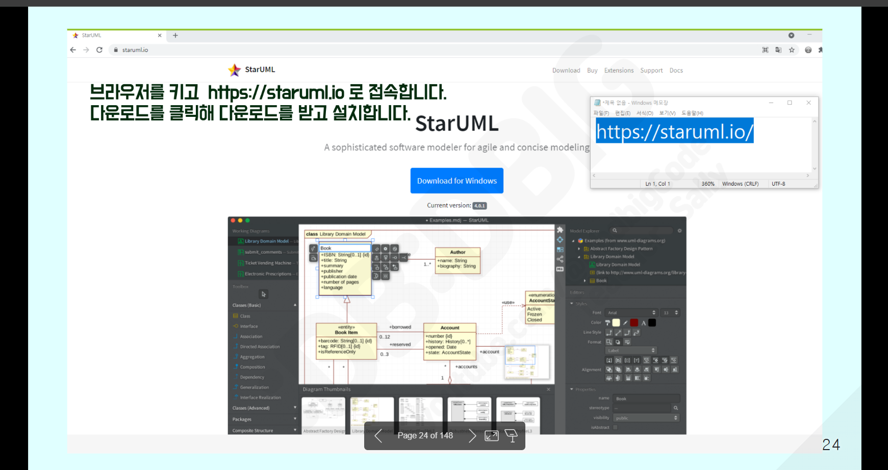
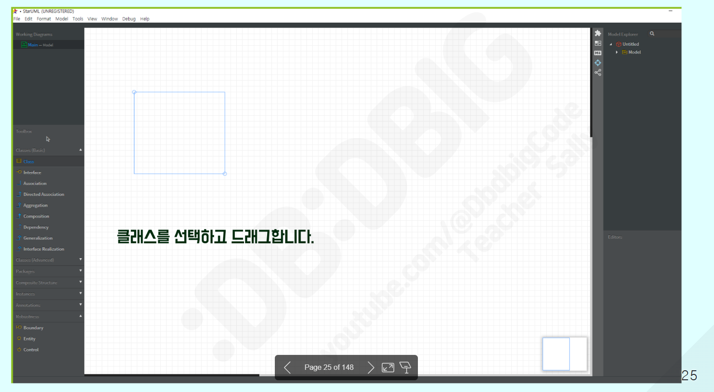
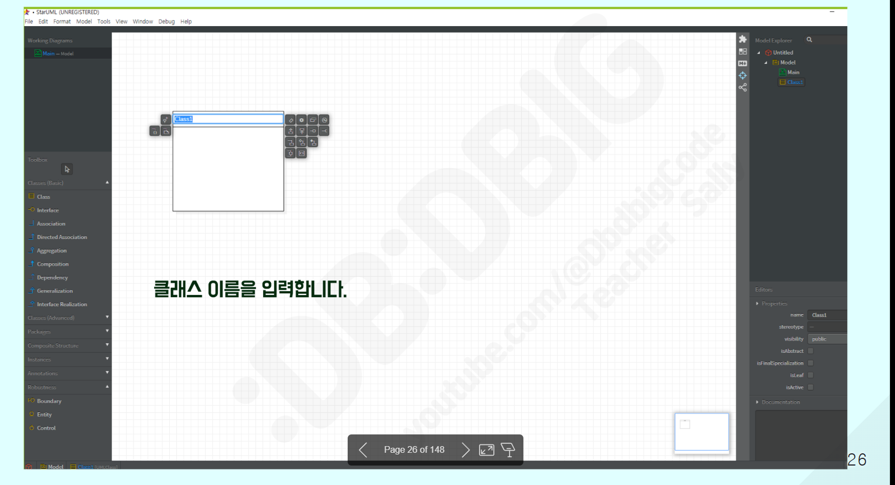
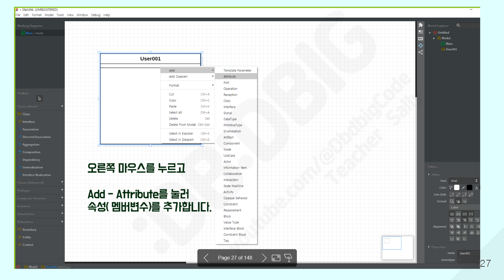
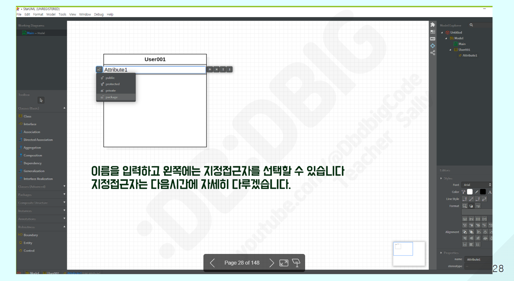
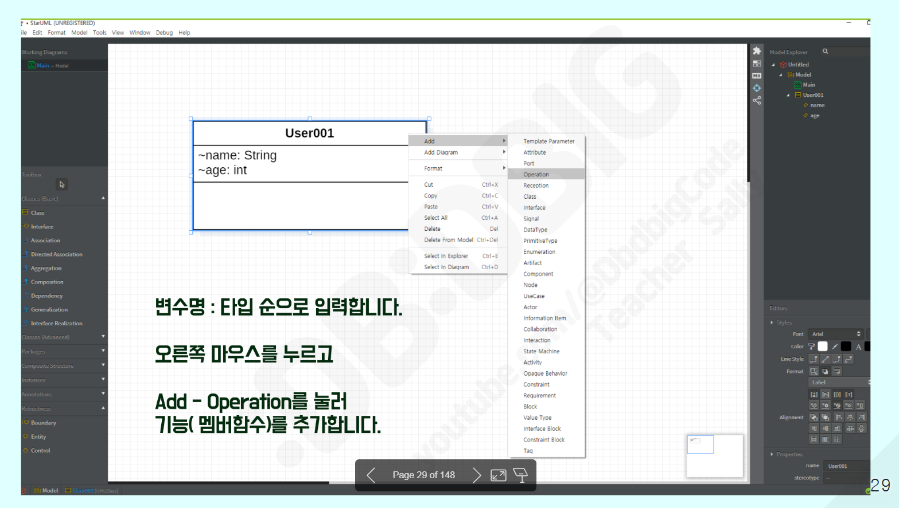
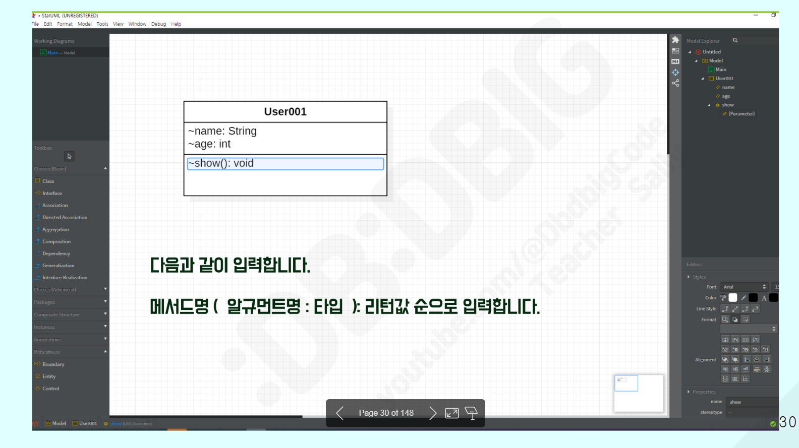
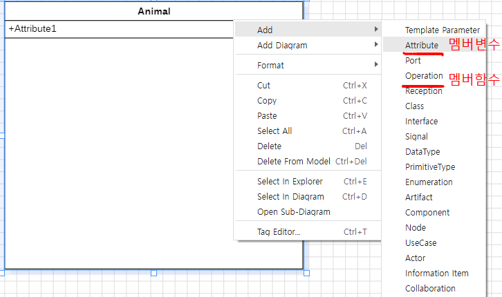
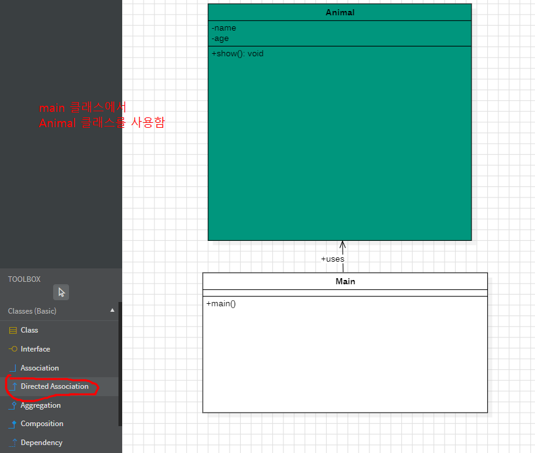
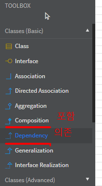
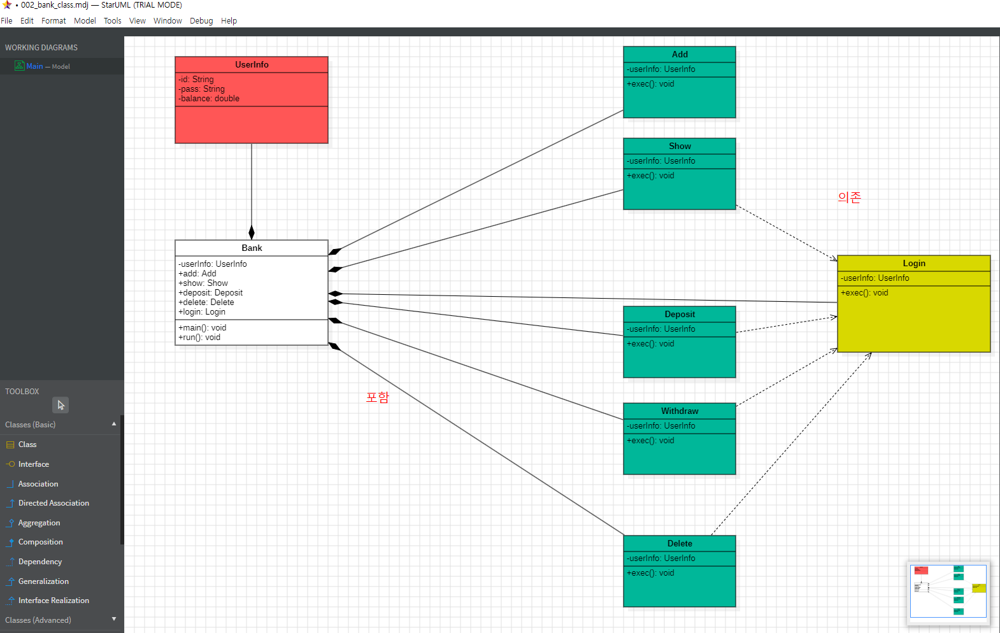


# Java 진행 (1)
>>>>>>>>>>>>>>>>>>>>>>>>>
1. UML 설계도
2. BANK 부품 class Bank{   }
1) 정보보관   : UserInfo [ -id, -pass, -balance]  <!-- -(private) -->  
2) 기능클래스 : 
   Add      [ exec() ]
   Show     [ exec() ]
   Deposit  [ exec() ]
   Withdraw [ exec() ]
   Delete   [ exec() ]
   login    [ exec() ]


# HTML 복습

>>>>>>>>>>>>>>>>>>>>>>>>


```

<!DOCTYPE html>
<html lang="ko">
<head>
  <meta charset="UTF-8">
  <meta name="viewport" content="width=device-width, initial-scale=1.0">
  <title>BOOTSTRAP</title>
  <!-- Latest compiled and minified CSS -->
  <link href="https://cdn.jsdelivr.net/npm/bootstrap@5.3.3/dist/css/bootstrap.min.css" rel="stylesheet">

  <!-- Latest compiled JavaScript -->
  <script src="https://cdn.jsdelivr.net/npm/bootstrap@5.3.3/dist/js/bootstrap.bundle.min.js"></script>
</head>
<body>
  <!-- 여기에 콘텐츠를 추가하세요 -->
   <div class="container card">
        <h3 class="card-header">001. repeat </h3>
         <div class="card-body">
            <h4>EX</h4>
            <input type="button"  value="click"         id="test1"    class="btn btn-success"   />
            <input type="button"  value="value"         id="test2"    class="btn btn-success"   />
            <input type="button"  value="innerHtml"     id="test3"    class="btn btn-success"   /> 
            <div class="result_target  my-5">JAVASCRIPT</div>
            <pre>
            브라우저가 로딩이 되면
            Q1) #test1를 클릭하면 본인이름 입력받고 입력받은 값 알림창 띄우기
            Q2) #test2를 클릭하면 #test2의 value값을 INPUT으로 수정
            Q3) #test3를 클릭하면
            1.  .result_target영역안의 문자열을 알림창으로 띄우고
            2.  .result_target영역안을 본인이름으로 수정

            </pre>
            <script>
              window.addEventListener("load", function(){

                let test1 = document.getElementById("test1");
                test1.onclick = function(){
                  let name  = prompt("이름을 입력해주세요"); 
                alert(name);};
                 
                let test2 = document.getElementById("test2");
                test2.onclick = function(){
                  // let value1 = test2.querySelector("#value");
                // alert("ddd");
                test2.value = "INPUT";};

                let test3 = document.getElementById("test3");
                test3.onclick = function(){
                let target = document.querySelector(".result_target");
                // alert("홍길동");
                target.innerText="홍길동"
                };


              });
            
            </script>
        </div>
   </div>
</body>
</html>

```


querySelector로 진행 할때.

- #idName → ID 선택자
- .className → 클래스 선택자
- document.querySelector(...)는 CSS 선택자 문법을 그대로 따릅니다


```
<div class="card-body">
    <h4>EX</h4>
    <div class="w-25  bg-success  rounded  p-2  mx-auto text-white  text-center target_box">
      <h1>ROTATE</h1>
    </div>
    <div class="w-25 text-center m-2">
      <a href="#" class="btnLeft   btn btn-outline-success">LEFT ROTATE</a>
      <a href="#" class="btnRight  btn btn-outline-success">RIGHT ROTATE</a>
    </div>
    <script>

      
      window.addEventListener("load", function(){

        let bl = document.querySelector(".btnLeft");
        let br = document.querySelector(".btnRight");
        let card = document.querySelector(".target_box");
        // let btn = card.querySelector("h1");
        let num = 0;
        bl.addEventListener("click", function(e){
          // alert("1");
          e.preventDefault();
          card.style.transform = "rotate(" + ++num + "deg)";
        });
        br.addEventListener("click", function(e){
          // alert("2");
          
          e.preventDefault();
          card.style.transform = "rotate(" + --num + "deg)";
        });

      }); 
    

    </script>
  </div>
</div>
```
원하는 동작 btnLeft를 눌렀을 때 왼쪽으로 회전, btnRight를 눌렀을 때 오른쪽으로 회전 시키는 것이 목표
변수는 대상이되는 버튼 2개와 회전시킬 목표, 그리고 회전 수치를 저장할 변수가 필요함
스크립트 해석,

```
window.addEventListener("load", function(){});
                          로드될때, 실행시킨다.
```

```

let   bl     =      document.querySelector    (".btnLeft");
변수 변수명            문서전체  쿼리셀렉터    클래스가 btnLeft인 요소

```

```
bl.      addEventListener("click", function(e){
버튼왼쪽       이벤트       (이벤트 실행조건 , 이벤트내용(e))
          e.preventDefault();
          기존 버튼의 이벤트를 막음 (이 경우 제일위로 이동하는 # 이벤트처리가 되어있음)
          card.style.transform = "rotate(" + ++num + "deg)";
        });

```


