# StarUML 다운로드 및 사용방법 (설계도 그리기)

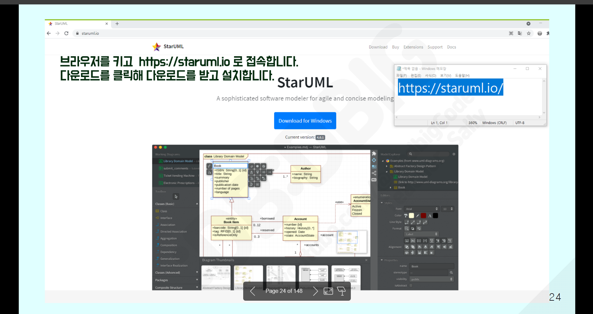
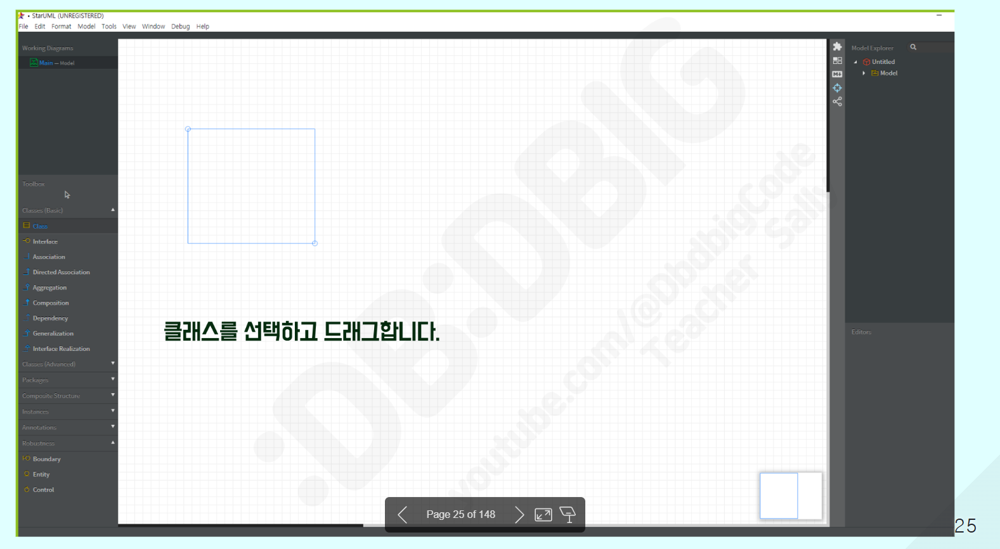
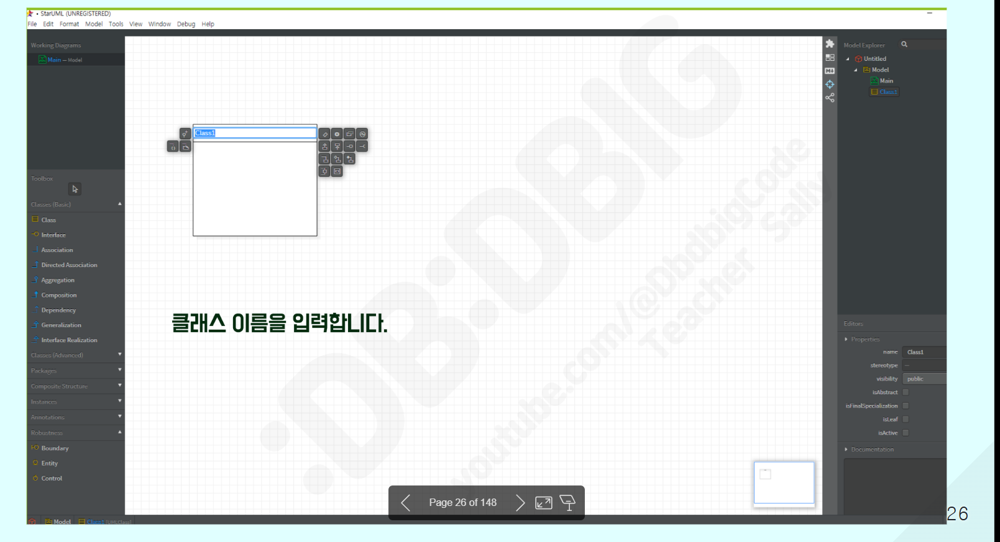
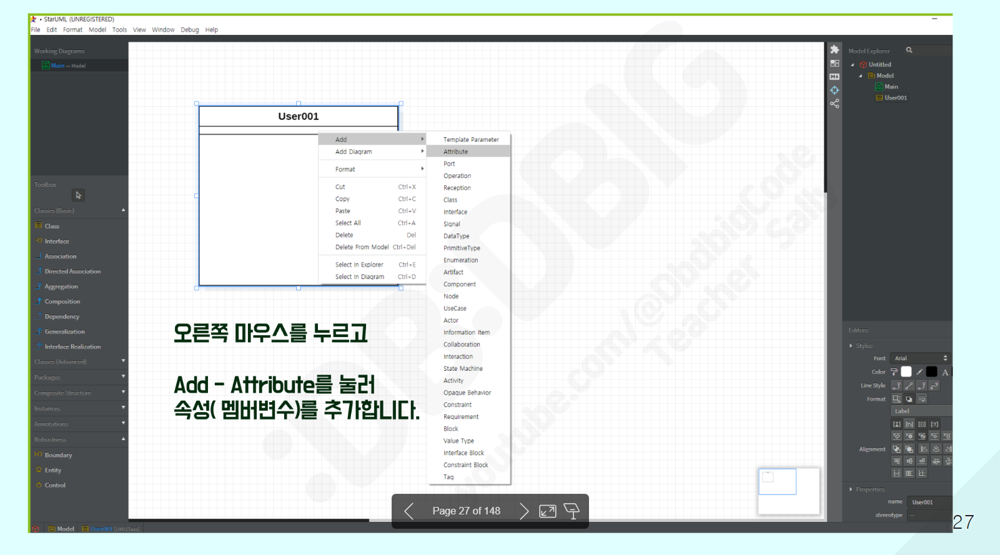
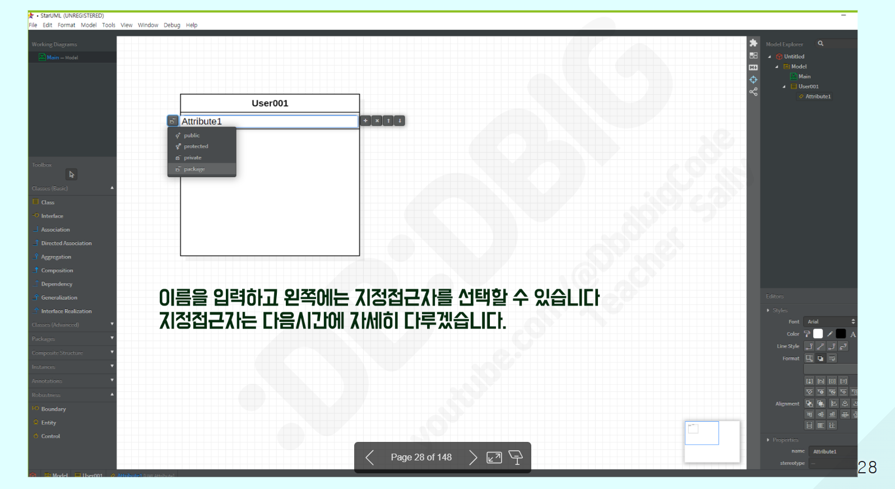
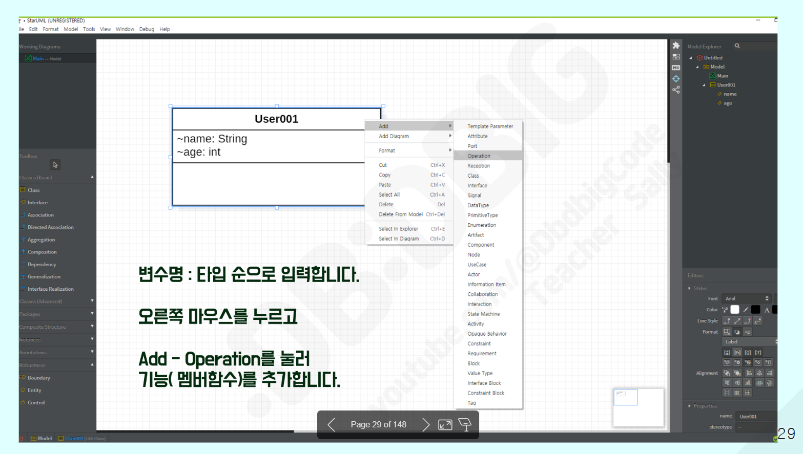
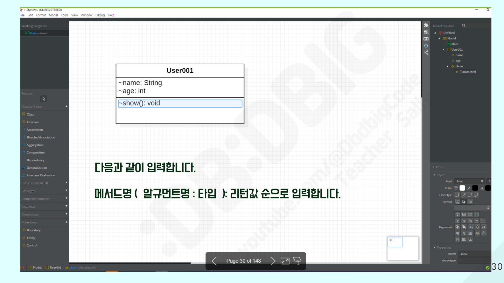
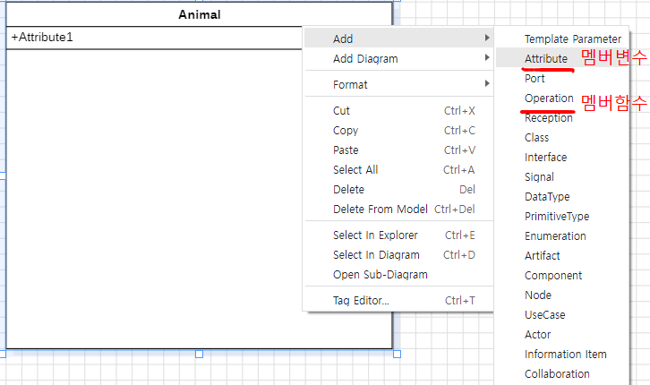
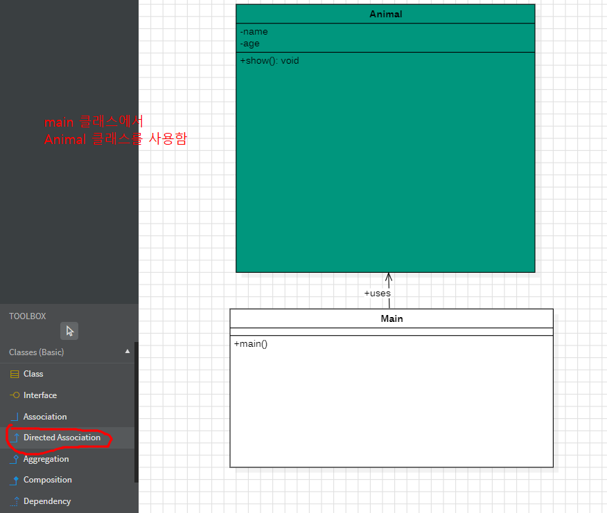
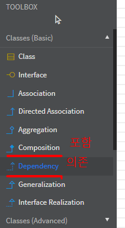
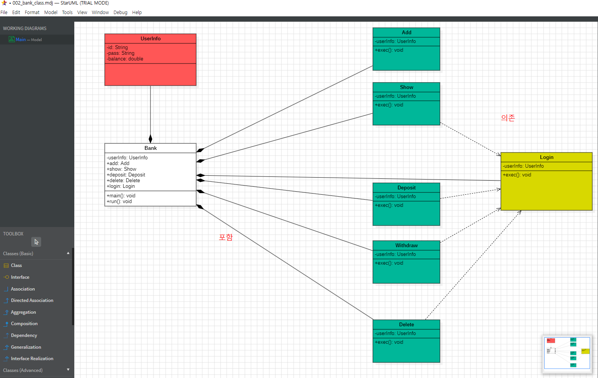


# Java 진행 (1)
>>>>>>>>>>>>>>>>>>>>>>>>>
1. UML 설계도
2. BANK 부품 class Bank{   }
1) 정보보관   : UserInfo [ -id, -pass, -balance]  <!-- -(private) -->  
2) 기능클래스 : 
   Add      [ exec() ]
   Show     [ exec() ]
   Deposit  [ exec() ]
   Withdraw [ exec() ]
   Delete   [ exec() ]
   login    [ exec() ]


Java 부분


인스턴스 변수 메서드는 생성자로 꼭초기화해줘야한다.

보니까 

```
Java

// Bank_Main 파일

//1.클래스는 부품객체
//2.상태와 행위
public class Bank_Main {
	// 상태 : 멤버변수
	UserInfo userinfo;	// 정보보관용도 - model - db
	Add 	 add; Show     show;
	Deposit deposit; Withdraw  withdraw; Delete    delete; Login     login  ; 
```
메인 클래스(bank_main)에서 DB로 저장하는 형식이 이런 형식으로 하는 거였음

```

public class UserInfo {
	private String id;
	private String pass;
	private double balance;
	private int    find = -1;
	
	public UserInfo() { super();}
	public UserInfo(String id, String pass, double balance) { super(); this.id = id; this.pass = pass; this.balance = balance; }
	
	@Override public String toString() 
	{ return "UserInfo [id=" + id + ", pass=" + pass + ", balance=" + balance + "]"; } // 디버깅

	public String getId() {return id;}			public void setId(String id) {this.id = id;}
	public String getPass() {return pass;}		public void setPass(String pass) {this.pass = pass;}
	public double getBalance() { return balance; } public void setBalance(double balance) { this.balance = balance; }
	public int getFind() { return find; } public void setFind(int find) { this.find = find; } 
	
}

```

구조 자체가 UserInfo에서 id와 pass, balance를 private로 선언하여 다른 class에서 사용할때, setId 형식을 사용해서 값을 설정하거나, getId로 값을 가져오는 형식을 사용함
getter & setter 자체는 UserInfo 파일에서 설정해서 사용 할 수 있게 만들어놓은 느낌이고.
@Override 는 변수값을 출력해주는 디버깅용 메서드이기 때문에 사용하여 문제점을 해결하기 좋아보임.

```

// 행위 : 멤버함수	( 초기화 )
	public Bank_Main() {
		// 상태 : 멤버변수
		this.userinfo = new UserInfo();
		this.add	  = new Add( this.userinfo );
		this.show 	  = new Show( this.userinfo);
		this.deposit  = new Deposit ( this.userinfo);	// Q1. Deposit   deposit  입금기능
		this.withdraw = new Withdraw ( this.userinfo);	// Q2. Withdraw  Withdraw 출금기능
		this.delete   = new Delete ( this.userinfo);	// Q3. Delete    delete   삭제기능
		this.login    = new Login ( this.userinfo);  	// Q4. Login     run      메서드 안에 기능
	}

```

인스턴트 변수를 사용할 때의 주의점이 항상 생성자를 호출하여 초기화를 해줘야함 안그러면 사용이안됨


```

public void run() {
		// 1. 무한반복
		Scanner sc = new Scanner(System.in);
		int num = -1;
		while(num != 9) {
//			System.out.println(this.userinfo + "\t" + 	System.identityHashCode(this.userinfo));
			System.out.print("\n\n🌟💰 WELCOME TO BANK SYSTEM 💰🌟\n" + 
		             "\n[1] ➕ 계좌 추가" + "\n[2] 🔍 계좌 조회" + "\n[3] 💵 입금하기" + "\n[4] 💸 출금하기" + "\n[5] 🗑️ 계좌 삭제  "
		             +"\n\n👉 번호를 선택하세요:");
			num = sc.nextInt();
			
			switch(num) {
			case 2 : case 3 : case 4: case 5:{if (userinfo.getFind() == 1){break;}
			else if (userinfo.getFind() == -1) {userinfo.setFind(login.exec());;	//메서드 리턴값 대입시 바로 메서드 실행
			}
			else {System.out.print("로그인실패");}continue;
			}}
			
			
			switch(num) {
			case 1	: this.add.exec(); break;
			case 2	: this.show.exec(); break;
			case 3	: this.deposit.exec(); break;
			case 4	: this.withdraw.exec(); break;
			case 5	: this.delete.exec(); break;
			
			}
			
			num = 0;
		
	};
	}
	
	public static void main(String[] args) { Bank_Main bank = new Bank_Main(); bank.run(); }
}
```
메뉴판 설정과 로그인을 요구하는 메뉴와 무한반복 설정등은 bank_main 클래스에서 담당시키고. login 자체의 기능은 다른 클래스로 따로 작성함


# HTML 복습

>>>>>>>>>>>>>>>>>>>>>>>>


```

<!DOCTYPE html>
<html lang="ko">
<head>
  <meta charset="UTF-8">
  <meta name="viewport" content="width=device-width, initial-scale=1.0">
  <title>BOOTSTRAP</title>
  <!-- Latest compiled and minified CSS -->
  <link href="https://cdn.jsdelivr.net/npm/bootstrap@5.3.3/dist/css/bootstrap.min.css" rel="stylesheet">

  <!-- Latest compiled JavaScript -->
  <script src="https://cdn.jsdelivr.net/npm/bootstrap@5.3.3/dist/js/bootstrap.bundle.min.js"></script>
</head>
<body>
  <!-- 여기에 콘텐츠를 추가하세요 -->
   <div class="container card">
        <h3 class="card-header">001. repeat </h3>
         <div class="card-body">
            <h4>EX</h4>
            <input type="button"  value="click"         id="test1"    class="btn btn-success"   />
            <input type="button"  value="value"         id="test2"    class="btn btn-success"   />
            <input type="button"  value="innerHtml"     id="test3"    class="btn btn-success"   /> 
            <div class="result_target  my-5">JAVASCRIPT</div>
            <pre>
            브라우저가 로딩이 되면
            Q1) #test1를 클릭하면 본인이름 입력받고 입력받은 값 알림창 띄우기
            Q2) #test2를 클릭하면 #test2의 value값을 INPUT으로 수정
            Q3) #test3를 클릭하면
            1.  .result_target영역안의 문자열을 알림창으로 띄우고
            2.  .result_target영역안을 본인이름으로 수정

            </pre>
            <script>
              window.addEventListener("load", function(){

                let test1 = document.getElementById("test1");
                test1.onclick = function(){
                  let name  = prompt("이름을 입력해주세요"); 
                alert(name);};
                 
                let test2 = document.getElementById("test2");
                test2.onclick = function(){
                  // let value1 = test2.querySelector("#value");
                // alert("ddd");
                test2.value = "INPUT";};

                let test3 = document.getElementById("test3");
                test3.onclick = function(){
                let target = document.querySelector(".result_target");
                // alert("홍길동");
                target.innerText="홍길동"
                };


              });
            
            </script>
        </div>
   </div>
</body>
</html>

```


querySelector로 진행 할때.

- #idName → ID 선택자
- .className → 클래스 선택자
- document.querySelector(...)는 CSS 선택자 문법을 그대로 따릅니다


```
<div class="card-body"> 
    <h4>EX</h4>
    <div class="w-25  bg-success  rounded  p-2  mx-auto text-white  text-center target_box">
      <h1>ROTATE</h1>
    </div>
    <div class="w-25 text-center m-2">
      <a href="#" class="btnLeft   btn btn-outline-success">LEFT ROTATE</a>
      <a href="#" class="btnRight  btn btn-outline-success">RIGHT ROTATE</a>
    </div>
    <script>

      
      window.addEventListener("load", function(){

        let bl = document.querySelector(".btnLeft");
        let br = document.querySelector(".btnRight");
        let card = document.querySelector(".target_box");
        // let btn = card.querySelector("h1");
        let num = 0;
        bl.addEventListener("click", function(e){
          // alert("1");
          e.preventDefault();
          card.style.transform = "rotate(" + ++num + "deg)";
        });
        br.addEventListener("click", function(e){
          // alert("2");
          
          e.preventDefault();
          card.style.transform = "rotate(" + --num + "deg)";
        });

      }); 
    

    </script>
  </div>
</div>
```
원하는 동작 btnLeft를 눌렀을 때 왼쪽으로 회전, btnRight를 눌렀을 때 오른쪽으로 회전 시키는 것이 목표
변수는 대상이되는 버튼 2개와 회전시킬 목표, 그리고 회전 수치를 저장할 변수가 필요함
스크립트 해석,

```
window.addEventListener("load", function(){});
                          로드될때, 실행시킨다.
```

```
let   bl     =      document.querySelector    (".btnLeft");
변수 변수명            문서전체  쿼리셀렉터    클래스가 btnLeft인 요소
```

```
bl.      addEventListener("click", function(e){
버튼왼쪽       이벤트       (이벤트 실행조건 , 이벤트내용(e))

          e.preventDefault();
          기존 버튼의 이벤트를 막음 (이 경우 제일위로 이동하는 # 이벤트처리가 되어있음)

    card.       style.    transform = "rotate(" +    ++num       + "deg)";
    변수(요소) 스타일속성변경   속성명   = 속성값  +     변수(증감)     +  단위

        }); // bl.addEventListener End
```


