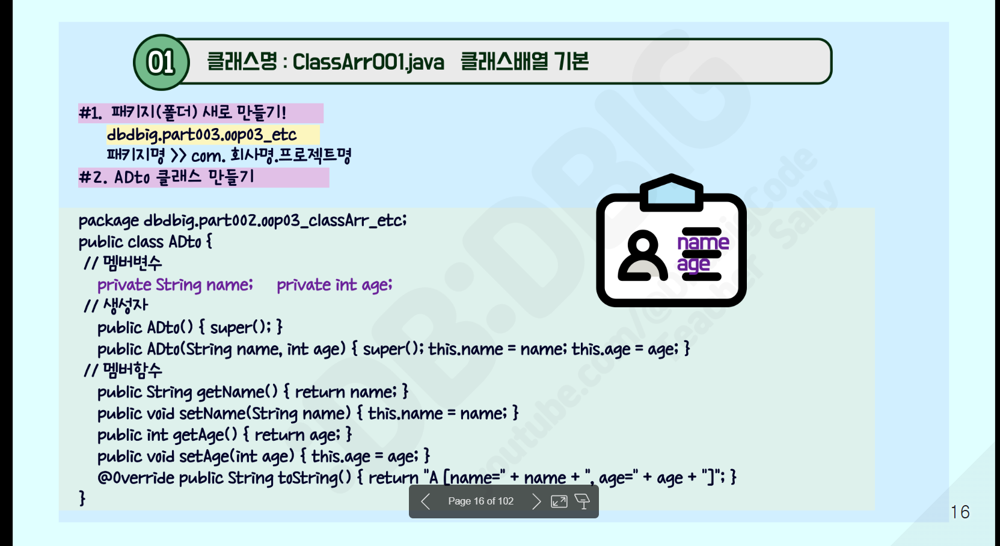
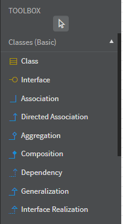

```
package com.company.java011_ex;
// 패키지 다를시 import필요

import java.util.Arrays;

//Apple [name=RED, order=iron, num=2, price=1000]
//Apple [name=GREEN, order=hulk, num=1, price=1500]
//Apple [name=GOLD, order=captain, num=3, price=2000]

public class ClassArrEx1{
	  public static void main(String[] args) {
	        Apple[] apples= new Apple[3]; 
	       
	        //위의 화면처럼 값 셋팅
	        String []name = {"RED","GREEN","GOLD"};
	        String []order = {"iron","hulk","captain"};
	        int []num = {2,1,3};
	        int []price = {1000,1500,2000};
	        
	        
	        apples[0] = new Apple("RED", "iron", 2, 1000);
	        apples[1] = new Apple("GREEN", "hulk", 1, 1500);
	        apples[2] = new Apple("GOLD", "iron", 3, 2000);
	        
	        System.out.println("ver-1 for");
	        for(int i = 0; i<apples.length; i++) {System.out.println(apples[i]);}
	        
	        System.out.println("\nver-2 향상된 for");
	        // 	한개씩 		: 배열, 객체명 
	        for ( Apple a : apples) {System.out.println(a);}
	        
	        Apple[] apples2 = new Apple[] {
	        		new Apple("RED", "iron", 2, 1000) , new Apple("GREEN", "hulk", 1, 1500)
	        		, new Apple("GOLD", "captain", 3, 2000)
	        };
	        System.out.println(Arrays.deepToString(apples2));
	        
	        
//	        for (int i = 0; i < apples.length; i++ ) {
//	        	apples[i] = new Apple(setName[i],setOrder,setNum,setPrice); 
//	        	
//	        	
//	        	apples[i].setName(name[i]);
//	        	apples[i].setNum(num[i]);
//	        	apples[i].setPrice(price[i]);
//	           
//	        }
//	        
//	        System.out.println(apple);
	        
	        
	        //위의 화면처럼 출력
	  }
	}
```

```
/* 클래스의 재사용
   Object      {         }
     ↑
  MobileNote   { show() }
     ↑
 MobileNote7   { iris,face / newShow() } 
     ↑
 MobileNote8   { ◎face     / ◎newShow() }  
     ↑
 MobileNote9   { battery   / ◎newShow() } 

----------------------------------------------
MobileNote8 my8 = new MobileNote8();
----------------------------------------------

----------------------------------------------
MobileNote7 my7 = new MobileNote7();
----------------------------------------------
1.     MobileNote7  는    MobileNote 이다.
2.     생성자호출순서 :  MobileNote7()  → MobileNote()  → Object()
3.     객체생성순서  :  Object → MobileNote → MobileNote7
       1번지 : { iris,face / newShow() } - { show() }
       
*/

```

```
연습문제2)     클래스 상속과 메서드 오버라이딩
패키지명 : com.company.java011_ex 
클래스명 : ClassEx002.java

1. 아래 조건에 맞게 ClassEx002.java 파일을 작성하고,
   main() 메서드를 수정하여 다음과 같은 출력 결과가 나오도록 하시오.
2. 주어진 코드 (수정 전)
```java
public class ClassEx002 {
    public static void main(String[] args) {
        MobileNote7 my7 = new MobileNote7();
        my7.setIris("brown");
        my7.setFace("pretty");
        my7.newShow();

        MobileNote8 my8 = new MobileNote8();
        my8.setFace("pretty");
        my8.newShow();

        MobileNote9 my9 = new MobileNote9();
        my9.setBattery(24);
        my9.newShow();
    }
}
```
3. 출력 결과 

NOTE7 객체 기능(Overriding)
iris = brown
face = pretty

NOTE8 객체 기능(Overriding) 추가
face = pretty

NOTE9 객체 기능(Overriding) 추가
battery 예쁘게 사용하기!
battery = 24

4. 클래스 구조 설명
클래스명      멤버변수        멤버메서드
MobileNote   없음                        void show()
MobileNote7   String iris, String face  void newShow()
MobileNote8   String face                 void newShow()
MobileNote9   int battery                 void newShow()
모든 멤버변수는 private으로 선언

-각 클래스는 MobileNote 클래스를 상속받음
-newShow() 메서드는 각 클래스에서 오버라이딩되어 고유한 출력 형식을 가짐

5. 요구사항
-MobileNote 클래스를 기반으로 상속 구조를 설계할 것 (MobileNote7, MobileNote8, MobileNote9 모두 상속)
-각 클래스에서 setter 메서드를 통해 멤버변수 값을 설정할 수 있도록 구현할 것
-newShow() 메서드를 오버라이딩하여 출력 형식을 문제에서 제시한 형태로 맞출 것
-출력 순서와 내용이 정확히 일치하도록 main() 메서드를 구성할 것


연습문제3)    클래스 상속과 메서드 호출 우선순위
패키지명 : com.company.java011_ex 
클래스명 : ClassEx003.java

1. 아래 조건에 맞게 ClassEx003.java 파일을 작성하고, 
   빈칸을 채운 뒤 main() 메서드를 실행하여 출력 결과를 예상하시오.
2. 주어진 코드 (수정 전)
```java
class Grand extends Object {
    public void one() { System.out.println("grand : one"); }
    public void two() { System.out.println("grand : two"); }
}
// (1) Father 클래스가 Grand 클래스를 상속받도록 수정
public class Father {
    public void three() { System.out.println("Father : three"); }
}

```
3. 출력 결과  
 
grand : one
grand : two
Father : three

4. 클래스 구조 설명
클래스명        상속 관계       주요 메서드
1) Object   최상위 클래스           -
2) Grand      Object → Grand         one(), two()
3) Father   Grand → Father       three()
4) Uncle      Object → Uncle 
5) Aunt      Object → Aunt     
- 모든 클래스는 Object 클래스를 기본적으로 상속받음
- Grand 클래스는 one()과 two() 메서드를 정의
- Father 클래스는 Grand를 상속받아 three() 메서드를 추가

5. 요구사항
- Father 클래스가 Grand 클래스를 상속받도록 extends 키워드를 활용할 것
- main() 메서드에서 Father 객체를 생성하고 one(), two(), three() 메서드를 순서대로 호출할 것
- 상속 관계에 따라 메서드 호출 우선순위를 이해하고 출력 결과를 정확히 예측할 것
- Uncle, Aunt 클래스도 Object를 상속받는 구조로 확장 가능하므로, 필요 시 추가 구현할 것


```


```

연습문제1)  멤버변수
패키지명 : com.company.java011_ex
클래스명 :   ExtendsEx001.java
1. 아래 조건에 맞게 Extends002.java 파일을 작성하고, main() 메서드를 수정하여 다음과 같은 출력 결과가 나오도록 하시오.
2. 주어진 코드 (수정 전)
```java
public class ExtendsEx001 {
    public static void main(String[] args){
        Green mygreen = new Green();
        mygreen.name = "LIGHT_GREEN";
        mygreen.num = 5;
        mygreen.show();
    }
}
```
3.출력 결과 
GREEN
NAME : LIGHT_GREEN
NUM : 5

4. 클래스 구조 설명
 Color 클래스 : 멤버 변수:  name (String, public)  / num (int, private)
  ↑
Green 클래스  : 멤버 변수:  name (String, public), num (int, private)
 

5 요구사항
1) Color와 Green 클래스의 상속 관계를 활용할 것
2) main() 메서드에서 직접 name과 num에 값을 할당할 수 있도록 접근 제어자를 고려할 것
3) show() 메서드를 통해 출력 형식을 맞출 것


```

```

package com.company.java011;

//1. 상속? 클래스의 재사용
/* 실선(확장-연결)-속이 빈 화살표(일반화)
   Object		3)			  {			Object		}	  4)
     ↑
     A	int a =10   2)			  {a	 A()		a=10} 5)
     ↑
     B	int b=20   1) new : 1번지 {b   → B()			b=20} 6)
     
     -------------------------------------------------------
     B b1 = new B(); b1.show();
     -------------------------------------------------------
     
     1) extends 상속
     2) is a : A는 Object이다, B도 Object
     3) 생성자호출 : B() → A() → Object
     4) 객체생성  : Object → A → B
     
     
 */
class A extends Object{
	int a=10;
	public A() { super(); }	
}
class B extends A	  {
	int b=20;
	public B() { super(); }
	public void show() {System.out.println(super.a+ " \t" + this.b);}
}

public class Extends001 {
	public static void main(String[] args) {
		B b1 = new B(); b1.show();
	}

}


```

```

package com.company.java011;

import java.util.Arrays;

public class ClassArr001 {
	public static void main(String[] args) {
		// 1) Toy [] 나주소 받을수 있어~
		Toy [] toys = new Toy[3];	//2) new 번지, Toy형태의 자료형 3개		
		System.out.println("1, " + toys);
		System.out.println("2, " + Arrays.toString(toys));
		
		
		toys[0] = new Toy();
		toys[0].setName("할로윈키티"); toys[0].setAge(52);
		System.out.println("3. " + toys[0] );
		
		
		// 사용방법2
		Toy [] toys2 = new Toy[] {
				new Toy("할로윈키티", 52) , new Toy("건담", 47)
		};
		// toys[0].name, toys[0].age
		// toys[1].name, toys[1].age
		
		for (int i=0; i<toys2.length; i++) { toys[i].show();}
		
		/// 클래스명의 뒷쪽에 [] 두번째 부분엔 숫자(층칸수) 선언
		///사용할땐 지역변수명[숫자]
	}
}


/*
------------------------[ runtime data area]
> Toy.class	Class_Repeat.class, Toy.company="(주) 703toyland" , Toy.num=0
------------------------------------
[heap: 동적]            | [stack : 잠깐빌리기]
1번지 [null][null][null]	<- toys [1번지]
						| 	main
		------------------------------------
*/

```


● 6. 클래스다이어그램
1. 시스템을 구성하는 클래스들 사이관계를 표현
2. 클래스 - 객체를 생성하는 설계도
3. staruml.io - 다운로드 - 설치
4. 클래스
----------------------------------------
[Animal]
----------------------------------------
add - attribute (멤버변수)
----------------------------------------
add - operation (멤버함수)
----------------------------------------

5. uml 관계
> 1) 연관관계 ( 연결 → 한쪽은 알지만, 다른쪽은 상대방의 존재는 모름 )
> 2) 일반화관계(상속, IS-A 고양이는 동물이다, 속이 빈 화살표   )
      고양이는 동물이다(O), 사람도 동물이다(O), 동물은 고양이다? (X)
> 3) 집합관계 (자동차 = 엔진 + 휠 
                ◆ 생성자안에서 new (합성)   ,   ◇ 생성자 안에서 주소(집약) )
4) 의존관계
5) 실체화관계(인터페이스)

6. SOLID 원칙 
S : 단일책임      - 한클래스는 한가지 일만해요.  (쿠키굽기)
O : 개방폐쇄      - 새로운 쿠키는 쉽게 추가 (확장가능, 수정닫힘)
L : 리스코프치환   - 모든 쿠키는 같은 방식으로 만들 수 있어요!  
I : 인터페이스분리 - 필요한 기능만 딱! 인터페이스 나누기
D : 의존역전      - 구체적인 쿠키말고, 추상적인 쿠키에 의존



● 6. 상속


```

package com.company.java011;

public class Apple{   //// 실행 main과 파일을 분리해주세요!
	   private String name;
	   private String order;
	   private int num;
	   private int price;
	   
	   public String getName() { return name; } public void setName(String name) { this.name = name; } public String getOrder() { return order; } 
	   public void setOrder(String order) { this.order = order; } 
	   public int getNum() { return num; } public void setNum(int num) { this.num = num; } public int getPrice() { return price; } public void setPrice(int price) { this.price = price; }  
	}

```


JavaScript
```
<!DOCTYPE html>
<html lang="ko">
<head>
  <title>DBDBIG</title>
  <meta charset="utf-8">
  <meta name="viewport" content="width=device-width, initial-scale=1">
<!-- Latest compiled and minified CSS -->
<link href="https://cdn.jsdelivr.net/npm/bootstrap@5.3.3/dist/css/bootstrap.min.css" rel="stylesheet">

<!-- Latest compiled JavaScript -->
<script src="https://cdn.jsdelivr.net/npm/bootstrap@5.3.3/dist/js/bootstrap.bundle.min.js"></script>
</head>
<body>

<!--                                    -->
<!--                                    -->
<!--                                    -->
<!--                                    -->
<!--                                    -->
<div class="p-3 bg-primary text-white ">
  <h1>007. CONTROL</h1>
  <ol>
    <li>IF</li>
    <li>SWITCH</li>
    <li>FOR/WHILE/DO WHILE</li>
  </ol>
</div>
<!--                                    -->
<!--                                    -->
<div class="container card  my-3">
  <h3  class="card-header">007. CONTROL - Step1. IF</h3>
  <div class="card-body">
    <h4>Step1. IF</h4>
      <script>
       // if(조건){조건이 true }
       // else    {조건이 false}
        let data = 1; 
        if (data==1 ) { console.log("1이다");}
        else{ console.log("1이 아니다.");}
      </script>
  </div>
  <!--     -->
  <!--     -->
  <hr/>
  <div class="card-body">
    <h4>EX</h4>
    <pre>
      평균을 입력하세요 __입력받기
      만약 평균이 60점 이상(60점포함)이라면 합격, 아니면 불합격 출력
    </pre>
    <input type="button" value="ex1"  id="ex1"  title="버튼을 클릭하세요" class="btn btn-success"      />
    <script>

      window.addEventListener("load", function(){
        let ex1 = document.querySelector("#ex1");
        ex1.addEventListener("click", function(){

        let avg  = prompt("평균입력");
        if(avg >= 60){alert("합격");}
        else {alert("불합격")}; 

        });

      });
 
    </script>
  </div>
</div>


<!--                                    -->
<!--                                    -->
<div class="container card  my-3">
  <h3  class="card-header">007. CONTROL - Step2. SWITCH</h3>
  <div class="card-body">
    <h4>Step2. SWITCH</h4>
      <script>
      /*
      swtich(  처리하고 싶은 대상    ){
          case 대상의상태:    처리;  break;
          case 대상의상태:    처리;  break;
          case 대상의상태:    처리;  break;
          default : 기본처리
      } */
        let data2=2;
        switch(data2){
          case 1 : console.log("1이다."); break;
          case 2 : console.log("2이다."); break;
          case 3 : console.log("3이다."); break;
          default : console.log("1,2,3이 아니다")
        }
      </script>
  </div>
  <!--     -->
  <!--     -->
  <hr/>
  <div class="card-body">
    <h4>EX</h4>
    <pre>
      4,5,6 중에 입력하세요
      4번 월드콘  ,  5번 구구콘 , 6번 설레임 알림창을 띄우시오.
    </pre>
    <input type="button" value="switch1"  id="switch1"  title="버튼을 클릭하세요" class="btn btn-success"      />
    <script>

      window.addEventListener("load", function(){
        let swc = document.querySelector("#switch1");
        swc.addEventListener("click", function(){
        let chs = prompt("4,5,6 중에 입력하세요");
        switch (chs){
          case "4" : {alert("월드콘")}; break;
          case "5" : {alert("구구콘")}; break;
          case "6" : {alert("설레임")}; break;
          default: {alert("아무값도 아님")}; break;
        };

        });

      });
      
    </script>
  </div>
</div>


<!--                                    -->
<!--                                    -->
<div class="container card  my-3">
  <h3  class="card-header">007. CONTROL - Step3. FOR/WHILE/DO WHILE</h3>
  <div class="card-body">
    <h4>Step3. FOR/WHILE/DO WHILE</h4>
      <script>
      /*
        STEP1 for  - 반복횟수 알때
        for(  초기문; 조건문; 증감문 ){  }

        STEP2 while- 반복횟수 모를때
        초기문;
        while(  조건문 ){     증감문;  }

        STEP3 do while- 한번은 실행을 해야할때
        초기문;
        do{     증감문;  } while(  조건문 );

        STEP4 향상된 for
        for( index  in 객체 ){     }*/
        console.log("step1-for");
        for(let i=1; i<4; i++){console.log(i);}

        console.log("step2-while");
        let i=1;
        while( i<4){console.log(i); i++}

        console.log("step3-do-while");
        i=1;
        do{console.log(i); i++;}while( i<4);
 
        console.log("step4-향상된 for");
        const list = ['a','b','c'];
        for(let i in list ) {console.log( i + "/" + list[i]); }

        console.log("step4-향상된 for 2");
        list.forEach( (ele , index, list)=> { // e-i-l
          console.log( ele + "/" + index + "/" + list);
        } );
      </script>
  </div>
  <!--     -->
  <!--     -->
  <hr/>
  <div class="card-body">
    <h4>EX</h4>
    <pre>
    for, while, do while
    Q1)		1	2	3	4	5
    Q2)		5	4	3	2	1
    Q3)		2	4	6
    Q4)		hello1		hello2		hello3
    Q5)		const list1 = [1	2	3	4	5];
    </pre>
    <script>
      // for, while, do while
      //A1)		1	2	3	4	5
      window.addEventListener("load", function(){


        console.log("1for 1 2 3 4 5")

        for (let i = 1; i<6; i++){
          console.log(i)
        };
        console.log("1while 1 2 3 4 5")
        let i = 1;
        while ( i<6){
          console.log(i)
        i++};

        console.log("1do-while 1 2 3 4 5")
        i = 1;
        do{
          console.log(i)
        i++}while ( i<6);


      //A2)		5	4	3	2	1

      console.log("2for 5 4 3 2 1")

      for (let i = 5; i>=1; i--){
          console.log(i)
        };

      console.log("2while 5 4 3 2 1")

      i = 5;
      while ( i>=1){
          console.log(i)
         i--};

      console.log("2do-while 5 4 3 2 1")
      i = 5;
      do{
          console.log(i)
        i--}while (i>=1);
        

      //A3)		2	4	6

      console.log("3for 2 4 6")
        let num = 0;
      for (let i = 1; i<4; i++){
          num += 2;
          console.log(num)
        };

      console.log("3while 2 4 6")
        num = 0;
        i = 1;
      while (i<4){
          num += 2;
          console.log(num)
        i++};

      console.log("3do-while 2 4 6")
        num = 0;
        i = 1;
      do{
          num += 2;
          console.log(num)
        i++}while (i<4);
        

      //A4)		hello1		hello2		hello3
        
        console.log("4for		hello1		hello2		hello3")
        let word = "hello";
      for (let i = 1; i<4; i++){
          console.log(word + i)
        };

        console.log("4while		hello1		hello2		hello3")
        i = 1; 
      while (i<4){
          console.log(word + i)
         i++};

         console.log("4do-while		hello1		hello2		hello3")
        i = 1; 
      do{
          console.log(word + i)
         i++}while (i<4);
        

      // 향상된 for , forEach
      //A5)		const list1 = [1	2	3	4	5];

      console.log("향상된 for = [1	2	3	4	5]")

      const list = [1,2,3,4,5];
      console.log("[");

      
      for (i in list){
        
        console.log(list[i]);

      }
      console.log("]");


       console.log("향상된 for 2 = [1	2	3	4	5]");
       console.log("[");
        list.forEach( (ele , index, list)=> { 
          console.log( ele );
        } );
        console.log("]");
      
         });
    </script>
  </div>
</div>


</body>
</html>
```


제어문의 종류와 새로운 제어문 향상된 for와 for each?


```

<script>
      /*
        console.log("step4-향상된 for");
        const list = ['a','b','c']; // 배열선언
        for(let i in list ) {console.log( i + "/" + list[i]); } // i in list

        console.log("step4-향상된 for 2");
        list.forEach( (ele , index, list)=> { // e-i-l
          console.log( ele + "/" + index + "/" + list);
        } );
      </script>

```

상수 list = ['a','b','c']; 배열이 있을때

향상된 for문
```
const list = ['a','b','c']; // 배열선언
        for(let i in list ) {console.log( i + "/" + list[i]); } // i in list

// for (리스트를 담을 변수 in 배열변수) {수행내용};
```

for(i in list ) {   }; 배열을 `i`에 한개씩 꺼내서 담는 for문.
alert(i); 로 출력하게되면 a b c 가 차례대로 출력되는 구조가 된다.


forEach 인경우
```
list.forEach((ele, index, list) => { 
console.log(ele + "/" + index + "/" + list); });

// 배열변수.forEach (엘레멘트, 순서, 배열변수) = > {수행내용}; 
```

`i`는 인덱스 순서를 담당하고,  "list[i]"형태로 배열을 순서대로 출력

