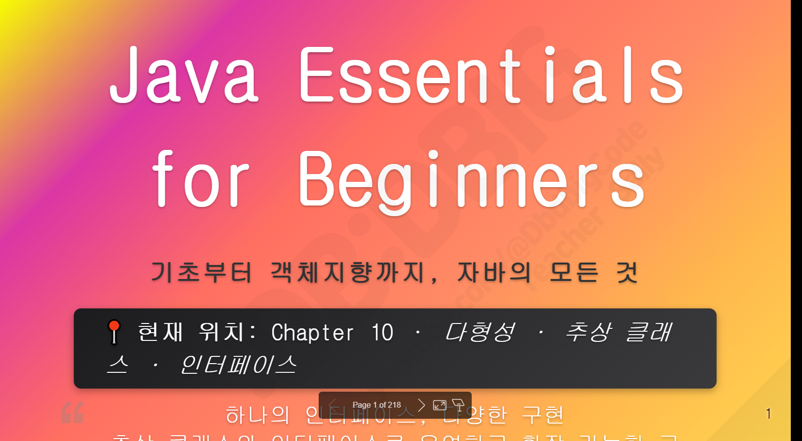

Track001 - github

>1. 자바 part002 - OOP
>2. WEB BASIC - 자기소개페이지 (목)
>3. 이력서 (전공자-100개 1개 , 비공자 200개 1개) 
  [필수]SQLD - join , subquery
  [선택]네트워크관리사 2급, 리눅스마스터 2급, 정보처리기능사

    09.29   /   11.04   /   10.13 일정확인

    3. 네트워크관리사 2급

    > ~2025.09.29 (필기 접수 ) : 11월 2윌 시험 / 11월 4일 발표
    > ~2025.11.04 (실기 점수 ) : 11월 30일 시험 / 12월 9일 발표

    4. Sqld 시험 (중)
    > ~2025.10.13 (필기 점수) : 11월 16일 시험 / 12월 12일 발표

# ■ Github
## 12. 깃허브 협업
---
1. html + css + js/jquery   [개인]
2. spring + mybatis + jstl
3. node + react
4. spring boot + thymeleaf + jpa + mybatis + react
5. flutter + spring boot + jpa + mybatis + react

Step1. 팀깃허브 (git)
Step2. 팀원 - 브랜치
Step3. mission002_자격증.md

## Java

연습문제1)
package com.company.java012_ex;
 
//Q1. 상속도를 그리시오. 
class TestA2 extends Object{  
   int a=10;
   @Override public String toString() { return "TestA2 [a=" + a + "]"; }    
}
class TestB2 extends TestA2{
   int b=10;
   @Override public String toString() { return "TestB2 [b=" + b + "]"; }   
}
/////////////////////////////////////////////////
public class PolyEx001 {
   public static void main(String[] args) {
      TestA2  ta = new TestB2();
      //Q2. 15번째줄에서   TestA2  ta 는 클래스의 무엇을 사용할수 있을까요? 코드의 의미
      //Q3. 15번째줄에서   TestB2() 는 클래스의 무엇을 사용할 수 있을까요?
      
      System.out.println(ta); // Q4. 출력내용과 이유?   TestA2  vs  TestB2
      System.out.println(ta.a); //Q5.사용가능?
      //System.out.println(ta.b); //Q6.사용가능?
   }
}
/////////////////////////////////////////////////

연습문제2)
패키지명 : com.company.java012_ex
클래스명 :  PolyEx002

//Q1. 상속도를 그리시오. 
class TestA3  extends Object{  
   int a=10;
   @Override public String toString() { return "TestA3 [a=" + a + "]"; }
}
class TestB3  extends TestA3{  
   int b=10;
   @Override public String toString() { return "TestB3 [b=" + b + "]"; }
} 
/////////////////////////////////////////////////
public class PolyEx002 {
   public static void main(String[] args) {
      TestB3  tb =  (TestB3) new TestA3();
      //Q2. 15번째줄에서   TestB3  tb는 클래스의 무엇을 사용할수 있을까요? 코드의 의미
      //Q3. 15번째줄에서   T(TestB3) new TestA3() 클래스의 무엇을 사용할 수 있을까요?
      //Q4. 코드상에서는 문제가 없는데 코드를 실행하면 오류가 나는 이유는?
   }
}

연습문제3)
패키지명 : com.company.java012_ex
클래스명 :  PolyEx003

//Q1. 상속도를 그리시오. 
class TestA4  extends Object{  
   int a=10;
   @Override public String toString() { return "TestA4 [a=" + a + "]"; }
}
class TestB4  extends TestA4{  
   int b=20;
   @Override public String toString() { return "TestB4 [b=" + b + "]"; }
}
/////////////////////////////////////////////////
public class PolyEx003 {
   public static void main(String[] args) {
      TestA4  ta = new TestA4();
      //Q2. TestA4  ta 사용할수 있는범위는?
      //Q3. new TestA4() 는  heap area 에서 호출되는 생성자의 순서와 객체가 만들어지는 순서는?
      TestB4  tb = new TestB4();  
      //Q4. TestB4  tb 사용할수 있는범위는?
      //Q5. new TestB4() 는  heap area 에서 호출되는 생성자의 순서와 객체가 만들어지는 순서는?
      ta = new TestB4();
      //Q6. ta가 사용할수 있는 보장하는 변수와 메서드는?
      //Q7.ta = new TestB4(); 에서 new TestB4() 에서 사용할수 있는 범위는? 
      tb         = (TestB4) ta;   
      //Q8. tb         = (TestB4) ta;   에서 tb가 사용할수 있는 범위는?
      //Q9. 컴피일러시  tb         = (TestB4) ta;  오류가 안나는 이유는?
      
      System.out.println(tb);  //Q10. 출력내용과 그이유는? TestA4  vs  TestB4
      System.out.println(tb.b);//Q11. 출력내용?
      System.out.println(tb.a);//Q12. 출력내용?
      
   }
}

연습문제4)  다형성
패키지명 : com.company.java012_ex
클래스명 : PolyEx004
다음과 같이 코드를 작성하시오.
// Q1. 상속도 그리기
// Q2. 각클래스에서 사용할수있는 멤버변수/멤버메서드
class Papa extends Object{  
   int money = 10000;     
   public Papa() { super(); }
   public void sing() {  System.out.println("GOD-거짓말");  }
}// end class
class Son extends Papa{ 
   int money = 1500;
   public Son() { super(); }
   @Override public void sing() {  System.out.println("빅뱅-거짓말"); }
} // end class
public class PolyEx001 {
   public static void main(String[] args) { 
      Papa mypapa = new Son2();    
      // Q3. Papa mypapa 의미?
      // Q4. 인스턴스화한 실제 메모리 빌려온그림
      System.out.println(mypapa.money); // Q5.  출력   
      mypapa.sing();  //Q6. 출력 
       //Q7. mypapa.money 를 이용해서  1500 출력되게 해주세요.  
   }
}

연습문제5)  다형성
패키지명 : com.company.java012_ex
클래스명 : PolyEx005
다음과 같이 코드를 작성하시오.
class Parent7  extends Object{
   int x = 100;
   public Parent7() { super(); }
   void method() { System.out.println("Parent Method"); }
} 
class Child7 extends Parent7 {
   int x = 200;
   public Child7() { super(); }
   @Override  void method() { System.out.println("Child Method"); }
}
public class PolyEx002 {
   public static void main(String[] args) {
      Parent7 p = new Child7();     
      // Q3.  Parent7 p   보장하는 범위   
      // Q4. 인스턴스화 했을때 사용가능한 범위 : new Child7()  
      
                            Child7 c = new Child7();     
      System.out.println("p.x = " + p.x);  // Q5. 출력되는 내용   
      p.method();  // Q6. 출력되는 내용     
      System.out.println("c.x = " + c.x);   // Q7. 출력되는 내용  
      c.method();   // Q8. 출력되는 내용   
   }
}

위에서 아래로 다운캐스팅,

고양이의 속성과 동물의 속성

동물이다 (동물만) new Animal();

cat

Type mismatch: cannot convert from TestA1 to TestB1

트러블슈팅

타입 미스매치 자료형 미스매치

