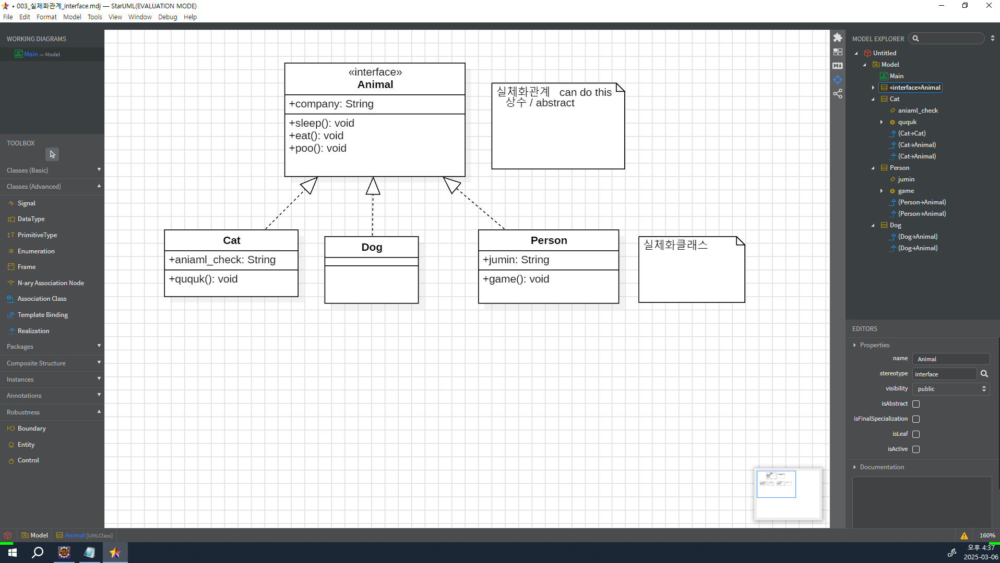
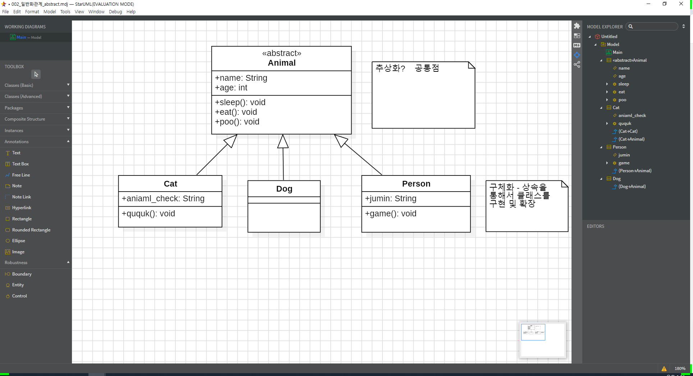
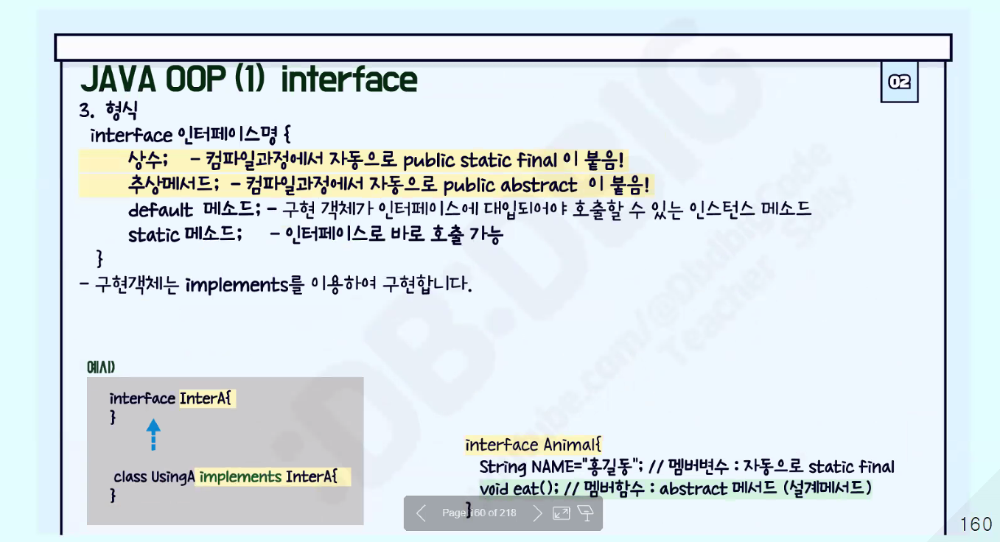
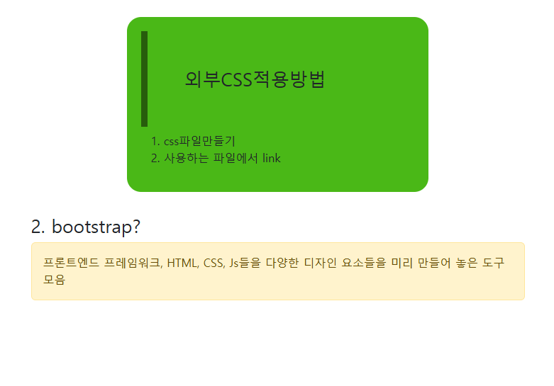
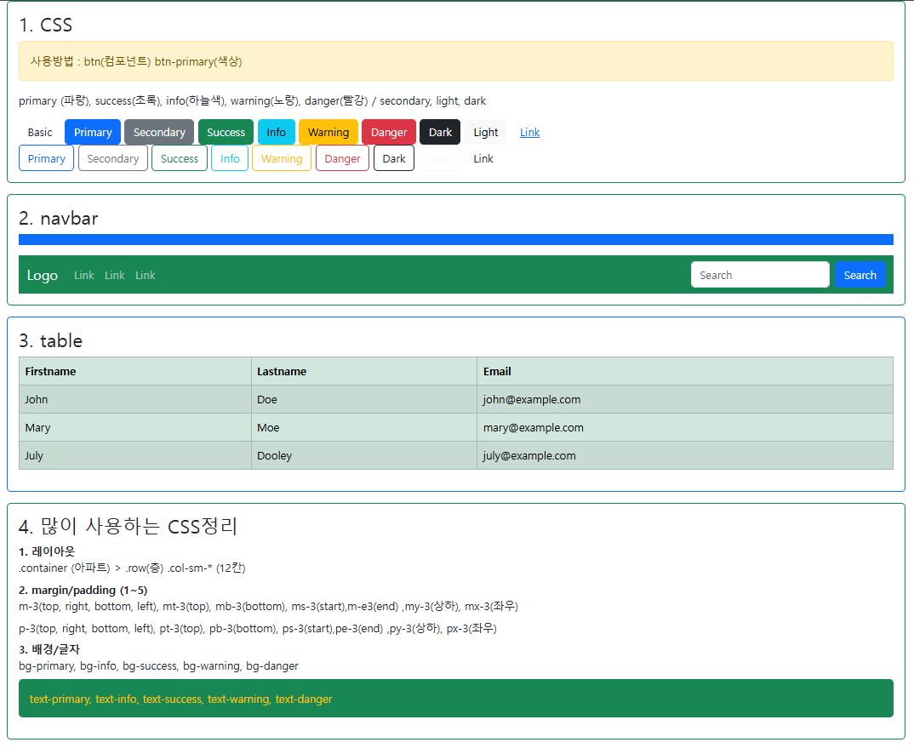
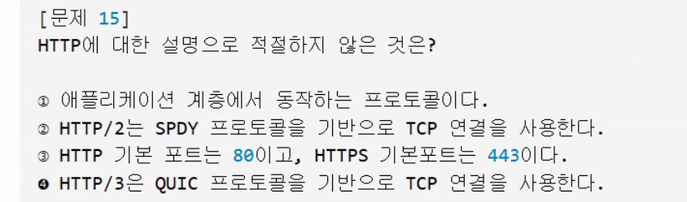
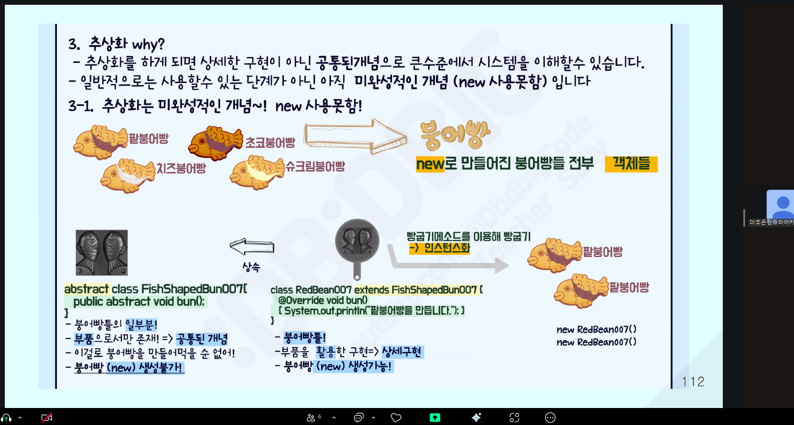
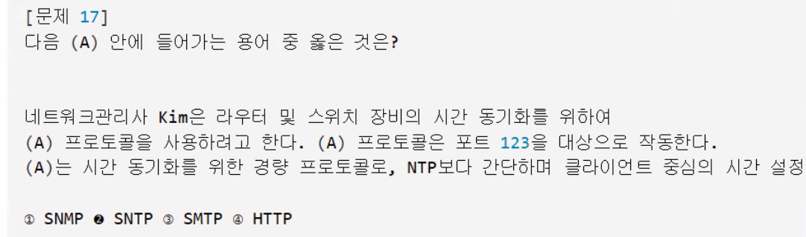
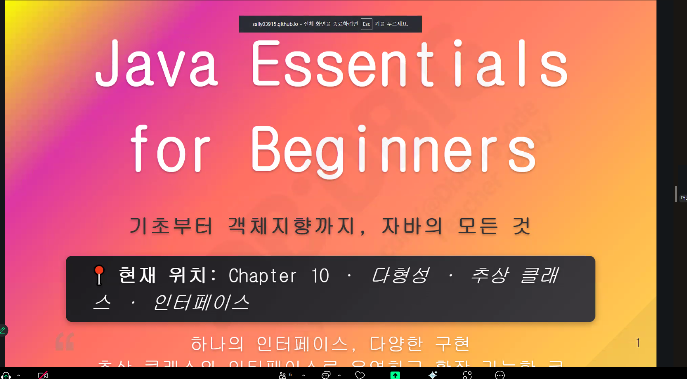

다항성

Object
  ↑
A Class (int b, toString)
  ↑
B Class (int a, @toString)

로 존재할때, 

A a1 = new B(); 구조가 업캐스팅

B b1 = (B)new A(); 구조가 다운캐스팅 (명시적 형변환, 위험)

참조변수 a는 모든 멤버를 사용할수있고, 기본적으로 A객체에 접근이 가능하기 때문에

a1.a 형태로 A클래스의 변수 또는 메서드와 B클래스 객체에 접근할때는 ((A)a1).b 로 수행하게된다. 

기본적으로 메서드가 오버라이드가 되었다면 자식개체의 메서드 정보를 출력한다.

그러나 메서드는 형변환으로 사용해도 실제 오버라이드 구조에선 


📊 자바 형변환 총정리 표
구분	코드 예시	참조 변수 타입	실제 객체 타입	접근 가능한 멤버	오버라이딩 메서드 실행	형변환 필요 여부
기본 생성	A a = new A();	A	A	A의 멤버만	A의 메서드	❌
업캐스팅	A a = new B();	A	B	A의 멤버만	B의 오버라이딩 메서드	❌ (자동)
다운캐스팅	B b = (B) a;	B	B	A + B의 모든 멤버	B의 메서드	✅ (명시적)
잘못된 다운캐스팅	B b = (B) new A();	B	A	❌ 런타임 오류	❌	✅ (하지만 위험)
명시적 업캐스팅	A a = (A) b;	A	B	A의 멤버만	B의 오버라이딩 메서드	✅ (불필요하지만 가능)
🔍 교집합 개념 요약
참조 변수의 타입이 기준이 되어 접근 가능한 멤버가 결정됨

실제 객체의 타입이 기준이 되어 오버라이딩된 메서드가 실행됨

업캐스팅 시: 교집합 = 부모 클래스의 멤버

다운캐스팅 시: 전체 멤버 접근 가능 (자식 + 부모)

✅ 핵심 포인트
업캐스팅은 안전하고 자동으로 이루어짐

다운캐스팅은 명시적으로 해야 하며, 실제 객체가 자식 타입일 때만 안전

오버라이딩된 메서드는 참조 변수 타입과 관계없이 실제 객체 기준으로 실행

명시적 업캐스팅은 가능하지만 대부분 불필요


실제객체와 참조변수 그리고 클래스의 관계에대해서 자세하게 알려줘
좋아요 준용님! 자바에서 실제 객체, 참조 변수, 그리고 클래스의 관계는 객체지향 프로그래밍의 핵심이에요. 이걸 정확하게 이해하면 상속, 다형성, 형변환, 메서드 호출 등 모든 흐름이 명확해집니다. 아래에 개념부터 메모리 구조까지 완벽하게 정리해드릴게요.

🧱 1. 클래스(Class)
클래스는 설계도입니다.

객체를 만들기 위한 청사진이며, 변수(속성)와 메서드(행동)를 정의합니다.

java
class Animal {
    int age;
    void sound() { System.out.println("Animal sound"); }
}
🧍‍♂️ 2. 실제 객체(Instance)
클래스의 설계도를 기반으로 new 키워드로 생성된 메모리상의 실체

객체는 힙 영역에 생성되며, 클래스에 정의된 변수와 메서드를 포함합니다.

java
Animal a = new Animal(); // a는 Animal 객체를 참조
🎮 3. 참조 변수(Reference Variable)
객체를 조종하는 리모컨 역할

객체의 주소값을 저장하고, 그 객체의 멤버에 접근할 수 있게 해줍니다

참조 변수는 스택 영역에 저장되며, 힙에 있는 객체를 가리킵니다

java
Animal a = new Animal(); // a는 참조 변수, new Animal()은 실제 객체
🔄 4. 클래스, 참조 변수, 객체의 관계
구성 요소	역할	위치
클래스	설계도	코드 영역
객체	실체	힙 영역
참조 변수	리모컨	스택 영역
🔁 5. 참조 변수 vs 실제 객체
✅ 참조 변수 기준
접근 가능한 멤버는 참조 변수의 타입 기준

컴파일러는 참조 변수의 타입만 보고 멤버 접근을 허용

✅ 실제 객체 기준
오버라이딩된 메서드는 실제 객체 기준으로 실행

런타임에 JVM이 실제 객체를 확인하고 메서드를 실행함

🔍 예시로 정리
java
class Papa {
    int money = 10000;
    void sing() { System.out.println("GOD-거짓말"); }
}

class Son extends Papa {
    int money = 1500;
    @Override void sing() { System.out.println("빅뱅-거짓말"); }
    void rap() { System.out.println("빅뱅-랩"); }
}
java
Papa mypapa = new Son(); // 업캐스팅
mypapa.sing();           // 출력: 빅뱅-거짓말 (실제 객체 기준)
System.out.println(mypapa.money); // 출력: 10000 (참조 변수 기준)

// 다운캐스팅
Son son = (Son) mypapa;
System.out.println(son.money); // 출력: 1500
son.rap();                    // 출력: 빅뱅-랩
🧠 핵심 요약
기준	결정되는 것	설명
참조 변수 타입	접근 가능한 멤버	컴파일 시점 기준
실제 객체 타입	실행되는 메서드	런타임 시점 기준
클래스	객체의 구조 정의	변수, 메서드 포함
객체	클래스 기반 실체	힙에 생성됨
참조 변수	객체를 가리킴	스택에 저장됨


```

■ 복습문제  (~09:40)
//Q1. 상속도를 그리시오. 
/*
     Object
       ↑   
    TestA4   {  a=10;    --------   }
       ↑
    TestB4   {  b=20;  @toString } 
*/

class TestA4  extends Object{  
   int a=10;
   @Override public String toString() { return "TestA4 [a=" + a + "]"; }
}
class TestB4  extends TestA4{  
   int b=20;
   @Override public String toString() { return "TestB4 [b=" + b + "]"; }
}
/////////////////////////////////////////////////
public class PolyEx003 {
   public static void main(String[] args) { 
      -----------------------------------
      TestA4  ta = new TestA4();
      -----------------------------------
      //Q2. TestA4  ta 사용할수 있는범위는?    {  a=10;   toString } 
      //Q3. new TestA4() 는  heap area 에서 호출되는 생성자의 순서와 객체가 만들어지는 순서는?
   생성자 :  TestA4()                 → Object()  / 객체가 만들어지는 순서 : Object → TestA4 

      -----------------------------------
      TestB4  tb = new TestB4();  
      -----------------------------------
      //Q4. TestB4  tb 사용할수 있는범위는?
                {  b=20;  @toString }   →  {  a=10;   --------  } 
      //Q5. new TestB4() 는  heap area 에서 호출되는 생성자의 순서와 객체가 만들어지는 순서는?
                생성자 : TestB4()   →  TestA4()  → Object()  / 객체가 만들어지는 순서 : Object → TestA4  →  TestB4      
                            {} → {  a=10;  -------  }   →{  b=20;  @toString }

      //Q6. ta가 사용할수 있는 보장하는 변수와 메서드는?   {  a=10;   toString } 

      //Q7.ta = new TestB4(); 에서 new TestB4() 에서 사용할수 있는 범위는? 
        7-1. ta :    {  a=10;   toString }  쓸수있게해줄께요... 일단 쓰지않음.
       > 7-2. new TestB4();    3000번지  실제 인스턴스화 :   TestB4{  b=20;  [ @toString } -   TestA4{  a=10;  ]  -------  } 
        7-3.  ta(3000번지) =  3000번지  {  b=20;  [@toString } -   {  a=10;]  -------  } 

      -----------------------------------
         tb         = (TestB4) ta;   
      -----------------------------------       
      //Q8. tb         = (TestB4) ta;   에서 tb가 사용할수 있는 범위는?
          8-1. tb : {  b=20;  @toString }   →  {  a=10;   --------  } 
          8-2.  ta =  3000번지  {  b=20;  [@toString } -   {  a=10;]  -------  } 
          8-3. 타입캐스팅  tb= [{  b=20;  @toString } -   {  a=10;]  -------  } 

      //Q9. 컴피일러시  tb         = (TestB4) ta;  오류가 안나는 이유는?     ta = new TestB4();  
            ta가 사용할수 있는거는 a=10, toString 이었는데,,,,,, 자식생성자를 호출해서 b=20, toString 처리해서 
      System.out.println(tb);  //Q10. 출력내용과 그이유는?   TestB4   본인꺼
      System.out.println(tb.b);//Q11. 출력내용?   20    본인꺼
      System.out.println(tb.a);//Q12. 출력내용?   10    부모꺼
      
   }
} 

```


1. 다형성
- 많은 형상을 띄는 성품
- 여러타입의 객체를 하나의 타입으로 관리

2. 부모는 자식을 담을 수 있다. (업캐스팅)
------------------------------
Animal [name, age / 먹기, 자기, 배변]
  ↑     
 Cat [card / 꾹꾹]
------------------------------
Animal ani = new Cat();  부모 = 자식 고양이는 동물이다.

2-1) Animal ani { name, age / 먹기, 자기, 배변}
2-2) Cat() → Animal() → Object()
    {card/꾹꾹} + {name,age / 먹기, 자기, 배변}

3. 자식은 부모를 담을 수 있다. (다운캐스팅)

Cat cat = new Animal()  자식 = 부모     동물은 고양이이다.

3-1) Cat cat = {card/꾹꾹} + {name,age / 먹기, 자기, 배변}
      자식 =      본인것    +          부모것
3-2) new Animal() {name, age / 먹기, 자기, 배변}

3-3) 만족 못 시키는 범위 생김
    {card / 꾹꾹}

3-4) 해결방안
    부모타입에서 자식생성자를 호출한 적이 있으면 사용가능.

Animal ani = new Cat();         3000번지 {card/ 꾹꾹} + [{name, age / 먹지, 자기, 배변}]
    자식생성자를 호출해서 자식의 범위를 쓸 수 있게 만들었으므로, 
Cat  cat = (Cat)ani 
      부모객체에서 자식타입으로 [타입캐스팅]이 필요함    
        cat(3000번지) = 3000번지 [{card/꾹꾹} + {name, age / 먹기, 자기, 배변}]


● 9. abstract
1. 추상화 
- 실체화된 객체들 간에 공통되는 특성을 추출
- 미완성적인 개념  ( new 사용하지 못함)
- 공통된 필드와 메서드의 이름을 통일할 목적

2. 추상클래스
--------------------------------------------------------
abstract class Animal{
    String name;           // 인스턴스 변수 - this - 각각 
    abstract void sound(); // abstract method()       - {} 구현부가 없음
}
class Cat extends Animal{@Override void sound{    야옹   }} ;
class Dog extends Animal{@Override void sound{    멍멍   }} ;
--------------------------------------------------------

● 10. interface
1. interface
    - 개발코드 변경없이 객체를 바꿔낄 수 있도록 하는 역할

2. abstract ( Is A : 고양이는 동물이다) vs interface( can do this )
  - 추상화 정도가 interface가 더 높다.
  1) abstract  - 인스턴스변수                , 일반메서드, 추상메서드(abstract) 가질수 있음.
  2) interface - 상수(public static final)  + 추상메서드(public abstract) 만 가짐.
 
3. 프로젝트 진행시 interface 사용
    다른 구성원들이 각각의 부분을 완성할때까지 기다리지 않고
    규약만 정해두고 본인 부분만 작성하면 됨.


4. interface 형식
---------------------------------------------클래스는 클래슨데 설계 클래스다 = 인터페이스
    interface 인터페이스명{
      상수;     // public static final
      추상메서드; // public abstract {}X - thisX
    }
---------------------------------------------
class interSon  implements 인터페이스명{}
class interSon2 extends 클래스명 implements 인터페이스1 인터페이스명2{}






추상화 개념

클래스하나를 부모클래스로 두고

실제작업은 이루어지지않고 메서드에 대한 선언만({}없이)

한다.


```


package com.company.java013;

/* 	Abstract	: 일반클래스 + 설계 - 추상클래스: 공통기능 설계
 	
 				  Object
 	  				↑
 				  Robot	{ charge() , move() , speak() }
 	↑ 				↑			 ↑
 CleaningRobot	 SecurityRobot  CookingRobot
{@charge()	,	 {@charge()	,   {@charge()	,   
	@move()	,   	@move()	,      @move()	,
	@speak() }}      @speak() }}      @speak() }}


	
 */


abstract class Robot{
	String model;	int batterylevel;
	void myrobot() {System.out.println("로봇입니다.");}
	
	abstract void charge();	// 충전방식
	abstract void move();	// 이동방식
	abstract void speak();	// 말하기방식
}

class CleaningRobot extends Robot{

	public CleaningRobot() { super();  }
	@Override void charge() {System.out.println("청소로봇 충전 중... 배터리 50%");}
	@Override void move() {System.out.println("청소로봇: 먼지를 제거합니다!");}
	@Override void speak() {System.out.println("청소로봇 : 안녕하세요");}
	
	
	

}

class SecurityRobot extends Robot{
	
	public SecurityRobot() { super();  }
	@Override void charge() {System.out.println("경비로봇 태양광 충전 중... 배터리 70%");}
	@Override void move() {System.out.println("경비로봇: 이상 없음. 안전 확보!");}
	@Override void speak() {System.out.println("경비로봇 : 이상없음!");}
	
	
}

class CookingRobot extends Robot{
	
	public CookingRobot() { super();  }
	@Override void charge() {System.out.println("요리로봇 인덕션 충전 중... 배터리 95%");}
	@Override void move() {System.out.println("요리로봇 : 요리만드는 중");}
	@Override void speak() {System.out.println("요리로봇 : 오늘의 메뉴는 파스타입니다!");}
	
	
}

public class AbstractEx001 {

	public static void main(String[] args) {
		
		//	Robot robot = new Robot(); // Q1.why ?? 구현부가 없어서 heap area에서 실체화 불가
		System.out.println("\n--- 로봇 배열 시뮬레이션 ---");
		//    부모	    =  자식 1						  자식2				  자식3
		Robot [] bots   = {new CleaningRobot(), new SecurityRobot(), new CookingRobot()};	
		int   [] levels = { 50, 70, 95};		
//		int   [] name   = {"Robot1","Robot2","Robot3"};
		
		//Q2.
		for(int i=0; i<bots.length; i++) {
			bots[i].model = "Robo" +   (i+1);
			bots[i].batterylevel = levels[i];
			bots[i].charge();   System.out.println(  bots[i].batterylevel + "%");
			bots[i].speak();	
		}
		// bots[0] = 1번지 CleaningRobot{@charge() , @move(), @speak() }- Robot { model = "Robo1" , batteryLevel=50 / --- , --- , ---}
		// bots[1] = 2번지 SecurityRobot{@charge() , @move(), @speak() }- Robot { model = "Robo2" , batteryLevel=70 / --- , --- , ---}
		// bots[2] = 3번지 CookingRobot {@charge() , @move(), @speak() }- Robot { model = "Robo3" , batteryLevel=95 / --- , --- , ---}

		
	}
}	

	// Abstract : 일반클래스 + 설계 - 추상클래스 : 공통기능 설계

/*
heap area: 동적,배열              stack area : 임시
1번지{model, battery, charge()X} ← robot(1번지)
 
--- 로봇 배열 시뮬레이션 ---
Robo1 청소로봇 충전 중... 배터리 50%
Robo1 청소로봇: 먼지를 제거합니다!
Robo2 경비로봇 태양광 충전 중... 배터리 70%
Robo2 경비로봇: 이상 없음. 안전 확보!
Robo3 요리로봇 인덕션 충전 중... 배터리 95%
Robo3 요리로봇: 오늘의 메뉴는 파스타입니다!
*/


```


추상화 클래스를 이용하여 로봇 이름과, 진행 상황을 메서드화하여 동작시키는 코드


```

package com.company.java013_ex;

//1) 상속도 구조 
//Object
//  ↑
//Astronaut { abstract explore(), report(), rest() }
//↑            ↑               ↑ 
//Engineer     Biologist       Pilot
//{ @explore(), @explore(),    @explore(),
//@report(),  @report(),     @report(),
//@rest() }   @rest() }      @rest() }
//
//- Astronaut는 추상 클래스이며, 모든 대원이 공통적으로 수행해야 할 기능을 설계함
//- 각 대원 클래스는 Astronaut를 상속받아 기능을 구체적으로 구현함
//- rest() 메서드는 각 대원의 고유한 휴식 방식 출력  
//
//2) 코드
abstract class Astronaut {
protected String name;
protected int stamina;

public void setName(String name) { this.name = name; }
public void setStamina(int stamina) { this.stamina = stamina; }
public int getStamina() { return stamina; }

public String getName() { return name; }

abstract void explore();
abstract void report();
abstract void rest();
}

class Engineer extends Astronaut {


@Override public String toString() { return "Engineer [name=" + name + ", stamina=" + stamina + "]"; }
@Override void explore() { System.out.println(name + " 엔지니어 탐사: 기계 장치 점검 완료!"); }
@Override void report() { System.out.println(name + " 보고서: 에너지 시스템 안정적"); }
@Override void rest() { System.out.println(name + " 휴식: 공구 정리하며 재충전 중..."); }
}

class Biologist extends Astronaut {
@Override void explore() { System.out.println(name + " 생물학자 탐사: 외계 식물 샘플 채취!"); }
@Override void report() { System.out.println(name + " 보고서: 생명체 흔적 발견"); }
@Override void rest() { System.out.println(name + " 휴식: 생체 리듬 조절 중..."); }
}

class Pilot extends Astronaut {
@Override void explore() {
	
	
System.out.println(this.name + " 파일럿 탐사: 항로 재설정 및 우주선 조종!");
}
@Override void report() {
System.out.println(this.name + " 보고서: 궤도 진입 성공");
}
@Override void rest() {
System.out.println(this.name + " 휴식: 조종석에서 짧은 명상...");
}
}

//3) main
public class AbstractEx002 {
public static void main(String[] args) {
// Astronaut astro = new Astronaut();  // Q1. 왜 객체 생성이 불가능한가?

System.out.println("\n--- 우주 탐사 대원 시뮬레이션 ---");
Astronaut[] crew = { new Engineer(), new Biologist(), new Pilot() };
String[] names = { "Nova", "Flora", "Jet" };
int[] stamina = { 75, 60, 85 };

// Q2. 체력이 낮은 대원만 휴식  70미만이 휴식을 취하게 만들기 

	for (int i = 0; i<crew.length; i++) {
		
		crew[i].setName(names[i]);
		crew[i].explore();
		crew[i].report();
		
		if (stamina[i] < 70) {crew[i].rest(); System.out.print("현재 스테미나 : " + stamina[i] + "\n"); }
		else {System.out.print(names[i] + "는 충분한 체력을 유지 중입니다. \n현재 스테미나 : " + stamina[i] + "\n");};
	};
}
}
//
//출력화면
//--- 우주 탐사 대원 시뮬레이션 ---
//Nova 엔지니어 탐사: 기계 장치 점검 완료!
//Nova 보고서: 에너지 시스템 안정적
//Nova는 충분한 체력을 유지 중입니다.
//
//Flora 생물학자 탐사: 외계 식물 샘플 채취!
//Flora 보고서: 생명체 흔적 발견
//Flora 휴식: 생체 리듬 조절 중...
//
//Jet 파일럿 탐사: 항로 재설정 및 우주선 조종!
//Jet 보고서: 궤도 진입 성공
//Jet는 충분한 체력을 유지 중입니다.


```


추상 클래스(Astronaut)를 활용하여 이름, 탐사, 보고, 휴식 기능을 설계하고, 이를 상속받은 각 대원 클래스(Engineer, Biologist, Pilot)에서 구체적으로 구현하였다. 각 대원의 이름을 표시하고 탐사 작업을 수행하며, 체력이 낮은 대원은 휴식하도록 처리하였다. 처음에는 private 접근제어자에서만 getter/setter가 필요하다고 생각했지만, protected 필드도 캡슐화와 유지보수 측면에서 getter/setter를 사용하는 것이 바람직하다는 것을 알게되었다.


## Track001 -  github

 
# ■ Github   
### 12. 깃허브 협업 
---
1. html + css + js/jquery      [개인]
2. spring + mybatis + jstl     
3. node + react
4. spring boot + thymeleaf + jpa + mybatis + react  
5. flutter + spring boot + jpa + mybatis + react
 


# ■ JAVA
# ■ Java 복습문제
■ 복습문제  (~09:40)
//Q1. 상속도를 그리시오. 
/*
     Object
       ↑	
    TestA4   {  a=10;    --------   }
       ↑
    TestB4   {  b=20;  @toString } 
*/

class TestA4  extends Object{  
   int a=10;
   @Override public String toString() { return "TestA4 [a=" + a + "]"; }
}
class TestB4  extends TestA4{  
   int b=20;
   @Override public String toString() { return "TestB4 [b=" + b + "]"; }
}
/////////////////////////////////////////////////
public class PolyEx003 {
   public static void main(String[] args) { 
      -----------------------------------
      TestA4  ta = new TestA4();
      -----------------------------------
      //Q2. TestA4  ta 사용할수 있는범위는?    {  a=10;   toString } 
      //Q3. new TestA4() 는  heap area 에서 호출되는 생성자의 순서와 객체가 만들어지는 순서는?
	생성자 :  TestA4()                 → Object()  / 객체가 만들어지는 순서 : Object → TestA4 

      -----------------------------------
      TestB4  tb = new TestB4();  
      -----------------------------------
      //Q4. TestB4  tb 사용할수 있는범위는?
                {  b=20;  @toString }   →  {  a=10;   --------  } 
      //Q5. new TestB4() 는  heap area 에서 호출되는 생성자의 순서와 객체가 만들어지는 순서는?
                생성자 : TestB4()   →  TestA4()  → Object()  / 객체가 만들어지는 순서 : Object → TestA4  →  TestB4	   
                            {} → {  a=10;  -------  }   →{  b=20;  @toString }

      //Q6. ta가 사용할수 있는 보장하는 변수와 메서드는?   {  a=10;   toString } 

      //Q7.ta = new TestB4(); 에서 new TestB4() 에서 사용할수 있는 범위는? 
        7-1. ta :    {  a=10;   toString }  쓸수있게해줄께요... 일단 쓰지않음.
       > 7-2. new TestB4();    3000번지  실제 인스턴스화 :   TestB4{  b=20;  [ @toString } -   TestA4{  a=10;  ]  -------  } 
        7-3.  ta(3000번지) =  3000번지  {  b=20;  [@toString } -   {  a=10;]  -------  } 

      -----------------------------------
      	tb         = (TestB4) ta;   
      -----------------------------------       
      //Q8. tb         = (TestB4) ta;   에서 tb가 사용할수 있는 범위는?
          8-1. tb : {  b=20;  @toString }   →  {  a=10;   --------  } 
          8-2.  ta =  3000번지  {  b=20;  [@toString } -   {  a=10;]  -------  } 
          8-3. 타입캐스팅  tb= [{  b=20;  @toString } -   {  a=10;]  -------  } 

      //Q9. 컴피일러시  tb         = (TestB4) ta;  오류가 안나는 이유는?     ta = new TestB4();  
            ta가 사용할수 있는거는 a=10, toString 이었는데,,,,,, 자식생성자를 호출해서 b=20, toString 처리해서 
      System.out.println(tb);  //Q10. 출력내용과 그이유는?   TestB4   본인꺼
      System.out.println(tb.b);//Q11. 출력내용?   20    본인꺼
      System.out.println(tb.a);//Q12. 출력내용?   10    부모꺼
      
   }
} 


1.  다형성
- 많은 형상을 띄는 성품
- 여러타입의 객체(자식객체)를 하나의 타입(부모)으로 관리

2. 부모는 자식을 담을 수 있다.  (업캐스팅)
----------------------------------
Animal  [name, age / 먹기, 자기, 배변]  
  ↑
 Cat     [card / 꾹꾹]
----------------------------------
Animal  ani = new Cat();        부모 = 자식      고양이는 동물이다

2-1)   Animal  ani { name, age / 먹기, 자기, 배변} 
2-2)   Cat() → Animal() → Object()
       {card / 꾹꾹} + {name, age / 먹기, 자기, 배변} 


3. 자식은 부모를 담을 수 있다.  (다운캐스팅) 
Cat     cat = new Animal()      자식 = 부모       동물은 고양이이다.

3-1)   Cat     cat;        
     {card / 꾹꾹} + {name, age / 먹기, 자기, 배변} 
3-2)   new Animal()    
                          {name, age / 먹기, 자기, 배변} 
3-3) 만족못시키는 범위 생김
     {card / 꾹꾹}
> 3-4)  해결방안
    ..... 부모타입에서 자식생성자를 호출한 적이 있으면 사용가능.
    Animal ani = new Cat();              3000번지 {card / 꾹꾹} + [{name, age / 먹기, 자기, 배변}] 
	자식생성자를 호출해서 자식의 범위를 쓸수 있게 만들었으므로 
    Cat     cat = (Cat)ani
	부모객체에서 자식타입으로 [타입캐스팅]이 필요함
	 cat(3000번지) =3000번지 [   {card / 꾹꾹} + {name, age / 먹기, 자기, 배변}  ] 
     

● 9. abstract         
1. 추상화
 -  실체화된 객체들 간에 공통되는 특성을 추출
 -  미완성적인 개념 (  new 사용하지 못함  )
 -  공통된 필드와 메서드의 이름을 통일할 목적

2. 추상클래스
-----------------------------------------------
abstract  class Animal{
   String name;               //인스턴스변수 - this - 각각
   abstract  void sound();  // abstract method();        -  {} 구현부가 없음
}
class Cat   extends Animal{  @override  void sound(){   야옹  } }
class Dog  extends Animal{  @override  void sound(){   멍멍  } }
-----------------------------------------------     


● 10. interface
1.  interface  
   - 개발코드변경없이 객체를 바꿔낄수 있도록 하는 역할

2.  abstract ( Is A : 고양이는 동물이다 ) vs  interface( can do this )
   - 추상화 정도가 interface가 도 높다.
   1) abstract  - 인스턴스변수                  , 일반메서드, 추상메서드(abstract) 가질수 있음.
   2) interface - 상수(public static final)   + 추상메서드(public abstract) 만 가짐.

3. 프로젝트 진행시 interface 사용
    다른구성원들이 각각의 부분을 완성할때까지 기다리지 않고
    규약만 정해두만 본인 부분만 작성.

4. interface 형식
------------------------------------------------------
  interface 인터페이스명{
     상수;      // public static final
     추상메서드; // public abstract    {} X - this X
  }
------------------------------------------------------
class  interSon    implements 인터페이스명{}
class  interSon2  extends 클래스명 implements 인터페이스1, 인터페이스2{}

 


# ■ WEB BASIC


# ■ JAVA
# ■ JAVA 복습문제
Q1. 다음의 상속도를 그리시오.
Q2. 상속도에서  각각의 클래스에서 사용가능한 멤버변수/멤버함수를  적으시오.

abstract class Animal{    
	String name; 
	abstract void eat();   
	abstract void sleep(); 
	abstract void poo();  
}
class Cat  extends Animal{  // 구현클래스 - 고양이는 동물이다
	@Override void eat()   {  System.out.println(super.name + "고양이 냠냠!");  }
	@Override void sleep() {  System.out.println(super.name + "고양이 수면!");  }
	@Override void poo()   {  System.out.println(super.name + "고양이 시원");  }
}
class Dog  extends Animal{  // 구현클래스 - 강아지는 동물이다
	@Override void eat()   {  System.out.println(super.name + "강아지 냠냠!");  }
	@Override void sleep() {  System.out.println(super.name + "강아지 수면!");  }
	@Override void poo()   {  System.out.println(super.name + "강아지 시원");  }
}
public class Abstract001 {
	public static void main(String[] args) {
		//1. abstract  class : 일반클래스 + 설계
		Animal ani = new Animal();   Q3. 이코드에서 오류나는 이유는? 
	 
		Animal ani = null;
		ani = new Cat();   //Q4. 다형성에서 다음을 뭐라하는가?   업캐스팅/다운캐스팅? , 타입캐스팅 필요여부
		ani.name = "sally";   ani.eat();
 
		
		//2. 사용목적
		Animal [] arr = {new Cat() , new Cat() , new Dog() , new Dog() , };
		int cnt=0;
		//Q5.  다음이 출력되게 코드를 작성하시오.
		/*ani1고양이 냠냠!
		  ani2고양이 냠냠!
		  ani3강아지 냠냠!
		 ani4강아지 냠냠!   */
	}
}


>>>>>>>>>>>>>>>>> Answer
```
/* Q1,Q2
	    Object  
      	↑
	     Animal {name / eat(), sleep(), poo() }
	     ↑   ↑ 
	    Cat  Dog  { @eat(), @sleep(), @poo() }
*/

abstract class Animal{   //일반클래스 + 설계
	String name; 
	abstract void eat();  // 추상메서드가 있으면 반드시 추상클래스로 만들어줘야함.
	abstract void sleep();// 구현부가 없음 {}
	abstract void poo();  // 추상화, 일반화, 설계: 공통의 속성, 구체적인 내용이 없음
}
class Cat  extends Animal{  // 구현클래스 - 고양이는 동물이다
	@Override void eat()   {  System.out.println(super.name + "고양이 냠냠!");  }
	@Override void sleep() {  System.out.println(super.name + "고양이 수면!");  }
	@Override void poo()   {  System.out.println(super.name + "고양이 시원");  }
}
class Dog  extends Animal{  // 구현클래스 - 강아지는 동물이다
	@Override void eat()   {  System.out.println(super.name + "강아지 냠냠!");  }
	@Override void sleep() {  System.out.println(super.name + "강아지 수면!");  }
	@Override void poo()   {  System.out.println(super.name + "강아지 시원");  }
}
public class Abstract001 {
	public static void main(String[] args) {
		//1. abstract  class : 일반클래스 + 설계
		// Animal ani = new Animal();   Q3 new 메모리빌리고,객체생성/ Animal()초기화, {}구현부없음
		// 
		Animal ani = null;
		ani = new Cat();   // Q4. 부모 = 자식 , 업캐스팅, 타입캐스팅 필요없음
		ani.name = "sally";   ani.eat();

		ani = new Dog();   // 부모 = 자식 , 업캐스팅, 타입캐스팅 필요없음
		ani.name = "alpha";   ani.eat();
		
		//2. 사용목적
		Animal [] arr = {new Cat() , new Cat() , new Dog() , new Dog() , };
		int cnt=0;
		//Q5
      for(Animal a :  arr) {  a.name = "ani" + ++cnt;  a.eat();  }
	}
} 
```


git hub
---


1. merge직후

```
git log --oneline
git reset --hard 로그에 나오는 이름(숫자영문으로된거)(깃허브까지 날아감)
git push origin master --force
```


2. merge 커밋은 유지하는데 되돌리는 커밋

```
git revert -m ""

```









