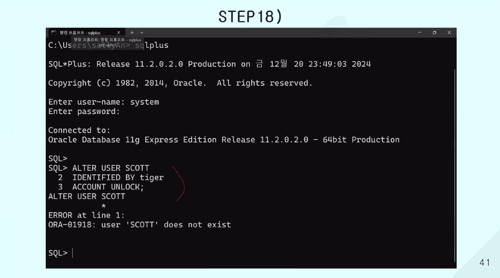
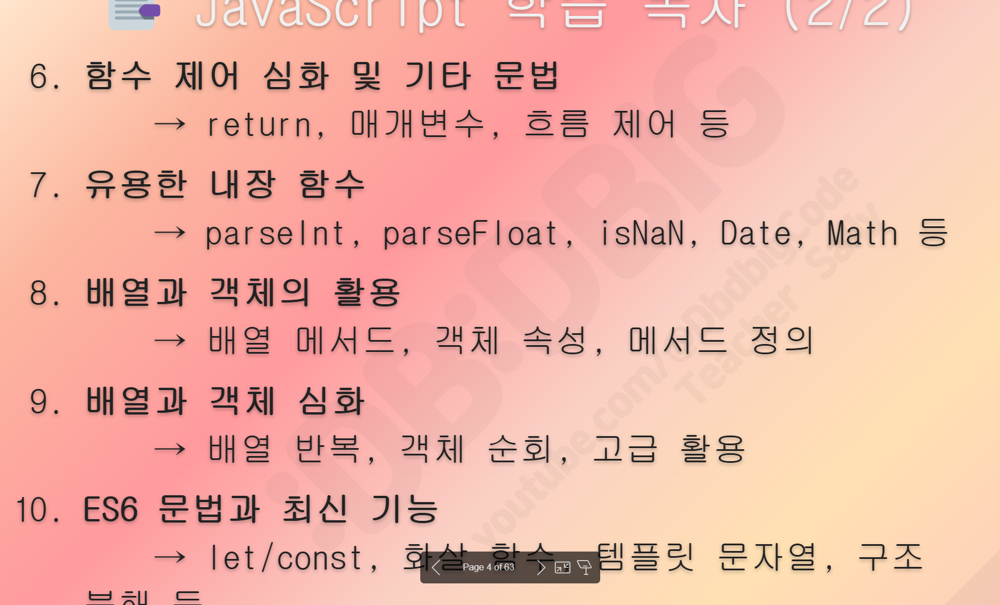
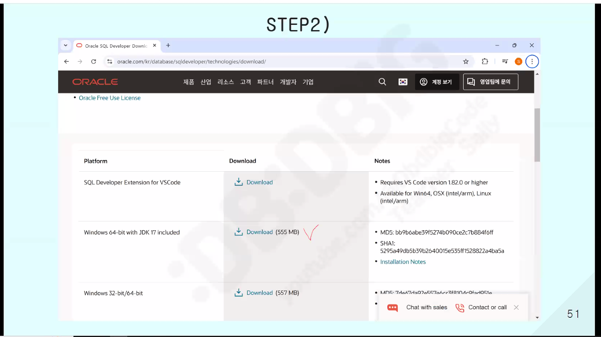

Oracle 설치파트



```cmd

Microsoft Windows [Version 10.0.19045.6332]
(c) Microsoft Corporation. All rights reserved.

C:\Users\tj-bu-703-23>sqlplus   // SQL 진입 

SQL*Plus: Release 11.2.0.2.0 Production on 월 10월 13 13:33:08 2025

Copyright (c) 1982, 2014, Oracle.  All rights reserved.

Enter user-name: system // 관리자 아이디
Enter password:         // 관리자 비밀번호 (최초설치시 입력한 비밀번호, 안보임)

Connected to:
Oracle Database 11g Express Edition Release 11.2.0.2.0 - 64bit Production

SQL> ALTER USER system IDENTIFIED BY "1234";    // 1234로 변경

User altered.   // 변경완료

SQL> exit   // 종료
Disconnected from Oracle Database 11g Express Edition Release 11.2.0.2.0 - 64bit Production

C:\Users\tj-bu-703-23>

```

오라클 관리자 비밀번호 변경 (cmd에서 진입)


```
C:\Users\tj-bu-703-23>sqlplus

SQL*Plus: Release 11.2.0.2.0 Production on 월 10월 13 14:55:38 2025

Copyright (c) 1982, 2014, Oracle.  All rights reserved.

Enter user-name: system
Enter password:

Connected to:
Oracle Database 11g Express Edition Release 11.2.0.2.0 - 64bit Production

SQL> @C:\oraclexe\app\oracle\product\11.2.0\server\rdbms\admin\scott.sql
SQL> show user;
USER is "SCOTT"
SQL>
```

case scott에 scott/tiger로 로그인이 안됨 경로에가서 직접 유저파일 경로를 복사하여 앞에 @를 붙이고 로그인하는?







1. 수동으로 접속 생성


> file

# ■ ORACLE
# ■ 001. Setting
- Oracle Setting 
★ 집에서 ORACLE 설치 후 스크린샷
...............................

# ■ Github
### 12. 깃허브 협업
................................
■1. basic 
```
#1. 가방에 담기 ( 불꽃마법재료, 불씨,,, )

git add .

#2. 가방에 메시지 남기기 (불꽃마법 완성)
git commit -m "메시지"

#3. [공용-github - 마법책] 같은 마법책을 쓰니깐 서로 바뀐거 확인
git pull origin master

#4. [공용-github -] 마법책] 에 불꽃마법 올리기 (공유)
git push origin master


```


■2. 깃협업
1. 팀원초대
2. 협업 중 같은 파일을 수정하면서 생기는 충돌(conflict) 해결


```
#1. 팀장 - 팀원초대 (github 웹)
#2. 팀원 - repository 클론
git clone 깃허브주소

#3. 팀원 - branch
    git checkout -b branch 명
#4. 팀원 - 파일 작성 
 git add . 
 git commit -m "message"
 git pull origin master
 git push origin master

※ 충돌 - HEAD , ===== , >>>>>> / 코드수정 merge conflict
```
Q. 1. 팀장 - test2.md 파일만들기 > 안녕하세요 포젝트입니다.
Q. 2. 팀원 - test2.md          > 안녕하세요 팀원 **입니다.
      충돌시 - 충돌해결 후 코드
      안녕하세요 포젝트입니다.
      팀장 : 세상에서 젤로 멋찐 홍길동입니다.
      팀원 : 세상에서 젤로 귀여운 가길동입니다.
................................