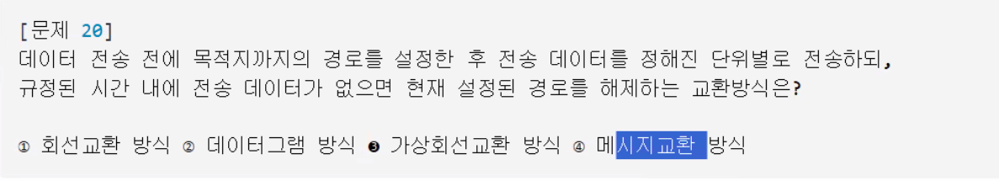

Oracle 설치파트



```cmd

Microsoft Windows [Version 10.0.19045.6332]
(c) Microsoft Corporation. All rights reserved.

C:\Users\tj-bu-703-23>sqlplus   // SQL 진입 

SQL*Plus: Release 11.2.0.2.0 Production on 월 10월 13 13:33:08 2025

Copyright (c) 1982, 2014, Oracle.  All rights reserved.

Enter user-name: system // 관리자 아이디
Enter password:         // 관리자 비밀번호 (최초설치시 입력한 비밀번호, 안보임)

Connected to:
Oracle Database 11g Express Edition Release 11.2.0.2.0 - 64bit Production

SQL> ALTER USER system IDENTIFIED BY "1234";    // 1234로 변경

User altered.   // 변경완료

SQL> exit   // 종료
Disconnected from Oracle Database 11g Express Edition Release 11.2.0.2.0 - 64bit Production

C:\Users\tj-bu-703-23>

```

오라클 관리자 비밀번호 변경 (cmd에서 진입)


```
C:\Users\tj-bu-703-23>sqlplus

SQL*Plus: Release 11.2.0.2.0 Production on 월 10월 13 14:55:38 2025

Copyright (c) 1982, 2014, Oracle.  All rights reserved.

Enter user-name: system
Enter password:

Connected to:
Oracle Database 11g Express Edition Release 11.2.0.2.0 - 64bit Production

SQL> @C:\oraclexe\app\oracle\product\11.2.0\server\rdbms\admin\scott.sql
SQL> show user;
USER is "SCOTT"
SQL>
```

case scott에 scott/tiger로 로그인이 안됨 경로에가서 직접 유저파일 경로를 복사하여 앞에 @를 붙이고 로그인하는?


1. 수동으로 접속 생성


> file

# ■ ORACLE
# ■ 001. Setting
- Oracle Setting 
★ 집에서 ORACLE 설치 후 스크린샷
...............................

# ■ Github
### 12. 깃허브 협업
................................
■1. basic 
```
#1. 가방에 담기 ( 불꽃마법재료, 불씨,,, )

git add .

#2. 가방에 메시지 남기기 (불꽃마법 완성)
git commit -m "메시지"

#3. [공용-github - 마법책] 같은 마법책을 쓰니깐 서로 바뀐거 확인
git pull origin master

#4. [공용-github -] 마법책] 에 불꽃마법 올리기 (공유)
git push origin master


```


■2. 깃협업
1. 팀원초대
2. 협업 중 같은 파일을 수정하면서 생기는 충돌(conflict) 해결


```
#1. 팀장 - 팀원초대 (github 웹)
#2. 팀원 - repository 클론
git clone 깃허브주소

#3. 팀원 - branch
    git checkout -b branch 명
#4. 팀원 - 파일 작성 
 git add . 
 git commit -m "message"
 git pull origin master
 git push origin master

※ 충돌 - HEAD , ===== , >>>>>> / 코드수정 merge conflict
```
Q. 1. 팀장 - test2.md 파일만들기 > 안녕하세요 포젝트입니다.
Q. 2. 팀원 - test2.md          > 안녕하세요 팀원 **입니다.
      충돌시 - 충돌해결 후 코드
      안녕하세요 포젝트입니다.
      팀장 : 세상에서 젤로 멋찐 홍길동입니다.
      팀원 : 세상에서 젤로 귀여운 가길동입니다.
................................


##### ■3. merge vs rebase
1. 기능 브랜치에서 작업 중 main 브랜치가 업데이트가 된 경우
> 여러 마법사가 함께 주문서를 쓰고 있을때
- 내가 주문을 다시 쓰면 친구들의 주문이 사라질 수 있음.

★ 브랜치 꼭 확인!
```
#1. 불꽃마법사가 본인코드 작성중 (dev-f)
  git add spell2.md 
  git commit -m "불꽃마법2 추가"
  
#2. 메인 마법서가 업데이트가 됨.
    불꽃마법사가 최신 마법서 위에 자신의 주문을 다시 써야 함.

    git checkout master
    git pull origin master

    # 최신 마법서 위에 주문 다시 쓰기 
    git checkout dev-f
    git rebase master     
    # > master 브랜치 기준으로 내 작업을 다시 정렬
    # > 주문이 겹쳐서 마법서 충돌남. 어떤 주문 쓸지 선택 / 수정완료

    git add spell2.md
    git rebase --continue

    # 안전하게 주문서 공유
    git push --force-with-lease
```

> ** Question1 **
```
1. test2.md 파일에 테이블옆에 본인이모지 붙이기
2. rebase 해서 파일 다시 올리기
```

> ** Question2 **
```
1. 팀장님      - test2.md (깃허브에서 응원의 메세지 남겨주기)
2. 팀원        - test2.md 파일에 본인이 다른 친구들한테 또는 본인한테 남기는 응원의 메세지 적기
3. 팀장 + 팀원 - rebase 해서 파일 다시 올리기
```


.................................