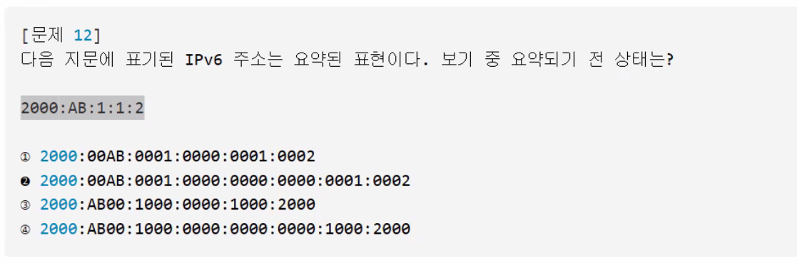
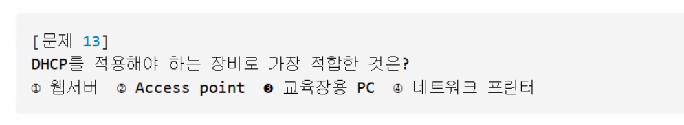
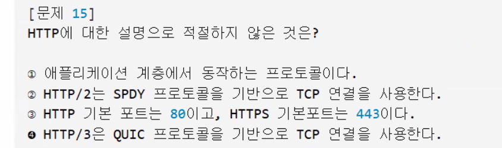
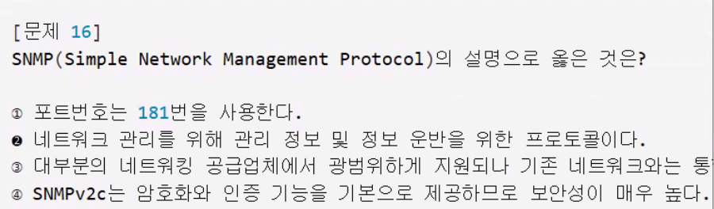
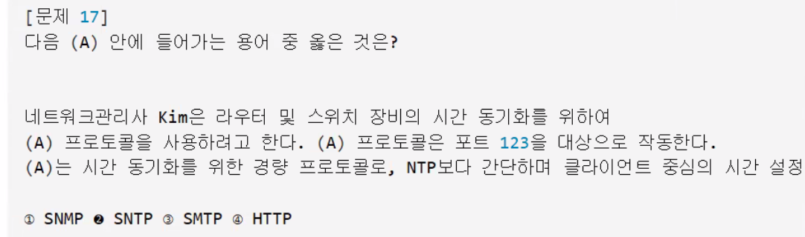
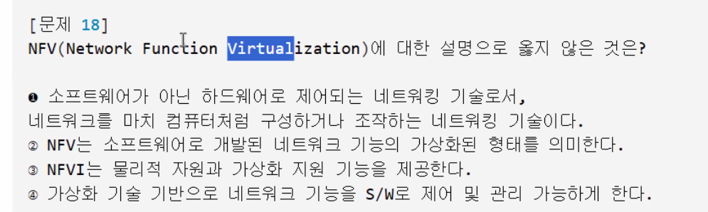
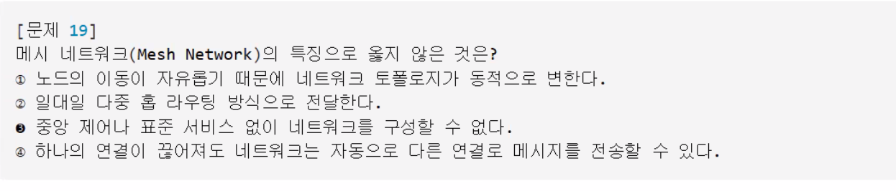

<!--  251017 -->
## 네트워크관리사 2급

1. ip - 컴퓨터 집주소 
2. IPv4 - 옛날 집주소  
   192.168.0.1 = > 0~255.0~255.0~255.0~255 
    2^8 = 256 = 0 ~ 255  1byte=8bit 
    8*4 = 32칸 = 42억 

3. IPv6 - 새로생긴 마을의 주소 
    128칸 ~ 거의 무한대

클래스 A : 왕국, 나라 
클래스 B : 도시급 
클래스 C : 동네 
클래스 D : 방송 
클래스 E : 연구실 
사설 ip 10, 172, 192 

ip 주소의 분류
네트워크 id + 호스트 id
인천시          703호

서브넷 마스크 = 여기서부터 마을, 여기서부터 집

NAT - 번역마법

- 마을 안에서는 사설주소만 사용가능
- 내부용 IP - 192.168.0.5 인데
밖에서 표현하는 203.25.112.1 보여줄께

> 내부용IP를 외부용으로 바꿔주는 번역기

브로드캐스트
> 마을 전체에 편지 보내기
> 애들아~ 이거봐봐

루프백 주소
나 동작잘하니?
127.0.0.1
> 자신에게 보내는 테스트편지 

사설IP VS 공인 IP

사설IP : 마을안에서만 쓰는 비공개 주소
→10.x.x.x / 172.16~31.x.x / 192.168.x.x
10,172,192

공인IP : 세상에서 쓰는 공개주소
A = 국가기관, 큰회사  - 1
B = 중간회사         - 128
C = 집, 소규모 사무실 - 192

■ 1. ip 마법사
-  1. ip? 컴퓨터의 집 주소
-  2. ipv4 - 192.168.0.1   / 4*8 32 42억
-  3. ipv6 - 128칸 , 거의 무한대
-  4. ip   - 네트워크id + 호스트id / 인천시
-  5. 서브넷마스크 - 주소나누는 칼 여기까지는 마을, 여기서부터는 집 (구분)
-  6. nat - 내부ip를 외부용으로 바꾸는 번역마법 "내부에서는 192.168.40.169 , 밖에서는 203.252.1.1"  
-  7. 사설ip(마을에서만 쓰는 비공개주소 10, 172, 192) vs 공인ip (밖에서는 공개주소)
-  8. ip 클래스 - 마을 크기별 주소
-    A(대기업:1), B(중소기업:128), C(집, 소규모사무실:192), D(방송용:224), E(연구소:240)
-  9. 브로드캐스트 → 애들아~ 다같이 들어봐~! 마을전체에 뿌리는 편지 
- 10. 루프백 → 나에게 보내는 테스트 편지 127.0.0.1

■ 2. dns (주소찾기요정) + dhcp (주소자동배달) + arp (주소로 장비찾기 탐정) /rarp(거꾸로) 
-  1. 숫자주소가 너무어려워요
-  2. 정방향 : 이름 → 숫자 cookie.com →  123.45.67.89
-  3. 역방향 : 숫자 → 이름 123.45.67.89 → cookie.com   
-  4. 53포트 : 이름과 숫자를 사용할 때 마법의 문
-  5. dhcp  - 새로운 컴퓨터 등장 시 자동으로 주소배달 - 67번번 서버 / 68 클라이트 - dora
-     > D (discover : 주소주세요) O (offer : 이 주소 어때요?) R ( request: 주세요) A ( ack: 주소드릴께요)
-  6. arp : ip (숫자 주소) → mac (컴퓨터 집 위치)
-  7. rarp: mac (컴퓨터장비) → ip (숫자주소)

■ 3. tcp + udp 택배기사 
- 1. tcp : 연결형 , 신뢰성 보장 / 순서대로, 빠짐없이, 안전하게 - 연결 : syn → syn+ack → ack , 파일전송
- 2. udp : 비연결형, 빠르지만 신뢰없음, 실시간 영상
- 3. 서비스문 : 80 (http) , 443(https) , 20/21(ftp:파일올리기) , 25(smtp-이메일), dns(53-이름을 숫자로 바꾸는 문)
- 4. ftp 파일전송, sftp 보안(ssh)+파일전송, tftp - udp기반 + 간단파일전송

■ 4. 네트워크 장비
-  1. 허브 : 소리지르는 확성기 , 허브 : 모든 포트로 브로드캐스트 , 충돌 발생 가능 자주일어남.
-  2. 스위치 : 똑똑한 분배기 (MAC기반 전달) , 포트별 분배로 충돌 X
-  3. 라우터 : 길안내 전문가 (IP 경로선택) , 서로다른 네트워크 연결
-  4. 게이트웨이 : 언어통역사 (서로다른 프로토콜을 연결해주는 통역사) ,  네트워크간 변환
-  5. 브리지 : 교통정리자 : 교통정리자( MAC주소보고 구역을 나누고, 데이터의 흐름을 정리) , 트래픽 필터링
-  6. NIC   : 출입증  (컴퓨터와 네트워크를 연결) , MAC 주소 포함   
-  7. 프록시 : 중계 및 캐싱 - 대신 나가는 대리인 , 속도향상 보안강화
-  8. VLAN  : 가상의 구역을 나누기 , 보안 및 트래픽관리 
-  9. DMZ   : 외부접근 서버 분리 내부는 건들지 말것~! 외부손님용 서버!

■ 5. 보안기사단
-  1. 방화벽 : 외부접근차단 문지기
-  2. IDS   : 침입탐지시스템 , 이상징후 감지 경고 (감시카메라)
-  3. IPS   : 침입차단기사
-  4. VPN   : 데이터 암호화 터널
-  5. SSL   : 데이터 암호화 (https : 웹 자물쇠)
-  6. Qos   : 서비스 품질보장 - 중요한 데이터 먼저 우선권 ~! 들어오세요~!
-  7. ICMP  : 네트워크 상태 점검 ( 네트워크 검진기사)
-  8. 브로드캐스트 : 전체 알림
-  9. 유니캐스트 : 1:1 메세지
- 10. 멀티캐스트 : 특정그룹 전송 
- 11. 애니캐스트 : 가장 가까운 수신자에게 전송 IPV6

■ 6. osi7 층

-  1. 1층-물리층-전기신호기사 (0,1 의 전기신호로, 실제 데이터가 움직이게 하는 가장 아래층) 
      빛처럼 빠르게 데이터 전송
-  2. 2층- 데이터링크층 - MAC 주소기사 
-  3. 3층- 네트워크층 - IP길잡이 , IP주소기반 경로선택 , 패킷단위전송
-  4. 4층- 전송층    - TCP, UDP 택배기사 / 세그먼트단위(데이터 잘게나눠서 정확하게 배달)
-  5. 5층- 세션층    - 대화관리자, 통신세션관리(생성, 유지, 종료 담당)
-  6. 6층- 표현층    - 데이터형식에변환, 암축화, 압축, 인코딩
-  7. 7층- 응용층    - 사용자와 직접연결

■ 7. 라우터길찾기
-  1. 라우터 : 다른 네트워크로 편지를 보내는 마법사, 경로 선택을 위한 다양한 프로토콜 사용
-  2. RIP : 홉 수 기반경로 선택 , 최대 15홉 제함, 몇 번 거쳐야 하는지 세는 마법 - 가장 적은 횟수로 도착길을 찾기
-  3. OSPF (★) : 링크 상태 기반 경로 선택 , Dijkstra 알고리즘 , 이 길은 막혔고 저 길은 빨라요 ~ 계산
-  4. BGP  : AS(서로 다른 왕국) 간 경로설정 , 왕국 간에 외교마법
-  5. Metric : 경로비용, 숫자가 낮을 수록 좋은 경로 
-  6. AD (Admnistrative distance) : 경로의 신뢰도, 숫자가 낮을 수록 더 신뢰, 믿을 수 있는 경로 찾기

■ 8. ICMP 경고탑
-  1. ICMP : 네트워크 상태 점검 및 오류 보고 , 발생되는 문제
-  2. ping 계세요? (  echo request : 8 )
-  3. 응답왔어요    ( echo reply : 0)
-  4. 길이 막혔어요 - 목적지 도달불가 ( destination unreachable : 3)
-  5. 시간초과 ( time exceeded : 11 ) - ttl 시간초과로 이것버립니다.
-  6. 이길이 더 빨라요 ( redirect : 5 )
-  7. 너무 막혀요~! 잠깐만요~!  (source quench : 4)
-  8. 지금 몇시에요? (timestamp request : 13 )
-  9. 동네구역 알려주세요 (address mask request: 17)

■ 9. DHCP
-  1. dhcp : 주소 자동배달 
-  2. dhcp : ip+서브넷마스크+게이트웨이+dns /주소 + 길 + 안내서 세트
-  3. 67번 서버 / 68 클라이트 - dora
      > D (discover : 주소주세요) O (offer : 이 주소 어때요?) R ( request: 주세요) A ( ack: 주소드릴께요)
-  4. dhcp 없으면 ip주소 못받아서 통신불가!

■ 10. VPN 비밀통로
-1. VPN : 공공망에서도 안전하게 통신 - 정보요원 비밀망토
-2. 터널링 기술로 데이터를 보호 : 회사밖에서도 내부망으로 접속할 수 있게 해줌.
-3. SSL (데이터 암호화) , https(443 웹자물쇠)
-4. sftp( 보안강화 파일전송 ) , tftp( 빠르지만 보안없는 udp 전송) 

■ 11. 케이블마을
-  1. 케이블 - 네트워크를 연결하는 물리적 통로 : 마을과 마을연결 케이블 기술자
-  2. utp : 비차폐 , 저렴, 설치쉬운, 일반 LAN 환경
-  3. stp : 차폐 , 간섭에 강함
-  4. 직결 : 서로 다른 장비 연결
-  5. 크로스 : 같은 장비 연결
-  6. 568a/b : 선색깔 순서
-  7. cat5e (기본속도) vs cat6 (고속)
-  8. 광케이블 : 빛의 속도로, 빠르고 멀리 전송
-  9. 연결단자 : rj45커넥터 , 8핀 , 이더넷에서 사용

■ 12. Qos VIP 시스템

응시과목 : 네트워크관리사 2급 모의고사 200402~202508

과목

과 목 명

문항수

맞힌수

점수

판정

1과목	TCP/IP	
17개

7개

41점

2과목	네트워크 일반	
10개

4개

40점

3과목	NOS	
18개

8개

44점

4과목	네트워크 운용기기	
5개

2개

40점

전체 판정

50개

21개

42점

불합격

좀 더 노력 하세요. 화이팅!!

경과시간 : 00시간 23분 27초

틀린 문제의 내용은 아래와 같습니다. 다시 한번 풀어 보세요

1과목 : TCP/IP

2010년10월12일 기출문제
2.	아래에서 설명하는 기술의 명칭은?
     이미지를 클릭하면 확대 가능합니다.(한번더 클릭하면 원본크기로 변경 됩니다).
     1.	WLAN
     2.	HomeRF
     3.	ZigBee
     4.	IrDA

     입력한 답 : 1
     정답 : [3] 
     정답률 : 72%
     	<문제 해설>
802.15.1 = 블루투스
802.15.4 = 지그비
외우세요 ^^

2022년05월22일 기출문제
3.	패킷 전송의 최적 경로를 위해 다른 라우터들로부터 정보를 수집하는데, 최대 홉이 15를 넘지 못하는 프로토콜은?
     
     1.	RIP
     2.	OSPF
     3.	IGP
     4.	EGP

     입력한 답 : 0 [풀지 않은 문제 입니다. 잘 확인 하세요.]
     정답 : [1] 
     정답률 : 82%
     	<문제 해설>
홉 카운트만을 기준으로 삼으며 최대 홉이 15를 넘지 못하는 프로토콜은 RIP이다.
[해설작성자 : 세이리엔]

2004년07월18일 기출문제
4.	서버와 클라이언트의 Telnet 프로토콜은 표준안에 정의된 명령을 주고받으면서 통신을 하는데 이러한 명령은 어떠한 코드로 구성되어 있는가?
     
     1.	EBCDIC
     2.	ASCII
     3.	HEXA
     4.	BINARY

     입력한 답 : 4
     정답 : [2] 
     정답률 : 79%
     	
해설이 아직 작성되지 않았습니다.
해설을 알고 계시다면 오른쪽 해설 추가 기능을 이용하여
해설을 작성하여 다른분들과 함께 해설을 나누었으면 합니다.
로그인 후 오류 신고 및 해설 작성 하시면 포인트가 제공됩니다.
[포인트 모으기 및 사용법]

2024년05월19일 기출문제
5.	네트워크주소가 ′192.168.100.128′이며, 서브넷마스크가 ′255.255.255.192′인 네트워크가 있다. 이 네트워크에서 사용가능한 마지막 IP주소는?
     
     1.	192.168.100.129
     2.	192.168.100.190
     3.	192.168.100.191
     4.	192.168.100.255

     입력한 답 : 0 [풀지 않은 문제 입니다. 잘 확인 하세요.]
     정답 : [2] 
     정답률 : 73%
     	<문제 해설>
서브넷마스크 255.255.255.192는 26비트로 구성된 서브넷으로써 총 64개의 IP주소를 포함하고 있습니다.
즉 범위는 192.168.100~192.168.100.191로, 마지막 주소인 192.168.100.191은 브로드캐스트 주소이기 때문에 이 네트워크에서 사용 가능한 마지막 주소는 192.168.100.190 입니다.
[해설작성자 : comcbt.com 이용자]

네트워크 주소는 192.168.100.128, 서브넷 마스크는 255.255.255.192입니다.
이 서브넷 마스크는 /26로 표현할 수 있는데, 이는 IP 주소의 처음 26비트가 네트워크 부분을 나타낸다는 뜻입니다.

2. 서브넷 크기 계산

서브넷 마스크가 /26이면, 32비트 IP 주소 중 26비트는 네트워크를 나타내고, 나머지 6비트(32 - 26 = 6)는 호스트를 위한 것입니다. 호스트 비트가 6개라는 뜻은 2^6 = 64개의 IP 주소를 사용할 수 있다는 의미입니다.

3. 네트워크 범위 계산

네트워크 주소가 192.168.100.128부터 시작하므로, 이 네트워크는 64개의 주소 범위를 가집니다.

네트워크 주소: 192.168.100.128

브로드캐스트 주소: 192.168.100.191 (네트워크의 마지막 주소)

브로드캐스트 주소는 호스트가 사용할 수 없는 마지막 주소입니다. 따라서 사용 가능한 마지막 IP 주소는 브로드캐스트 주소 바로 직전인 192.168.100.190입니다.

4. 정답

사용 가능한 마지막 IP 주소는 192.168.100.190이므로, 정답은 2번
[해설작성자 : 여돼지]

2004년02월15일 기출문제
7.	다음 중 TCP/IP 응용프로토콜이 아닌 것은?
     
     1.	UDP
     2.	SMTP
     3.	SNMP
     4.	TFTP

     입력한 답 : 3
     정답 : [1] 
     정답률 : 52%
     	<문제 해설>
UDP는 전송계층입니다

2021년08월29일 기출문제
8.	SNMP에 대한 설명으로 옳지 않은 것은?
     
     1.	TCP를 이용하여 신뢰성 있는 통신을 한다.
     2.	네트워크 관리를 위한 표준 프로토콜이다.
     3.	응용 계층 프로토콜이다.
     4.	RFC 1157에 규정되어 있다.

     입력한 답 : 2
     정답 : [1] 
     정답률 : 67%
     	<문제 해설>
SNMP는 UDP 161,162 의 포트번호를 사용한다
[해설작성자 : comcbt.com 이용자]

FTP는 TCP 20,21 포트를 이용하지만 TFTP는 UDP 69번 포트를 이용합니다.
[해설작성자 : 시험기간]

2017년10월22일 기출문제
9.	ARP의 기능에 대한 설명 중 옳지 않은 것은?
     
     1.	모든 호스트가 성공적으로 통신하기 위해서 각 하드웨어의 물리적인 주소문제를 해결하기 위해 사용된다.
     2.	목적지 호스트의 IP Address를 MAC Address로 바꾸는 역할을 하며, 목적지 호스트가 시작지의 IP Address를 MAC Address로 바꾸는 것을 보장한다.
     3.	기본적으로 ARP 캐시(Cache)를 사용하지 않으며, 매번 서버와 통신할 때 마다 MAC Address를 요구한다.
     4.	ARP 캐시(Cache)는 MAC Address와 IP Address의 리스트를 저장한다.

     입력한 답 : 2
     정답 : [3] 
     정답률 : 63%
     	<문제 해설>
Cmd창에서 arp -a 를 치면 arp테이블(arp캐시)를 볼수 있다. Arp테이블은 캐시 개념이라 일정 시간이 지나면 사라진다.
[해설작성자 : Ict킹정민]

2021년02월28일 기출문제
12.	IPv6의 주소 표기법으로 올바른 것은?
     
     1.	192.168.1.30
     2.	3ffe:1900:4545:0003:0200:f8ff:ffff:1105
     3.	00:A0:C3:4B:21:33
     4.	0000:002A:0080:c703:3c75

     입력한 답 : 3
     정답 : [2] 
     정답률 : 92%
     	<문제 해설>
IPv6는 128비트 주소공간이 있다.
16비트를 16진수로 표현해서 8자리수로 표현한다.
즉 8자리를 가지고있는 2번이 정답
[해설작성자 : 히오스최고]

2018년10월21일 기출문제
13.	TCP 프로토콜에서 사용하는 흐름제어 방식은?
     
     1.	GO-Back-N
     2.	선택적 재전송
     3.	Sliding Window
     4.	Idle-RQ

     입력한 답 : 1
     정답 : [3] 
     정답률 : 84%
     	<문제 해설>
1. 슬라이딩 윈도우(Sliding Windows)는 두 개의 호스트간의 흐름을 제어하기 위한 방법이다.
2. TCP와 같이 데이터의 전달을 보증하는 프로토콜에서는 패킷 하나하나가 전달되었음을 확인하는 신호(ACK)를 받아야 하고
3. 패킷이 잘못되엇거나 없어서 확인이 안될 경우 해당 패킷을 재전송해야 함

[해설작성자 : 사이엘]

2004년07월18일 기출문제
15.	TCP/IP가 지원하는 링크 계층 프로토콜이 아닌 것은?
     
     1.	DQDB
     2.	RS-232C
     3.	FDDI
     4.	Ethernet

     입력한 답 : 3
     정답 : [1] 
     정답률 : 40%
     	<문제 해설>
TCP/IP가 지원하는 링크 계층 프로토콜이>>--  RS-232C  FDDI    Ethernet

2과목 : 네트워크 일반

2024년08월25일 기출문제
19.	다음 내용이 나타내는 매체 방식은?
     이미지를 클릭하면 확대 가능합니다.(한번더 클릭하면 원본크기로 변경 됩니다).
     1.	Token Passing
     2.	Demand Priority
     3.	CSMA/CA
     4.	CSMA/CD

     입력한 답 : 0 [풀지 않은 문제 입니다. 잘 확인 하세요.]
     정답 : [4] 
     정답률 : 81%
     	<문제 해설>
CSMA/CA : 충돌 회피 방식으로 충돌을 사전에 방지
CSMA/CD : 충돌 검출 방식으로 충돌이 발생하면 충돌 신호를 보내고 대기한 후 다시 전송 시도
[해설작성자 : 최장현]

2006년10월15일 기출문제
21.	방송망을 구성하는 형태로 옳지 않은 것은?
     
     1.	패킷 무선 망(Packet Radio Network)
     2.	위성 망(Satellite Network)
     3.	지역 망(Local Network)
     4.	개인 망(Personal Network)

     입력한 답 : 1
     정답 : [4] 
     정답률 : 73%
     	<문제 해설>
애초에 방송망을 구성하는데 개인망을 사용하는것은 상식적으로도 불가능하다.
[해설작성자 : rpe]

2005년07월17일 기출문제
23.	다음의 망 연동 장치 중 네트워크 계층에서 사용하며, 여러 개의 서브네트워크를 연결할 때 사용하는 것은?
     
     1.	Bridge
     2.	Router
     3.	Repeater
     4.	Gateway

     입력한 답 : 4
     정답 : [2] 
     정답률 : 71%
     	
해설이 아직 작성되지 않았습니다.
해설을 알고 계시다면 오른쪽 해설 추가 기능을 이용하여
해설을 작성하여 다른분들과 함께 해설을 나누었으면 합니다.
로그인 후 오류 신고 및 해설 작성 하시면 포인트가 제공됩니다.
[포인트 모으기 및 사용법]

2009년10월18일 기출문제
25.	광통신에서 빛의 전반사 원리를 이용한 것으로 관련이 없는 것은?
     
     1.	코어의 굴절률이 클래드 보다 클 때 발생
     2.	입사각이 임계각보다 클 때 완전 반사
     3.	굴절률이 낮은 매질에서 높은 매질로 진행시 발생
     4.	수광각이 임계각보다 클 때 발생

     입력한 답 : 0 [풀지 않은 문제 입니다. 잘 확인 하세요.]
     정답 : [4] 
     정답률 : 57%
     	<문제 해설>
전반사를 이용한 대표적인 예가 광섬유(광통신)이다.
광섬유는 코어의 굴절률이 클래딩의 굴절률보다 크다

전반사가 일어나기 시작할 때 입사각을 임계각이라고 한다.

전반사는 매질이 큰 물질에서 작은 물질로 진행할 때 일어난다.
(예 : 물에서 공기로 진행할 때, 공기에서 물로 진행할 때는 일어나지 않는다.)
[해설작성자 : 부산삼성컴퓨터학원]

2023년11월05일 기출문제
26.	다음은 Home Network에 사용되는 기술 중 WPAN(Wireless Personal Area Network)에 대한 설명이다. (A),(B),(C) 안에 들어갈 표준을 순서대로 나열한 것은?
     이미지를 클릭하면 확대 가능합니다.(한번더 클릭하면 원본크기로 변경 됩니다).
     1.	802.11.1 – 802.11.3 – 802.11.4
     2.	802.11a – 802.11b – 802.11c
     3.	802.15.1 – 802.15.3 – 802.15.4
     4.	802.16.1 – 802.16.3 – 802.16.4

     입력한 답 : 0 [풀지 않은 문제 입니다. 잘 확인 하세요.]
     정답 : [3] 
     정답률 : 74%
     	<문제 해설>
■  WPAN에 대한 IEEE(Institute of Electrical and Electronics Engineers) 표준
- WPAN/Bluetooth: IEEE 802.15.1 표준. 주로 Bluetooth와 관련.
- 고속 WPAN(High-Speed Wireless Personal Area Network): IEEE 802.15.3 표준.
- 저속 WPAN(Low-Speed Wireless Personal Area Network): IEEE 802.15.4 표준. 주로 Zigbee와 관련.
[해설작성자 : 빠대비]

2009년04월26일 기출문제
27.	Routing 정책에 대한 다음 설명 중 옳지 않은 것은?
     
     1.	Fixed Routing은 구성이 간단하나 네트워크 장애에 대응하지 못하는 단점이 있다.
     2.	Flooding은 가능한 경로를 모두 이용하기 때문에 매우 신뢰성이 높다.
     3.	Adaptive Routing에서는 트래픽 정보에 따른 반응이 너무 빠를 경우 Congestion을 유발할 우려가 있다.
     4.	Random Routing은 네트워크 정보를 이용하지 않기 때문에 트래픽 부하를 높일 수 있다.

     입력한 답 : 0 [풀지 않은 문제 입니다. 잘 확인 하세요.]
     정답 : [4] 
     정답률 : 59%
     	
해설이 아직 작성되지 않았습니다.
해설을 알고 계시다면 오른쪽 해설 추가 기능을 이용하여
해설을 작성하여 다른분들과 함께 해설을 나누었으면 합니다.
로그인 후 오류 신고 및 해설 작성 하시면 포인트가 제공됩니다.
[포인트 모으기 및 사용법]

3과목 : NOS

2013년07월21일 기출문제
31.	Windows 2003 Server에서 IIS를 이용하여 수행할 수 있는 서비스는?
     
     1.	NNTP 서비스, 웹 서비스
     2.	웹 서비스, Telnet 서비스
     3.	Telnet 서비스, SMTP 서비스
     4.	SMTP 서비스, DHCP 서비스

     입력한 답 : 2
     정답 : [1] 
     정답률 : 63%
     	<문제 해설>
Windows 2003 Server에서 IIS를 이용하여 수행할 수 있는 서비스는 NNTP,FTP,HTTP,SMTP가 있다.
[해설작성자 : 망우리대표]

2014년04월27일 기출문제
32.	Windows 2003 Server의 Active Directory 특성으로 올바른 것은?
     
     1.	DNS와 독립적으로 동작한다.
     2.	LDAP를 사용하는 다른 디렉터리 서비스와 호환되지 않는다.
     3.	그룹 정책을 기반으로 GPO에 해당 그룹 사용자가 가지고 있는 권한이 명시되어 있다.
     4.	글로벌 카탈로그는 자기 도메인 내의 모든 정보를 가지고 있다.

     입력한 답 : 0 [풀지 않은 문제 입니다. 잘 확인 하세요.]
     정답 : [] 
     정답률 : 61%
     	<문제 해설>
아래와 같은 오류 신고가 있었습니다.
여러분들의 많은 의견 부탁 드립니다.
추후 여러분들의 의견을 반영하여 정답을 수정하도록 하겠습니다.
참고로 정답 변경은 오류 신고 5회 이상일 경우 수정합니다.

[오류 신고 내용]
정답 4번
[해설작성자 : 123]

2016년07월24일 기출문제
35.	Windows Server 2008 R2의 FTP Server에 관한 설명으로 옳지 않은 것은?
     
     1.	Windows Server 2008 R2에 기본적으로 포함되어 있지 않기 때문에 'www.iis.net' 에서 다운로드 하여야 한다.
     2.	IIS 7의 웹사이트에 FTP 기능을 추가 할 수 있다.
     3.	FTP는 별도의 프로토콜이기 때문에 명시적으로 IP주소, 포트를 계획해야 한다.
     4.	FTP 구성 시 SSL 사용여부를 결정할 수 있다.

     입력한 답 : 4
     정답 : [] 
     정답률 : 58%
     	<문제 해설>
FTP Server가 기본적으로 포함되어 있다.
[해설작성자 : Song Seungha]

2024년11월03일 기출문제
37.	Linux 시스템에서 기존에 설정된 ′crontab′을 삭제하려고 할 때 올바른 명령어는?
     
     1.	crontab –u
     2.	crontab –e
     3.	crontab –l
     4.	crontab -r

     입력한 답 : 1
     정답 : [4] 
     정답률 : 79%
     	<문제 해설>
1. crontab -u: 특정 사용자의 crontab을 관리할 때 사용
2. crontab -e: crontab을 편집하는 명령어
3. crontab -l: 현재 사용자의 crontab 내용을 확인하는 명령어
[해설작성자 : ㅇㅇㅇ]

2009년07월26일 기출문제
38.	매킨토시(Macintosh) 컴퓨터와 통신을 하고자 한다. 서버에 설치한 프로토콜은?
     
     1.	NetBEUI
     2.	AppleTalk
     3.	TCP/IP
     4.	IPX/SPX

     입력한 답 : 1
     정답 : [2] 
     정답률 : 70%
     	
해설이 아직 작성되지 않았습니다.
해설을 알고 계시다면 오른쪽 해설 추가 기능을 이용하여
해설을 작성하여 다른분들과 함께 해설을 나누었으면 합니다.
로그인 후 오류 신고 및 해설 작성 하시면 포인트가 제공됩니다.
[포인트 모으기 및 사용법]

2019년05월19일 기출문제
40.	다음 그림은 Windows Server 2008 R2에서 IIS의 기본문서 화면이다. 현재 접속할 페이지에 ′default.aspx′, ′iisstart.htm′, ′index.html′, ′index.htm′ 파일이 있다면 접속하였을 때 어떤 파일을 불러오는가?
     이미지를 클릭하면 확대 가능합니다.(한번더 클릭하면 원본크기로 변경 됩니다).
     1.	Default.aspx
     2.	iisstart.htm
     3.	index.html
     4.	index.htm

     입력한 답 : 2
     정답 : [4] 
     정답률 : 56%
     	<문제 해설>
index는 첫 번째 화면이라는 뜻
htm 과 html은 같은 파일이지만 다른 확장자
서버에서는 htm -> html -> php 순으로 우선적 인식.
[해설작성자 : 짧은하루]

2025년02월23일 기출문제
41.	다음 지문에서 설명하는 Linux 시스템의 구성요소로 옳은 것은?
     이미지를 클릭하면 확대 가능합니다.(한번더 클릭하면 원본크기로 변경 됩니다).
     1.	SSL(Secure Sockets Layer)
     2.	SSH(Secure Shell)
     3.	TLS(Transport Layer Security)
     4.	RDP(Remote Desktop Protocol)

     입력한 답 : 3
     정답 : [2] 
     정답률 : 80%
     	<문제 해설>
SSH의 포트 번호는 22번이다.
[해설작성자 : 두드림]

2017년07월16일 기출문제
42.	리눅스의 가상 파일시스템으로 동작 중인 프로세스의 상태 정보, 하드웨어 정보, 시스템 정보 등을 확인할 수 있는 디렉터리로 올바른 것은?
     
     1.	/boot
     2.	/etc
     3.	/proc
     4.	/lib

     입력한 답 : 2
     정답 : [3] 
     정답률 : 64%
     	<문제 해설>
proc는 말그대로 process의 약자로 /process라는 명령어는 프로세스 정보, 하드웨어 정보, 시스템 정보등을 확인할 수 있다.
[해설작성자 : 서초구 제드 장인]

2020년02월16일 기출문제
43.	로컬호스트에서 도메인 쿼리를 어느 네임서버에게 질의할 것인지를 결정해주는 파일로 도메인 해석이 이루어지도록 하기 위해서 반드시 필요한 파일은?
     
     1.	/etc/hosts
     2.	/etc/resolv.conf
     3.	/etc/sysconfig/iptables
     4.	/etc/sysconfig/network

     입력한 답 : 1
     정답 : [2] 
     정답률 : 65%
     	<문제 해설>
1./etc/hosts - IP와 Hostname 또는 Domain Name을 Mapping 하는 역할을 가진다.작은 네트워크에서는 DNS를 대신하도록 설정할 수도 있다.
2./etc/resolv.conf -  요청할 DNS 서버를 지정할 때 사용하는 파일이다.
3./etc/sysconfig/iptables - 리눅스의 방화벽 설정 파일
4./etc/sysconfig/network - 시스템의 Hostname / Default GW 정보를 지정할 때 사용하는 파일이다.

2007년07월01일 기출문제
45.	Linux 시스템을 설치하고 부팅 하였더니 “li” 메시지만 나오고 시스템이 멈추었다. 이때 LILO를 삭제하는 방법은?
     
     1.	파티션을 제거한다.
     2.	“fdisk /mbr” 명령어를 사용하여 부트 레코드를 제거한다.
     3.	“format” 명령어를 사용하여 하드디스크를 포맷한다.
     4.	“del” 명령어로 “lilo”를 삭제한다.

     입력한 답 : 4
     정답 : [2] 
     정답률 : 61%
     	
해설이 아직 작성되지 않았습니다.
해설을 알고 계시다면 오른쪽 해설 추가 기능을 이용하여
해설을 작성하여 다른분들과 함께 해설을 나누었으면 합니다.
로그인 후 오류 신고 및 해설 작성 하시면 포인트가 제공됩니다.
[포인트 모으기 및 사용법]

4과목 : 네트워크 운용기기

2004년02월15일 기출문제
47.	Ethernet 표준 케이블을 사용한 외장 MAU(Medium Access Unit)를 무엇이라 하는가?
     
     1.	Transceiver
     2.	Hub
     3.	Switching Hub
     4.	Codec

     입력한 답 : 3
     정답 : [1] 
     정답률 : 39%
     	
해설이 아직 작성되지 않았습니다.
해설을 알고 계시다면 오른쪽 해설 추가 기능을 이용하여
해설을 작성하여 다른분들과 함께 해설을 나누었으면 합니다.
로그인 후 오류 신고 및 해설 작성 하시면 포인트가 제공됩니다.
[포인트 모으기 및 사용법]

2021년02월28일 기출문제
48.	한 대의 스위치에서 네트워크를 나누어 마치 여러 대의 스위치처럼 사용할 수 있게 하고, 하나의 포트에 여러 개의 네트워크 정보를 전송할 수 있게 해주는 기능은?
     
     1.	스패닝 트리 프로토콜
     2.	가상 랜(Virtual LAN)
     3.	TFTP 프로토콜
     4.	가상 사설망(VPN)

     입력한 답 : 4
     정답 : [2] 
     정답률 : 74%
     	<문제 해설>
VLAN - 1이상 다수의 스위치로 복수의 LAN을 다룰 수 있게 한다.
[해설작성자 : 내일 시험데수웅]

2013년10월20일 기출문제
49.	경로 지정을 위해 'hop'을 사용하는 프로토콜은?
     
     1.	SNA
     2.	RIP
     3.	TCP/IP
     4.	OSPF

     입력한 답 : 4
     정답 : [2] 
     정답률 : 84%
     	<문제 해설>
rip 최대 15 hop을 넘을 수 없다.

여기까지가 틀린 문제 입니다.

다음에는 꼭 만점 받으세요 ^___^*
로그인 기능을 이용하지 않고 계십니다. 문제푼 기록을 남기시려면 본인의 이름이나 닉네임을 적으세요.
기록을 남겨 두시면 차후에 틀린문제만 다시 볼수 있는 오답노트 기능 및 본인의 틀린문제를 이용한 인공지능 모의고사가 지원됩니다.

이름을 남겨 두시면 이후 CBT 작동시 자동으로 이름을 인식 합니다.(접속중에 한함)
한글 15자 영문 30자 까지 입력가능합니다. 총 30Byte(한글 2Byte, 영문 1Byte, 공백문자 자동 제거됩니다.)

이름 : 
바이트 입력하였습니다.

아래 내용부터는 맞히신 문제입니다.

해설을 알고 계시다면 해설 추가 기능을 이용하여 다른분들과 함께 해설을 나누었으면 합니다.
여러분들께서 작성하신 해설 하나 하나가 모여서 전자문제집 CBT의 해설이 이루어 집니다.

해설작성후 해설은 바로 보이지 않으며 관리자의 간단한 검사 및 승인후 보이기 시작합니다.

해설 작성시 그림파일로 설명하고자 하실경우
www.comcbt.com/xe/freeb에 작성후 주소를 남겨주시면 됩니다.
1과목 : TCP/IP

2017년10월22일 기출문제
1.	서브넷 마스크(Subnet Mask)에 대한 설명 중 올바른 것은?
     
     1.	IP Address에서 Network Address와 Host Address를 구분하는 기능을 수행한다.
     2.	하나의 Network를 두 개 이상의 Network로 나눌 수 없다.
     3.	IP Address는 효율적으로 관리하나 트래픽 관리 및 제어가 어렵다.
     4.	불필요한 브로드캐스트 메시지를 제한할 수 없다.

     정답 : [1] 
     정답률 : 83%
     	<문제 해설>
브로드 캐스트 영역을 나누어 주기 위해 한 네트워크에 수 많은 호스트가 있을 경우 원활 한 통신이 불가능해집니다.
이를 해결하기 위해서는 네트워크를 적절하게 나누어 주어야합니다.
네트워크를 적절히 구분지어 주면 IP 주소를 절약하는 효과가 있습니다.
서브넷마스크로 네트워크와 호스트영역을 나눌수있습니다.
[해설작성자 : 정보보안김우석]

서브넷마스크는 ip address에서 network address,host address 구분하는 기능을합니다
[해설작성자 : 넷관 고수]

2019년11월10일 기출문제
6.	RARP에 대한 설명 중 올바른 것은?
     
     1.	TCP/IP 프로토콜에서 데이터의 전송 서비스를 규정한다.
     2.	TCP/IP 프로토콜의 IP에서 접속 없이 데이터의 전송을 수행하는 기능을 규정한다.
     3.	하드웨어 주소를 IP Address로 변환하기 위해서 사용한다.
     4.	IP에서의 오류(Error) 제어를 위하여 사용되며, 시작 지 호스트의 라우팅 실패를 보고한다.

     정답 : [] 
     정답률 : 89%
     	<문제 해설>
ip를 하드웨어주소로 바꾸는건 arp
하드웨어주소를 ip로 바꾸는건 rarp
[해설작성자 : 가빈]

2018년07월15일 기출문제
10.	TCP/IP에서 데이터 링크층의 데이터 단위는?
     
     1.	메시지
     2.	세그먼트
     3.	데이터그램
     4.	프레임

     정답 : [] 
     정답률 : 87%
     	<문제 해설>
1 계층(물리 계층) PDU - 비트(스트림)
2 계층(데이터 링크 계층) PDU - 전달정보(프레임)
3 계층(네트워크 계층) PDU - 패킷 혹은 UDP의 데이터그램
4 계층 4(전송 계층) PDU - TCP 세그먼트
5~7계층 (응용 계층) PDU - 메시지, 데이터
[해설작성자 : 너프대상]

2011년10월23일 기출문제
11.	원격지의 호스트에 연결하여 접속하려할 때 이용할 수 있는 서비스는?
     
     1.	SNMP
     2.	ICMP
     3.	POP3
     4.	Telnet

     정답 : [4] 
     정답률 : 87%
     	<문제 해설>
SNMP : 네트워크를 감시하는 프로토콜
ICMP : 인터넷 통제 메시지 프로토콜
POP3 : 메일 서버에 있는 메일을 자신의 컴퓨터로 가져와 관리하는 것

2021년08월29일 기출문제
14.	네트워크주소 210.212.100.0과 서브넷마스크 255.255.255.224인 네트워크에서 브로드캐스트주소는 무엇인가? (문제 오류로 가답안 발표시 2번으로 발표되었으나, 확정답안 발표시 모두 정답처리 되었습니다. 여기서는 가답안인 2번을 누르면 정답 처리 됩니다.)
     
     1.	210.212.100.30
     2.	210.212.100.31
     3.	210.212.102.32
     4.	210.212.103.64

     정답 : [] 
     정답률 : 86%
     	<문제 해설>
문제의 2번 보기 오타로 인하여 ‘210.212.100.31’으로 수정이 되었으며 해당문제는 전원 정답으로 변경되었습니다.
[해설작성자 : comcbt.com 이용자]

서브넷 마스크가 .224라는 것은 (128 + 64 + 32) 즉, 8-bit의 Host 부분 중 3-bit 만큼을 서브네팅에 할당했다는 것이다.
따라서 해당 서브넷에서 Host 부분은 5-bit이다. 그리고 어떤 네트워크에서 브로드캐스트 주소는 'Host 부분이 모두 1'인 주소이다.
따라서 5-bit가 모두 1이면 2^5 - 1 = 31을 나타낸다.
[해설작성자 : rudevico]

2024년02월25일 기출문제
16.	다음 (A) 안에 들어가는 용어 중 옳은 것은?
     이미지를 클릭하면 확대 가능합니다.(한번더 클릭하면 원본크기로 변경 됩니다).
     1.	DNS
     2.	Proxy
     3.	DB
     4.	TTS

     정답 : [] 
     정답률 : 78%
     	<문제 해설>
프록시는 클라이언트와 서버 사이 중개하는 서버 혹은 소프트웨어
[해설작성자 : Vermouth]

2004년07월18일 기출문제
17.	TCP에 대한 설명 중 잘못된 것은?
     
     1.	Flow Control을 수행한다.
     2.	신뢰할 수 있는 비연결형 프로토콜이다.
     3.	에러 없이 Byte Stream을 전송한다.
     4.	Byte Stream을 일련의 메시지로 쪼개어 Internet 계층에 전달한다.

     정답 : [] 
     정답률 : 74%
     	
해설이 아직 작성되지 않았습니다.
해설을 알고 계시다면 오른쪽 해설 추가 기능을 이용하여
해설을 작성하여 다른분들과 함께 해설을 나누었으면 합니다.
로그인 후 오류 신고 및 해설 작성 하시면 포인트가 제공됩니다.
[포인트 모으기 및 사용법]

2과목 : 네트워크 일반

2011년07월24일 기출문제
18.	반이중(Half-Duplex) 통신방식에 대한 설명으로 올바른 것은?
     이미지를 클릭하면 확대 가능합니다.(한번더 클릭하면 원본크기로 변경 됩니다).
     1.	(ㄱ), (ㄴ)
     2.	(ㄱ), (ㄹ)
     3.	(ㄴ), (ㄷ)
     4.	(ㄴ), (ㄹ)

     정답 : [] 
     정답률 : 68%
     	<문제 해설>
(ㄱ)은 단방향 방식
(ㄷ)은 전이중 방식
(ㄴ),(ㄹ) 반이중은 양쪽 모두 통신이 가능하지만 양쪽을 한번에
사용이 불가능하여 전송 방향을 바꾸는데 시간이 소요된다.(예시. 무전기)
[해설작성자 : AWS_JUN]

2012년01월15일 기출문제
20.	병렬통신(Parallel Communication)의 특징이 아닌 것은?
     
     1.	동시에 여러 비트의 데이터를 전송한다.
     2.	전송속도가 빠르다.
     3.	회로의 구성이 단순하다.
     4.	원거리 통신에는 부적합하다.

     정답 : [] 
     정답률 : 73%
     	<문제 해설>
━━━━━━━━━━━━━━━━ 직렬 (단순)
      
━━━━━━━━━━━━  
━━━━━━━━━━━━ 병렬 (복잡)
[해설작성자 : Song Seungha]

2020년08월23일 기출문제
22.	LAN의 구성형태 중 중앙의 제어점으로부터 모든 기기가 점 대 점(Point to Point) 방식으로 연결된 구성형태는?
     
     1.	링형 구성
     2.	스타형 구성
     3.	버스형 구성
     4.	트리형 구성

     정답 : [] 
     정답률 : 91%
     	<문제 해설>
스타형특징 모든 기기를 점 대 점으로 연결함
한대의 컴퓨터가 고장을 일으켜도 전체 네트워크에는 영향을 주지 않습니다.
장애 발생시 해당 컴퓨터와 허브 사이만 점검해 문제를 쉽게 해결할 수 있습니다.
새로운 컴퓨터를 네트워크에 추가로 설치하기 용이합니다.
[해설작성자 : 칼들은처키]

2011년05월01일 기출문제
24.	회선 교환 방식과 비교하였을 때, 패킷 교환 방법의 특성이 아닌 것은?
     
     1.	데이터 통신에 적합한 방식이다.
     2.	회선을 효율적으로 사용하는 방식이다.
     3.	음성 통화에 적합한 방식이다.
     4.	패킷 단위로 전송이 이루어진다.

     정답 : [] 
     정답률 : 76%
     	
해설이 아직 작성되지 않았습니다.
해설을 알고 계시다면 오른쪽 해설 추가 기능을 이용하여
해설을 작성하여 다른분들과 함께 해설을 나누었으면 합니다.
로그인 후 오류 신고 및 해설 작성 하시면 포인트가 제공됩니다.
[포인트 모으기 및 사용법]

3과목 : NOS

2006년01월22일 기출문제
28.	Windows 2000 Server가 지원하는 File System으로 옳지 않은 것은?
     
     1.	EXT2
     2.	NTFS
     3.	FAT
     4.	FAT32

     정답 : [] 
     정답률 : 70%
     	
해설이 아직 작성되지 않았습니다.
해설을 알고 계시다면 오른쪽 해설 추가 기능을 이용하여
해설을 작성하여 다른분들과 함께 해설을 나누었으면 합니다.
로그인 후 오류 신고 및 해설 작성 하시면 포인트가 제공됩니다.
[포인트 모으기 및 사용법]

2004년10월10일 기출문제
29.	Windows 2000 Server의 인터넷 정보 서비스(IIS)에서 사용 가능한 서비스는?
     
     1.	FTP 서비스, 웹 서비스
     2.	웹 서비스, 텔넷 서비스
     3.	텔넷 서비스, SMTP 서비스
     4.	SMTP 서비스, DHCP 서비스

     정답 : [] 
     정답률 : 67%
     	
해설이 아직 작성되지 않았습니다.
해설을 알고 계시다면 오른쪽 해설 추가 기능을 이용하여
해설을 작성하여 다른분들과 함께 해설을 나누었으면 합니다.
로그인 후 오류 신고 및 해설 작성 하시면 포인트가 제공됩니다.
[포인트 모으기 및 사용법]

2008년10월19일 기출문제
30.	Windows 2000 Server 설치 시 기본으로 생성되는 사용자 계정은?
     
     1.	Administrator, Guest
     2.	Administrator, User
     3.	Power User, Guest
     4.	Administrator, Power User

     정답 : [] 
     정답률 : 80%
     	
해설이 아직 작성되지 않았습니다.
해설을 알고 계시다면 오른쪽 해설 추가 기능을 이용하여
해설을 작성하여 다른분들과 함께 해설을 나누었으면 합니다.
로그인 후 오류 신고 및 해설 작성 하시면 포인트가 제공됩니다.
[포인트 모으기 및 사용법]

2019년11월10일 기출문제
33.	Linux 시스템에서 사용되고 있는 메모리양과 사용 가능한 메모리 양, 공유 메모리와 가상 메모리에 대한 정보를 볼 수 있는 명령어는?
     
     1.	mem
     2.	free
     3.	du
     4.	cat

     정답 : [] 
     정답률 : 81%
     	<문제 해설>
free-여유,사용 메모리 양을 보여준다

mem-linux에서 사용하는 application의 메모리 양을 보여준다
du-사용한 디스크 용량에 대한 정보를 제공한다
cat-파일의 내용을 간단하게 출력한다
[해설작성자 : 히히호후후하]

2013년01월27일 기출문제
34.	Windows 2003 Server에서 사용하는 사용자 계정의 설명으로 옳지 않은 것은?
     
     1.	Administrator 계정은 Windows 2003 Server 설치 시 만들어진다.
     2.	일반적으로 사용자를 만들면 그 사용자는 Backup Operations 그룹의 구성원이 된다.
     3.	일반 사용자 계정으로 로그온 하면 컴퓨터와 도메인에 대한 제한적인 권한만을 가진다.
     4.	Administrator 계정으로 로그온 하면 컴퓨터와 도메인에 대한 모든 관리를 할 수 있다.

     정답 : [] 
     정답률 : 67%
     	<문제 해설>
일반적으로 사용자를 만들면 USER그룹의 구성원이 됨

2012년01월15일 기출문제
36.	Windows 2000 Server에서 소프트웨어 설치나 다른 사용자 계정을 생성, 삭제 및 각 사용자들의 권한을 부여하는 작업을 위해 접속해야 할 계정은?
     
     1.	Guest
     2.	User
     3.	Installer
     4.	Administrator

     정답 : [] 
     정답률 : 85%
     	
해설이 아직 작성되지 않았습니다.
해설을 알고 계시다면 오른쪽 해설 추가 기능을 이용하여
해설을 작성하여 다른분들과 함께 해설을 나누었으면 합니다.
로그인 후 오류 신고 및 해설 작성 하시면 포인트가 제공됩니다.
[포인트 모으기 및 사용법]

2022년08월21일 기출문제
39.	Linux 시스템에 새로운 사용자를 등록하려고 한다. 유저 이름은 ′network′로 하고, ′icqa′라는 그룹에 편입시키는 명령은?
     
     1.	useradd -g icqa network
     2.	useradd network
     3.	userdel -g icqa network
     4.	userdel network

     정답 : [] 
     정답률 : 84%
     	<문제 해설>
사용법 : useradd [옵션] 사용자계정
예시) useradd -g icqa network : 유저를 등록하되 유저이름(계정)은 network이며 icqa라는 그룹에 편입시켜라.
[해설작성자 : 자격증사냥꾼]

2015년07월26일 기출문제
44.	DHCP의 장점으로 옳지 않은 것은?
     
     1.	클라이언트에게 자동으로 IP Address를 할당해 줄 수 있다.
     2.	IP Address의 관리가 용이하다.
     3.	영구적인 IP Address를 필요로 하는 웹 서버에 대해서는 동적인 주소를 제공한다.
     4.	사용자들이 자주 바뀌는 학교와 같은 환경에서 특히 유용하다.

     정답 : [] 
     정답률 : 77%
     	<문제 해설>
영구적인 IP Address의 경우 IP Address가 고정되므로 정적인 주소를 제공하여야 한다.
[해설작성자 : 위키]

DHCP(Dynamic Host Configuration Protocol)은 동적으로 IP를 할당하는 방식입니다.
사용자가 자주 바뀌는 일반 PC에서는 IP가 변경될 때마다 매번 새로 설정해야 하는 번거로움이 있으므로 DHCP를 사용하면 편리합니다.
하지만, 서버(DNS서버,웹서버,메일서버,FTP서버등)는 대체로 사용자를 대상으로 고정적인 서비스를 제공합니다. 그러므로 고정적인 서비스를 해야하는데 DHCP로 동적인 IP를 제공하면, IP가 바뀌는 경우 서비스에 문제가 생기게 됩니다.
따라서, 서버에는 정적인 IP, 즉 Static IP Address를 사용하게 됩니다.
[해설작성자 : 우주]

4과목 : 네트워크 운용기기

2016년10월23일 기출문제
46.	라우터(Router)에 대한 설명으로 올바른 것은?
     
     1.	물리적인 주소를 참조하여 데이터 패킷을 Forwarding 한다.
     2.	네트워크 세그먼트의 길이를 확장하여 하나의 충돌영역을 갖는다.
     3.	신호나 커넥터의 연결 형태를 다른 형태로 바꾸어 주는 장비이다.
     4.	패킷 전송 시 논리적인 주소인 IP Address를 기초로 하고 OSI 참조모델 중 3계층 장비이다.

     정답 : [] 
     정답률 : 69%
     	<문제 해설>
OSI 7계층
물리-데이터링크-네트워크-전송-세션-표현-응용
[해설작성자 : Song Seugha]

라우터는
가. 논리적인 주소인 IP Address 를 참조한다.
다. 패킷의 경로를 설정해주는 역할을 한다.
라. 라우터는 네트워크 계층 장비다.
[해설작성자 : dev]

2006년07월16일 기출문제
50.	학교 등과 같이 몇 개의 건물들을 백본을 사용하여 네트워크로 연결 한다. 이때 서브 네트워크에서 내부의 네트워크와 인터넷을 동시에 사용하기 위하여 사용하는 장비는?
     
     1.	Switch Hub
     2.	Bridge
     3.	Brouter
     4.	Gateway

     정답 : [] 
     정답률 : 33%
     	<문제 해설>
ㅇ 라우터와 브리지의 특성이 혼성된 장치
ㅇ OSI 계층모델의 관점에서 보면 망계층(3계층)과 데이타링크 계층(2계층)에서 패킷을 전달하는 장치

과거에는 흔히 brouter라고 했지만 Multiprotocol bridge/router가 더 일반적인 용어이다.

다음에는 꼭 만점 받으세요 ^___^*
로그인 기능을 이용하지 않고 계십니다. 문제푼 기록을 남기시려면 본인의 이름이나 닉네임을 적으세요.
기록을 남겨 두시면 차후에 틀린문제만 다시 볼수 있는 오답노트 기능 및 본인의 틀린문제를 이용한 인공지능 모의고사가 지원됩니다.

이름을 남겨 두시면 이후 CBT 작동시 자동으로 이름을 인식 합니다.(접속중에 한함)
한글 15자 영문 30자 까지 입력가능합니다. 총 30Byte(한글 2Byte, 영문 1Byte, 공백문자 자동 제거됩니다.)

이름 : 
바이트 입력하였습니다.

25 10 21

1. CIDR - 서브넷 마스크를 변환
- 서브넷마스크 : 네트워크와 호스트 구분
- 여기까지는 마을, 여기서부터는 집
- IPv4 = 4*8 = 32

C Class의 네트워크 주소가 '192.168.10.0'이고
서브넷 마스크가 '255.255.255.240'일 때, 최대 사용 가능한 호스트 수는 ?
- 192.168.10.0 / 28
- 192.168.10.0      255.255.255.240

1) 서브넷마스크
     192.168.10.0         2 4 8 16 32 64 128 = 256 
CIDR      서브넷마스크      이진법
/8  A클래스      255.0.0.0       11111111.00000000.00000000.00000000
/16 B클래스      255.255.0.0     11111111.11111111.00000000.00000000
/24 C클래스      255.255.255.0   11111111.11111111.11111111.00000000  
                                   1의 갯수만큼 못쓰는 범위
2) 사용 가능한 호스트수 계산 2 4 8 16 32 64 128 = 256 (0~255)
11111111.11111111.11111111.11110000 /28       0 0 0 0
                                             16 8 4 2
   255.255.255.240 = 256-240 = 16-2(네트워크주소+브로드캐스트) = 14
   1. 서브넷마스크가 /28 앞자리를 다 1로 채우기 = 4*8=32
   2. 총IP   0000 2 4 8 16 = 16
★ 3. 사용 가능한 호스트수 계산 16-2 (네트워크주소+브로드캐스트) = 14
   4. 네트워크주소범위 : 192.168.10.0
   5. 네트워크주소범위 : 192.168.10.0 + 16-1 = 192.168.10.15
   6. 호스트의 범위   : 192.168.10.1 ~ 192.168.10.14 
   7. 호스트의 수 : 2^( 32- CIDR ) = 2^(32-28) = 2^4 = 16

3) 네트워크 그룹수 계산
     8. 2^(구한CIDR - C클래스의 CIDR) = 2^(28-24) = 2^4 = 16

1. CIDR - 서브넷마스크를 변환
- 서브넷마스크 : 네트워크와 호스트구분
- 여기까지는 마을, 여기서부터 집
- IPv4 = 4*8 = 32

C Class의 네트워크 주소가 '192.168.10.0'이고, 
서브넷 마스크가 '255.255.255.240'일 때, 최대 사용 가능한 호스트 수는?
- 192.168.10.0/28   
- 192.168.10.0         255.255.255.240
1) 서브넷마스크
      192.168.10.0       2 4 8 16 32 64 128 
CIDR    서브넷마스크   이진법
/8      255.0.0.0      11111111.00000000.00000000.00000000
/16    255.255.0.0         11111111.11111111.00000000.00000000
/24    255.255.255.0      11111111.11111111.11111111.00000000

2) 사용가능한 호스트수 계산    2 4 8 16 32 64 128   256 (0~255)
11111111.11111111.11111111.11110000    /28
                                   255.255.255.240 = 256-240 = 16-2(네트워크주소+브로드캐스트) = 14
   1. 서브넷마스크가  /28  앞자리를 다 1로 채우기 =    4*8=32 
   2. 총IP   0000   2 4 8 16 = 16
★3. 사용가능한 호스트수 계산  16-2(네트워크주소+브로드캐스트) = 14  
   4. 네트워크주소  :  192.168.10.0  
   5. 브로드캐스트  :  192.168.10.0  + 16-1 = 192.168.10.15
   6. 호스트의 범위 : 192.168.10.1~192.168.10.14
   7. 호스트의 수 :  2^( 32- CIDR ) = 2^(32-28) = 2^4 = 16        →  2^( 32- CIDR ) ★

3) 네트워크그룹수 계산
   8.   2^(구한CIDR-C클래스의CIDR)  = 2^(28-24)= 2^4 = 16   

[5문제]
물데네 전세 표응

물 - 전기적
데 - MAC
* 네 - IP - 패킷
전 - TCP(신뢰성)/UDP
세 - 연결보장
표 - 압축
응 - 화면(FPT/SMTP)

[12 문제]

IPv4 4*8  = 32
IPv6 8*16 = 128     (8) 8블록

2000:AB:1:1:2
2000:00AB:0001:0001:0002 || 0000:0000:0000 이 생략된 형태 , 위치가 중간에 껴있어야함

[13문제]
DHCP - 새로운 친구 자동 IP 할당
- 교육장용 PC처럼 여러대의 PC

[14문제]
TCP 헤더를 구성하는 필드의 길이(비트수)가 적절하지 않은 것은?

1. Source port address : 16비트 - 송수신포트(16)
2. Sequence Number : 32비트 - 데이터 순서지정(32)
3. Flags : 9비트       - 제어비트(9)

4. Checksum : 16비트

[15문제]

TCP - 신뢰, 연결, 애플리케이션(웹사이트열어줌)
UDP - 속도 (QUIC)

물데네 전세 표응

[문제 16]

SNMP(Simple Network Management Protocol)

포트번호 161번
통합쉬움 
네트워크 관리를 위해 관리 정보 및 운반을 위한 프로토콜 
v3 보안높음

[문제 17] T - Time

SNTP (Simple Network Time Protocol)
장비의 시간 동기화

[문제 18]

NFV (Network Function Virtualize)

[문제 19]

[문제 20]

[문제 21]
MUltiplexing ( 다중화 ) 

[문제 22]

링형 순환구조
버스형 하나의 선로에 모든
트리형 계층적 구조 확장
스타형 구성 점대점

[문제 23]

흐름 제어 

[문제 24]

ARQ 방식 중 에러가 발생한 블록으로 되돌아가 모든 블록을 재전송

Go-Back-ARQ

[문제 25]

리눅스 

> 쓰기

< 읽기

분시일월요일 명령어

chmod 6(유저)6(그룹)6(기타)
chmod a+w(모든유저 + 쓰기 권한)
chmod ugo+w(유저, 그룹, 기타 + 쓰기권한)
chmod go=w (덮어쓰기)

net user 로컬

[39] SOA 레코드
숫자주소를 이름으로 해석  .으로접근 (@불가)
http://www.naver.com(DNS형태)

[40]
( ps(process) ) , fsck(file system check), men(X) man(O) , daemon(X)

[41]
new user = 로컬 사용자 계정
dsadd user = ds(도메인) 사용자계정추가
useradd = 리눅스 사용자계정
adduser = 쉽게 만들기위한 스크립트

> dsadd (사용자 계정추가)
> dsmod (수정)
> dsrm (계정삭제)

[문제42]

net user : 비밀번호 변경
net account : 계정정책 설정
net 